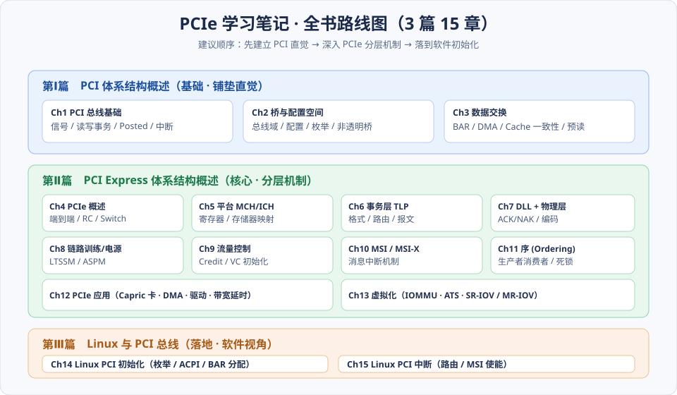
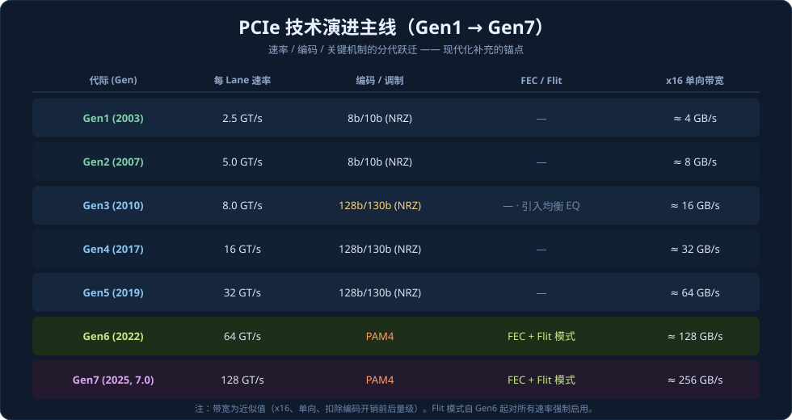
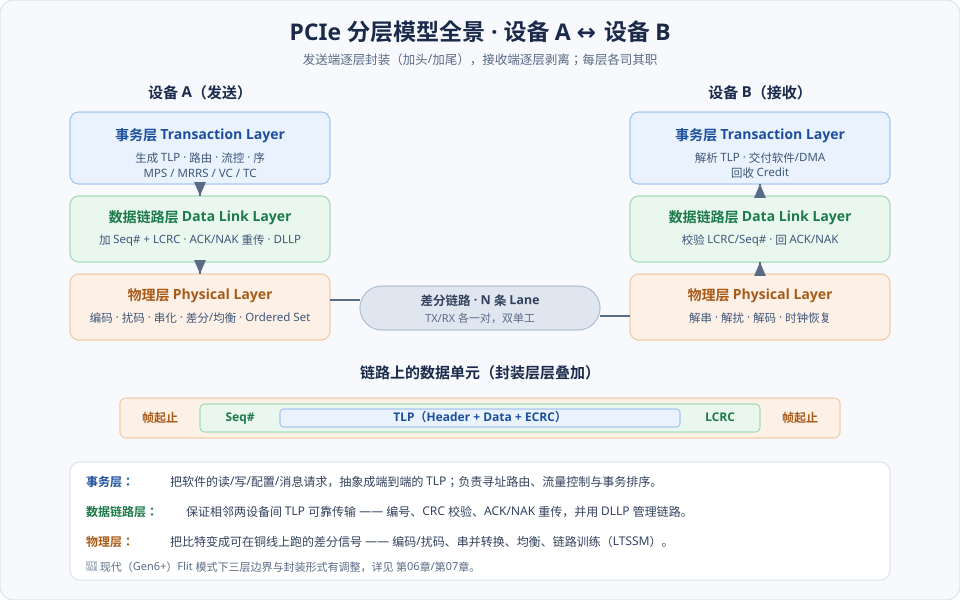

# PCIe 学习笔记 · 工程总纲（CLAUDE.md）

> 这是一套以 **王齐《PCI Express 体系结构导读》** 为骨架、结合 **PCI Express Base Specification 7.0（NCB-PCI_Express_Base_7.0）** 深度现代化的中文学习笔记。
> 本文件既是**工程说明书**（约定笔记怎么写、放哪、怎么配图），也是学习者的**总入口 / 路线图**。文风以「讲解」为主 —— 先讲清「为什么这么设计」，再讲「具体怎么做」。

---

## 1. 这套笔记是什么 · 面向谁 · 怎么用

- **是什么**：把一本厚书拆成「可逐章啃、每节配图」的讲解式笔记。原书讲 Gen1/2 时代的 PCI/PCIe，本笔记在保留其经典推理的同时，把每一处涉及物理速率、编码、报文格式、电源/链路状态的地方，对照 **SPEC 7.0** 做现代化补充——**以当前主流部署的 Gen5（32 GT/s、128b/130b、非 Flit）为现代基准**；Gen6/7（PAM4 + Flit）以「🔭 展望」形式呈现。
- **面向谁**：想系统理解 PCIe「从软件请求 → TLP → 链路比特」全链路的工程师；做驱动、FPGA/ASIC、验证、性能调优、虚拟化的读者。
- **怎么用**：
  1. 先读本文件的 **§2 路线图** 与 **§4 分层模型**，建立全局地图；
  2. 按 **§6 章节索引** 逐章阅读 `notes/` 下的笔记；每章开头的**术语表**先扫一遍，建立词汇基线；
  3. 遇到「> 📘 SPEC 7.0」引用块，即为以 Gen5 为基准的现代化补充，可对照官方 Spec 章节深入；遇到「> 🔭 Gen6/7 展望」引用块，为下一代（PAM4/Flit 等）前瞻内容，非当前主流，可按需选读。

---

## 2. 全书结构总览（3 篇 15 章）



| 篇 | 定位 | 章 | 主题 |
|----|------|----|------|
| **Ⅰ PCI 体系结构** | 建立总线直觉、为 PCIe 铺垫 | 1–3 | PCI 基础 / 桥与配置 / 数据交换 |
| **Ⅱ PCIe 体系结构** | 核心：分层机制 | 4–13 | 概述 / 平台 / 事务层 / DLL+PHY / 链路训练+电源 / 流控 / MSI / 序 / 应用 / 虚拟化 |
| **Ⅲ Linux 与 PCI** | 落地：软件视角 | 14–15 | PCI 初始化 / 中断处理 |

**阅读顺序建议**：Ⅰ→Ⅱ→Ⅲ 顺序最稳。若已有 PCI 基础，可从 **第04章** 直接进入 PCIe；只关心报文与链路的读者，主攻 **第06/07/08/09章**。

---

## 3. PCIe 技术演进主线（现代化锚点）

原书成书于 Gen1/2 时代（8b/10b、2.5–5 GT/s）。要读懂今天的 PCIe，必须知道后续几代的跃迁点 —— 本表是全书「现代化补充」的坐标系。



| 代际 | 速率/Lane | 编码/调制 | 里程碑机制 |
|------|-----------|-----------|-----------|
| Gen1/2 | 2.5 / 5 GT/s | 8b/10b（NRZ） | 原书基线 |
| Gen3 | 8 GT/s | **128b/130b**（NRZ） | 发送端**均衡 EQ**、扰码 |
| **Gen4/5 ⭐** | 16 / **32 GT/s** | **128b/130b**（NRZ） | **当前主流部署基线**：10-bit Tag、Scaled FC、L1 子状态、Retimer |
| Gen6 🔭 | 64 GT/s | PAM4 | FEC + Flit 模式（强制）、L0p —— 展望 |
| Gen7 (7.0) 🔭 | 128 GT/s | PAM4 | 沿用 Flit + FEC —— 展望 |

> 📘 **贯穿全书的现代化主线（以 Gen5 为基准）**：①编码从 8b/10b→**128b/130b（Gen3–5，当前主流，开销仅 ~1.5%）**（第07章）；②性能三件套 **10-bit Tag / Scaled FC / 大 MPS**（第06/09/12章）；③电源与链路新增 **L1 子状态**、逐代加严的均衡与 Retimer（第08章）。**🔭 Gen6/7 专属内容（PAM4、FEC、Flit、L0p、14-bit Tag）统一以「展望」块呈现于各章末尾**，非当前主线。

---

## 4. PCIe 分层模型全景

PCIe 是**分层协议**：软件的一次读写，在发送端被事务层→数据链路层→物理层逐层封装，在接收端逐层剥离。理解这张图，等于拿到全书的「装配总图」。



- **事务层（Transaction Layer）**：面向软件语义。把读/写/配置/消息请求打包成 **TLP（Transaction Layer Packet，事务层包）**，负责路由、流量控制、事务排序。→ 第06章
- **数据链路层（Data Link Layer）**：面向可靠性。给 TLP 加序号与 **LCRC**，用 **ACK/NAK** 协议保证相邻设备间不丢包；用 **DLLP（Data Link Layer Packet）** 管理链路与流控。→ 第07、09章
- **物理层（Physical Layer）**：面向电气。编码/扰码、串并转换、差分驱动与均衡，并通过 **LTSSM** 完成链路训练。→ 第07、08章

---

## 5. 写作与文风规范（后续逐章正文遵循）

### 5.1 每章统一骨架 ⭐
每个章节 `.md` 正文按此固定结构写，保证风格一致：

1. **导读** —— 一段话说清「这章解决什么问题、在全局的位置」。
2. **术语表（Glossary）** —— ⭐置于导读之后、正文之前的三列表：`英文 / 缩写 | 中文 | 一句话释义`（**英文/缩写在前，中文在后**）。让读者在深入前先建立词汇基线；术语首现处再展开。
3. **核心概念** —— 关键心智模型，先给直觉。
4. **机制详解（配图）** —— 逐小节展开，配 SVG；重推理、重「为什么」。
5. **小结** —— 章内编号小节（如 `6.5 小结`），一图/一表收束，并给出下一章过渡。
6. **📘 SPEC 7.0 现代化对照** —— 以 **Gen5 为基准**的新版演进（10-bit Tag/Scaled FC/128b/130b 等），并注 Base Spec 章节号；末尾以 `> 🔭 Gen6/7 展望` 块收纳 Flit/PAM4 等前瞻内容。
7. **常见误区 / FAQ** —— 易错点、面试/实战高频问题。
8. **与 SPEC 章节对照表** —— 本章内容 ↔ Base Spec 7.0 章节映射；Gen6/7 专属行加（🔭 展望）标注。

> 全部 15 章正文均已按此骨架完成。

### 5.2 排版约定
- **术语首现给中英文**：如「事务层包（TLP, Transaction Layer Packet）」，之后**正文中特定含义的名词可直接用英文/缩写**（如 TLP、Completion、Posted、MPS、Flit），以贴合工程惯例；每章开头的**术语表**（英文/缩写在前）统一收录本章高频术语。
- **现代化补充统一样式**：用引用块 `> 📘 SPEC 7.0：……（Base Spec §x.y）`，与忠于原书的主线视觉区分。
- **Gen6/7 展望统一样式**：Gen6/7 专属内容（Flit、PAM4、FEC、L0p、14-bit Tag 等）用引用块 `> 🔭 Gen6/7 展望：……` 标注，明确「非当前主流、按需选读」，与 📘 主线补充区分。
- **历史基线保留**：原书 Gen1/2 结论不删除，作为「历史基线」讲，再用 📘 块给出新版差异 —— 让读者看到「为什么演进」。
- **代码/寄存器**：字段名、寄存器名用行内代码，如 `Fmt`、`Max_Payload_Size`。

### 5.3 文件命名规范（中文名）
- **章节文件**：`notes/第X篇-<中文>/第NN章-<中文名>.md`；章号数字与 `.md` 扩展名保留。
- **SVG 文件**：全局图 `总览-<主题>.svg`；章内图 `第NN章-<主题>.svg`。均放 `assets/svg/`。
- **保留「特殊含义字符」**：章号数字、扩展名、以及 `PCIe / TLP / MSI-X / MCH / ICH / LTSSM / Linux` 等技术缩写按原样保留，不强译。
- **引用路径**：章节文件在 `notes/第X篇-…/` 下，引用 SVG 用 `../../assets/svg/第NN章-xxx.svg`。

### 5.4 SVG 规范
- 一图一文件，固定 `viewBox`，**不引用任何外部资源**（无外链字体/图片），字体用系统 sans-serif 兜底。
- 自带背景面板，保证在浅色/深色页面下都可读；配色语义统一：**事务层=蓝、数据链路层=绿、物理层=橙**。

### 5.5 与 SPEC 的引用规范
引用官方规范写作 `Base Spec 7.0 §<章节号> <小节标题>`；只引用**当前工程内**的 `NCB-PCI_Express_Base_7.0.pdf`，不外链。

---

## 6. 章节索引

> **全部 15 章正文与配图已完成**（每章含术语表、📘 Gen5 主线对照与 🔭 Gen6/7 展望）；进度与修订记录见 [TODO.md](TODO.md)。

### 第Ⅰ篇　PCI 体系结构概述
- [第01章 PCI 总线基础](notes/第一篇-PCI体系结构/第01章-PCI总线基础.md)
- [第02章 PCI 桥与配置空间](notes/第一篇-PCI体系结构/第02章-PCI桥与配置.md)
- [第03章 PCI 数据交换](notes/第一篇-PCI体系结构/第03章-PCI数据交换.md)

### 第Ⅱ篇　PCI Express 体系结构概述
- [第04章 PCIe 总线概述](notes/第二篇-PCIe体系结构/第04章-PCIe总线概述.md)
- [第05章 平台地址空间组织（附 MCH/ICH 历史案例）](notes/第二篇-PCIe体系结构/第05章-平台MCH与ICH.md)
- [第06章 事务层 TLP](notes/第二篇-PCIe体系结构/第06章-事务层.md)
- [第07章 数据链路层与物理层](notes/第二篇-PCIe体系结构/第07章-数据链路层与物理层.md)
- [第08章 链路训练与电源管理](notes/第二篇-PCIe体系结构/第08章-链路训练与电源管理.md)
- [第09章 流量控制](notes/第二篇-PCIe体系结构/第09章-流量控制.md)
- [第10章 MSI 与 MSI-X 中断](notes/第二篇-PCIe体系结构/第10章-MSI和MSI-X中断.md)
- [第11章 PCI/PCIe 的序（Ordering）](notes/第二篇-PCIe体系结构/第11章-总线的序.md)
- [第12章 PCIe 总线的应用](notes/第二篇-PCIe体系结构/第12章-PCIe应用.md)
- [第13章 PCIe 与虚拟化技术](notes/第二篇-PCIe体系结构/第13章-虚拟化技术.md)

### 第Ⅲ篇　Linux 与 PCI 总线
- [第14章 Linux PCI 初始化](notes/第三篇-Linux与PCI/第14章-Linux-PCI初始化.md)
- [第15章 Linux PCI 中断处理](notes/第三篇-Linux与PCI/第15章-Linux-PCI中断处理.md)

---

## 7. 资料对照

| 资料 | 角色 | 工程内文件 |
|------|------|-----------|
| 王齐《PCI Express 体系结构导读》 | **主线教材**（骨架、推理、直觉） | `PCI+EXPRESS体系结构导读.pdf` / `…z-library.sk….epub` |
| PCI Express Base Specification 7.0 | **现代化补充**（新版字段、机制、数值） | `NCB-PCI_Express_Base_7.0.pdf` |

**映射原则**：以原书章节为主目录；凡涉及速率/编码/报文格式/链路状态/电源管理/流控/序，均在对应章补一条 `> 📘 SPEC 7.0` 对照，并标注 Base Spec 章节号，便于回查原文。

---

## 8. 目录结构

```
pcie/
├── CLAUDE.md                        # 本文件：工程总纲
├── TODO.md                          # 进度与修订记录
├── notes/
│   ├── 第一篇-PCI体系结构/    第01–03章
│   ├── 第二篇-PCIe体系结构/   第04–13章
│   └── 第三篇-Linux与PCI/     第14–15章
├── assets/svg/                      # 所有独立 SVG（总览-* 与 第NN章-*）
├── PCI+EXPRESS体系结构导读.pdf        # 原书
└── NCB-PCI_Express_Base_7.0.pdf     # 官方 SPEC 7.0
```

> **维护约定**：新增一章正文时，先在 `assets/svg/` 落该章 SVG，再在章节文件用 `../../assets/svg/…` 引用，最后确认本文件 §6 索引链接与 [TODO.md](TODO.md) 状态同步。
