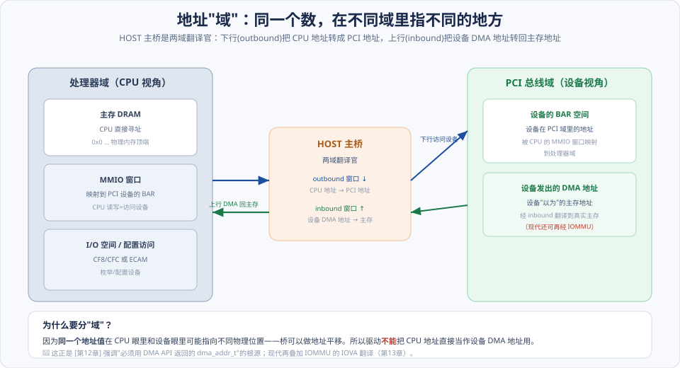
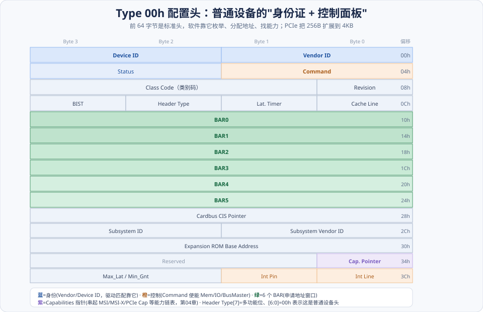
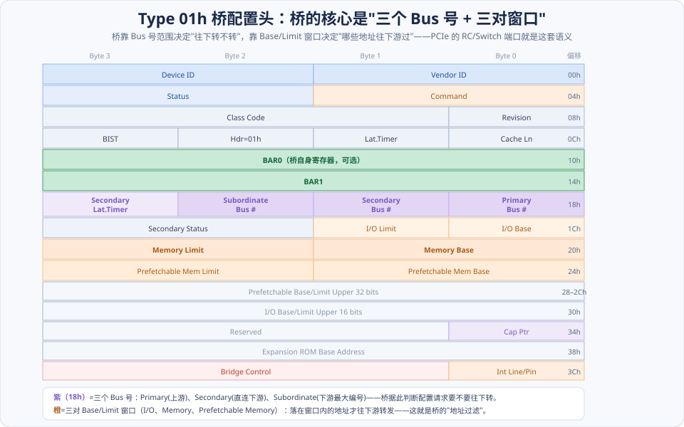
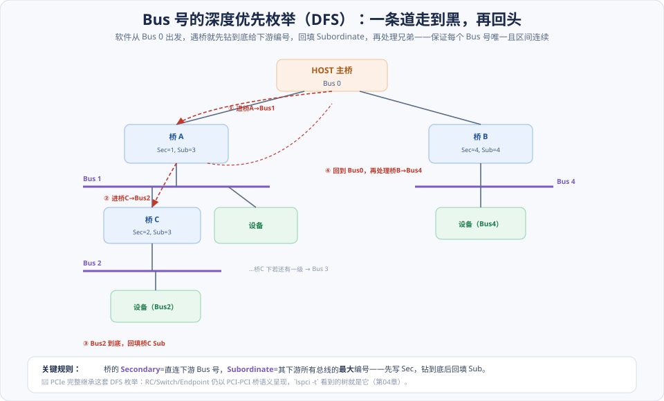
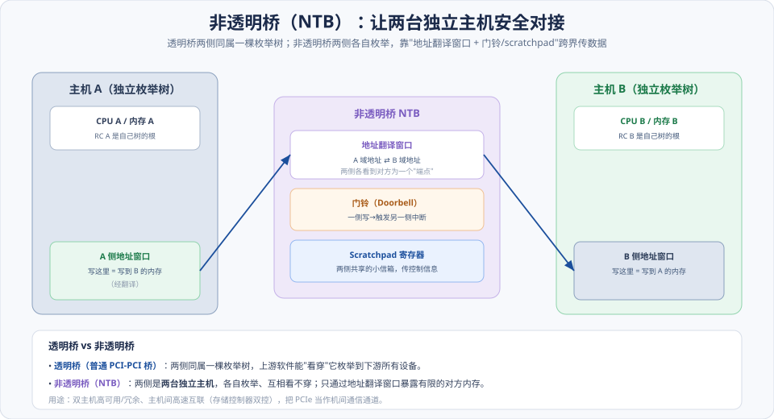

# 第02章　PCI 总线的桥与配置

> **导读**：上一章讲清了 PCI"怎么传"，这一章讲**"软件怎么认识和管理设备"**——两件事：**地址空间怎么划分成域并相互转换**，以及**设备怎么被枚举与配置**。这是整个即插即用（Plug and Play）的地基。
>
> 为什么重要？因为 **PCIe 几乎原样继承了这套机制**：配置空间、Type 0/1 配置请求、总线号/设备号的分配规则，PCIe 一个没改，只是把"访问配置空间的方式"从端口 I/O（`CF8/CFC`）换成了内存映射（ECAM），并把配置空间从 256 字节扩到 4KB。所以你现在敲的 `lspci`、看到的 BAR、驱动匹配的 Vendor/Device ID，全都建立在本章的概念上。
>
> 本章按 [CLAUDE.md §5.1](../../CLAUDE.md) 八节骨架展开，配 5 张图。

---

## 术语表

| 英文 / 缩写 | 中文 | 一句话释义 |
|-------------|------|-----------|
| Memory / PCI Bus Domain | 存储器域 / PCI 总线域 | 同一物理地址在不同"域"中的含义不同 |
| Configuration Space | 配置空间 | 每设备 256B（PCIe 扩展到 4KB）的即插即用寄存器区 |
| Type 0 / 1 Header | Type 00h / 01h 头 | 普通设备头 / 桥设备头 |
| BAR, Base Address Register | 基地址寄存器 | 设备申请 MMIO/IO 窗口的寄存器 |
| Primary/Secondary/Subordinate | 上游/下游/最末总线号 | 桥的三个 Bus 号，界定其管辖的总线区间 |
| Base / Limit | 基址/上限窗口 | 桥的地址过滤窗口，决定哪些地址往下游转 |
| DFS Enumeration | 深度优先枚举 | 递归扫描总线树、分配 Bus 号的过程 |
| IDSEL | 初始化设备选择 | 配置访问时片选某设备的信号，决定 Device 号 |
| ECAM | 增强配置访问机制 | 把 Bus/Dev/Fun/Reg 映射为内存地址访问配置空间 |
| NTB, Non-Transparent Bridge | 非透明桥 | 两侧各自枚举、经地址翻译窗口互联的桥 |
| ARI | 备用路由 ID 解释 | 突破每设备 8 功能限制（配合 SR-IOV） |

---

## 核心概念：三个心智模型

本章内容多，但可以压成三个核心心智模型，抓住它们细节就串起来了：

**① 地址要分"域"，因为同一个数在不同视角指不同地方。** CPU 眼中的地址空间和设备眼中的地址空间是**两套坐标系**，中间由 HOST 主桥翻译。CPU 访问设备（下行）走一套翻译，设备 DMA 主存（上行）走另一套。**驱动绝不能把 CPU 地址直接当设备 DMA 地址**——这个铁律的根就在"域"。

**② 配置空间是设备的"标准化履历表"。** 每个设备都有一段固定格式的寄存器（256B/4KB），软件不需要知道设备型号就能读出它的身份（Vendor/Device ID）、需要多少地址窗口（BAR）、有哪些能力（Capabilities）。**普通设备用 Type 0 头，桥用 Type 1 头**——两种头的差异，正好体现"设备"和"桥"的职责不同。

**③ 枚举是一次深度优先的树遍历。** 系统从 Bus 0 出发，遇桥就钻下去给下游编号，靠"三个 Bus 号"和"Base/Limit 窗口"把整棵总线树的地址空间划分得井井有条。理解了桥怎么"往下转发"，就理解了整个 PCI/PCIe 拓扑如何被软件组织起来。

---

## 2.1 存储器域与 PCI 总线域

### 2.1.1 CPU 域、DRAM 域与存储器域

原书特意区分"域"，是为了打破一个新手的错觉：**"地址是全局唯一的"**。其实同一个地址值，在不同域里可能指向完全不同的物理位置。如图，处理器域是 CPU 看到的地址空间（主存 + MMIO 窗口 + I/O），PCI 总线域是设备看到的地址空间。两者由 HOST 主桥翻译，**并不保证相等**——桥可以做地址平移。

### 2.1.2 PCI 总线域

设备发出的地址（如 DMA 目标地址）落在 **PCI 总线域**里。当设备想访问主存时，它发出的是"它以为的主存地址"，这个地址要经 HOST 主桥的 **inbound 翻译**才落到真实 DRAM。现代系统里还可能再经 IOMMU 做一层 IOVA 翻译（[第13章](../第二篇-PCIe体系结构/第13章-虚拟化技术.md)）。

### 2.1.3 处理器域

CPU 想访问设备时，往 MMIO 窗口里的地址读写，经 HOST 主桥的 **outbound 翻译**映射到设备的 BAR 空间。所以"CPU 读设备寄存器"本质是：CPU 域地址 → 主桥翻译 → PCI 域地址 → 命中设备 BAR。

> 一句话记住：**下行 outbound（CPU→设备）和上行 inbound（设备→主存）是两套独立的翻译窗口**。这就是 [第12章](../第二篇-PCIe体系结构/第12章-PCIe应用.md) 反复强调"驱动必须用 DMA API 返回的 `dma_addr_t`、不能直接用 CPU 地址"的根源。

---

## 2.2 HOST 主桥

### 2.2.1 PCI 设备配置空间的访问机制

配置空间不在普通内存里，得用特殊机制访问。经典 x86 用**一对 I/O 端口**：

- **`CONFIG_ADDRESS`（0xCF8）**：写入目标的 `Bus/Device/Function/Register` 编号。
- **`CONFIG_DATA`（0xCFC）**：读写这个端口，就等于读写上面选定的配置寄存器。

这套"先写地址端口、再读数据端口"的机制能工作，但**慢且受 I/O 空间限制**（只能访问每设备前 256 字节）。PCIe 用 **ECAM** 取而代之（见 §SPEC 对照）。

### 2.2.2 / 2.2.3　两个方向的地址转换

- **outbound（存储器域 → PCI 总线域）**：CPU 访问设备的窗口，把处理器地址映射到 PCI 地址。
- **inbound（PCI 总线域 → 存储器域）**：设备 DMA 的窗口，把设备发出的地址映射回主存。

两个窗口独立配置，正是 2.1 "两套坐标系"的落地。

### 2.2.4 x86 处理器的 HOST 主桥

早期 x86 把 HOST 主桥集成在**北桥/MCH**（Memory Controller Hub）里；现代 CPU 把它集成进片内（[第05章](../第二篇-PCIe体系结构/第05章-平台MCH与ICH.md) 会讲平台演进）。无论集成在哪，职责不变：两域枢纽 + 发起配置请求。

---

## 2.3 PCI 桥与 PCI 设备的配置空间

配置空间是本章的重头。**普通设备**和**桥**用两种不同格式的头，分别看：

### 2.3.1 PCI 桥

PCI-PCI 桥的核心职责是"把上游总线的事务，有选择地转发到下游总线"。要做到这一点，它的配置头里有两组关键寄存器（详见 2.3.3 的 Type 1 头图）：

- **三个 Bus 号**：`Primary`（上游总线号）、`Secondary`（直连的下游总线号）、`Subordinate`（下游所有总线的最大编号）。桥靠它判断一个配置请求"要不要往下转"。
- **三对 Base/Limit 窗口**：I/O、Memory、Prefetchable Memory 各一对。**落在窗口区间内的地址才往下游转发**——这就是桥的"地址过滤"。

### 2.3.2 PCI Agent 设备的配置空间：Type 00h 头 ⭐

普通设备（非桥）用 **Type 00h 头**，共 256 字节，前 64 字节是标准布局：

按图中颜色抓重点：

- **身份区（蓝）**：`Vendor ID` + `Device ID`——**驱动就是靠这两个值匹配设备的**（`lspci` 显示的也是它）。还有 `Class Code`（设备类别，如网络/存储）、`Subsystem ID`。
- **控制区（橙）**：`Command` 寄存器——置 `Memory Space Enable`/`I/O Space Enable` 才让 BAR 响应，置 `Bus Master Enable` 才允许设备发 DMA（[第12章](../第二篇-PCIe体系结构/第12章-PCIe应用.md) 的经典坑）；`Status` 报告状态。
- **6 个 BAR（绿）**：`BAR0–BAR5`，设备用它们**申请地址窗口**（下一节讲探测机制，[第03章](第03章-PCI数据交换.md) 详解）。
- **Capabilities 指针（紫）**：指向配置空间里的**能力链表**——MSI/MSI-X、PCIe Capability、电源管理等都挂在这条链上（[第04章](../第二篇-PCIe体系结构/第04章-PCIe总线概述.md)、[第10章](../第二篇-PCIe体系结构/第10章-MSI和MSI-X中断.md)）。
- **Header Type（0Ch）**：bit[6:0]=00h 表示这是普通设备头；bit[7]=1 表示**多功能设备**。
- **Interrupt Pin/Line（3Ch）**：INTx 中断相关（[第01章](第01章-PCI总线基础.md) 的 swizzle）。

### 2.3.3 PCI 桥的配置空间：Type 01h 头

桥用 **Type 01h 头**，前半部分（ID、Command、Status）和 Type 0 相同，关键差异在后半部分：

如图，桥头没有 6 个 BAR（桥自己一般只用 0–2 个 BAR），取而代之的是：

- **三个 Bus 号（紫，18h）**：`Primary / Secondary / Subordinate`——桥的"管辖范围"。
- **三对 Base/Limit 窗口（橙）**：`I/O Base/Limit`、`Memory Base/Limit`、`Prefetchable Memory Base/Limit`——桥的"地址过滤器"。
- **Bridge Control（3Ch）**：控制下游复位、错误转发等。

**对比记忆**：Type 0 头的核心是"6 个 BAR"（一个设备要什么地址）；Type 1 头的核心是"3 个 Bus 号 + 3 对窗口"（一个桥管哪些总线、放哪些地址往下走）。

---

## 2.4 PCI 总线的配置

有了配置头，接下来看软件如何用它**枚举整棵总线树、给每个设备编号**。

### 2.4.1 Type 01h 和 Type 00h 配置请求

配置请求本身分两型：

- **Type 0 配置请求**：目标就在**本条总线**上——桥看到 Type 0 请求且 Bus 号匹配，直接片选目标设备。
- **Type 1 配置请求**：目标在**更下游的总线**上——请求带着目标 Bus 号，一路往下游桥传递。

### 2.4.2 配置请求的转换原则

桥收到 **Type 1 请求**时的决策逻辑：

- 若目标 Bus 号 **等于**自己的 `Secondary`（就在紧邻的下游总线）→ 把请求**转换成 Type 0**，在下游总线上片选目标。
- 若目标 Bus 号 **在 `Secondary` 和 `Subordinate` 之间**（在更深的下游）→ 保持 **Type 1**，透传给下游。
- 若**不在** `[Secondary, Subordinate]` 区间 → 不是我的辖区，**不转发**。

这套规则就是整个配置路由的核心——理解它，就理解了配置请求如何精确抵达任意深度的设备。

### 2.4.3 PCI 总线树 Bus 号的初始化：DFS 枚举 ⭐

Bus 号不是预先固定的，而是软件在枚举时**动态分配**的，用**深度优先（DFS）**遍历：

如图，过程是"一条道走到黑，再回头"：

1. 从 **Bus 0** 开始扫描，发现桥 A → 给它的 `Secondary` 分配下一个号（Bus 1），**先钻进去**。
2. 在 Bus 1 上发现桥 C → 分配 `Secondary`=Bus 2，**继续钻**。
3. Bus 2 到底（无更多下游桥）→ **回填**桥 C 的 `Subordinate`（=其下游最大号）。
4. 逐层回退到 Bus 0，再去处理兄弟桥 B → 分配 Bus 4……

**关键在于 `Subordinate` 必须"钻到底才知道"**：它是某桥下游所有总线的最大编号，所以只能在深度遍历完成后回填。这套 `[Secondary, Subordinate]` 区间保证每个桥都能用简单的区间比较来路由配置请求（2.4.2）。

### 2.4.4 PCI 总线 Device 号的分配

同一条总线上，用 **`IDSEL`（Initialization Device Select）** 信号区分不同设备——配置访问时，主桥/桥用地址线的某几位驱动对应设备的 `IDSEL`，从而片选它。哪根地址线接到哪个设备的 IDSEL，就决定了该设备的 **Device 号**。这是硬件布线决定的。

---

## 2.5 非透明 PCI 桥

普通 PCI-PCI 桥是**透明**的：上游软件能"看穿"它，枚举到下游所有设备（两侧同属一棵树）。但有些场景需要连接**两台独立的主机**——这时用**非透明桥（NTB）**。

### 2.5.1 Intel 21555 中的配置寄存器

NTB（如经典的 Intel 21555）两侧**各有一套配置寄存器**，两台主机各自把对方看成"一个端点设备"，互相**看不穿**对方的枚举树。这样两台主机的枚举互不干扰、各自独立。

### 2.5.2 通过非透明桥片进行数据传递

如图，两侧靠三样东西通信：

- **地址翻译窗口**：A 侧写入自己的某个窗口地址，经翻译落到 B 侧内存的对应区域（反之亦然）——把"写对方内存"变成"写本地一个窗口"。
- **门铃（Doorbell）**：一侧写门铃寄存器 → 触发另一侧的中断，用于"我放好数据了，你来取"的通知。
- **Scratchpad 寄存器**：两侧共享的小信箱，传少量控制信息。

**用途**：双主机高可用/冗余（如存储控制器双控互备）、主机间高速互联——把 PCIe 当作机间通信通道。这是 NTB 至今仍在数据中心存活的原因。

---

## 2.6 小结

一句话收束：

> **配置空间（设备的标准履历）+ Type 0/1 配置请求（精确寻址设备）+ DFS 枚举（给总线树编号）= 即插即用的地基。PCIe 原样继承这套软件模型，只把访问方式从 CF8/CFC 换成 ECAM、把配置空间从 256B 扩到 4KB。**

三个心智模型回顾：

1. **地址分域**：CPU 域与 PCI 域是两套坐标系，HOST 主桥双向翻译；驱动必须用 DMA 地址、不能用 CPU 地址。
2. **两种配置头**：Type 0（普通设备，核心是 6 个 BAR）vs Type 1（桥，核心是 3 个 Bus 号 + 3 对窗口）。
3. **DFS 枚举**：深度优先给 Bus 号，`[Secondary, Subordinate]` 区间让桥能简单路由配置请求。

带着"配置空间 + 枚举"这套地基，下一章 [第03章](第03章-PCI数据交换.md) 讲 **BAR 探测的具体机制**和数据交换（正负向译码、DMA 与 Cache 一致性、预读）。

---

## 📘 SPEC 7.0 现代化对照

> 📘 **配置访问：CF8/CFC → ECAM**。PCIe 用 **ECAM（Enhanced Configuration Access Mechanism，增强配置访问机制）** 取代端口机制：把 `Bus/Device/Function/Offset` 直接编码成一段**保留的物理内存地址**，CPU 用普通的内存读写就能访问任意设备的配置空间。基址由固件通过 ACPI 的 **MCFG 表**告知 OS。好处：访问快、无 I/O 空间限制、天然支持多段（Segment）大拓扑。（Base Spec：Enhanced Configuration Access Mechanism）

> 📘 **配置空间：256B → 4KB**。PCIe 把配置空间从 256 字节扩展到 **4KB**：前 256 字节保持与 PCI 兼容（Type 0/1 头 + 传统 Capabilities），**0x100–0xFFF** 是 **Extended Configuration Space**，承载 **Extended Capabilities**——AER（错误报告）、SR-IOV、ATS、PASID 等现代能力都挂在这里（[第13章](../第二篇-PCIe体系结构/第13章-虚拟化技术.md)）。注意：**只有 ECAM 才能访问 0x100 以上**，CF8/CFC 够不着。

> 📘 **枚举模型完整保留**。这是 PCIe 兼容性的精髓——**Type 0/1 头、Base/Limit 窗口、DFS 枚举一个没改**。PCIe 的 Root Port、Switch 的上下游端口，在配置空间里**仍然表现为 PCI-PCI 桥（Type 1 头）**，Endpoint 表现为 Type 0。所以 `lspci -t` 看到的树、老的枚举代码，在 PCIe 上原样工作。RC/Switch/Endpoint 的对应关系见 [第04章](../第二篇-PCIe体系结构/第04章-PCIe总线概述.md)。

> 📘 **ARI：突破每设备 8 功能限制**。传统一个设备最多 8 个 Function（3 位功能号）。**ARI（Alternative Routing-ID Interpretation）** 重新解释 Bus/Device/Function 号的位分配，把功能号位宽扩大，从而容纳**大量功能**——这是 **SR-IOV** 派生几十上百个 VF 的前提（[第13章](../第二篇-PCIe体系结构/第13章-虚拟化技术.md)）。（Base Spec：Alternative Routing-ID Interpretation）

---

## 常见误区 / FAQ

**Q1：为什么非要区分"存储器域"和"PCI 总线域"？地址不就是地址吗？**
因为**同一个地址值在 CPU 和设备眼里可能指向不同物理位置**——桥可以做地址平移。CPU 访问设备（outbound）和设备 DMA 主存（inbound）走的是两套独立翻译窗口。不区分域，就会犯"把 CPU 虚拟/物理地址直接塞给设备当 DMA 地址"的错误（[第12章](../第二篇-PCIe体系结构/第12章-PCIe应用.md)）。现代叠加 IOMMU 后，设备用的更是完全不同的 IOVA（[第13章](../第二篇-PCIe体系结构/第13章-虚拟化技术.md)）。

**Q2：Type 0 头和 Type 1 头最本质的区别是什么？**
职责不同导致布局不同。**Type 0（普通设备）**的核心是 **6 个 BAR**——"我这个设备需要哪些地址窗口"。**Type 1（桥）**的核心是 **3 个 Bus 号 + 3 对 Base/Limit 窗口**——"我这个桥管辖哪些下游总线、放哪些地址范围往下游转发"。一个描述"要地址"，一个描述"转发地址"。

**Q3：为什么 Bus 号要用深度优先，不能简单地从左到右编号？**
因为桥的 `Subordinate`（下游最大 Bus 号）**必须钻到底才知道**。DFS 先给直连下游分 `Secondary`、钻进去把整条支路编完、回填 `Subordinate`，才能保证每个桥的 `[Secondary, Subordinate]` 区间**连续且不重叠**——这样桥就能用一次简单的区间比较判断配置请求要不要往下转（2.4.2）。广度优先做不到区间连续。

**Q4：ECAM 和老的 CF8/CFC 能同时用吗？**
能，但覆盖范围不同。CF8/CFC 只能访问每设备**前 256 字节**（传统配置空间），ECAM 能访问**完整 4KB**。所以要访问 PCIe 扩展能力（AER/SR-IOV 等在 0x100 以上），**必须用 ECAM**；CF8/CFC 够不着。现代系统两者可能都在，但扩展空间只有 ECAM 能碰。

**Q5：透明桥和非透明桥（NTB）怎么区分用途？**
**透明桥**（普通 PCI-PCI 桥）让上游软件"看穿"它、枚举到下游全部设备——用于**在一棵树内**扩展总线。**非透明桥（NTB）**两侧是**两台独立主机**，各自枚举、互相看不穿，只通过地址翻译窗口 + 门铃暴露有限的对方内存——用于**主机间互联**（双控存储、高可用）。一句话：透明桥连"设备"，NTB 连"主机"。

**Q6：`Command` 寄存器里最容易踩的坑是哪个位？**
`Bus Master Enable`。不置它，设备就**无权发起 DMA**，所有 `MWr`/`MRd` 被静默丢弃——现象是"寄存器读写正常但 DMA 不动、也不报错"（[第12章](../第二篇-PCIe体系结构/第12章-PCIe应用.md) 的经典坑，对应内核 `pci_set_master()`）。此外 `Memory/IO Space Enable` 不置，BAR 不响应访问。

---

## 与 SPEC 7.0 章节对照

| 本章主题 | Base Spec 7.0 章节 / 相关规范 |
|----------|-------------------------------|
| 配置空间 / Type 0/1 头 | Configuration Space / PCI-Compatible Configuration Registers |
| BAR / 地址窗口 | Base Address Registers（[第03章](第03章-PCI数据交换.md)） |
| 桥 Bus 号 / Base·Limit | PCI-PCI Bridge Architecture（Type 1 Header） |
| 配置请求路由 | Configuration Request Routing（Type 0/1 转换） |
| ECAM | Enhanced Configuration Access Mechanism |
| 扩展配置空间 / Extended Capabilities | Extended Configuration Space（0x100–0xFFF，AER/SR-IOV/ATS） |
| ARI | Alternative Routing-ID Interpretation（[第13章](../第二篇-PCIe体系结构/第13章-虚拟化技术.md)） |
| Capabilities 链表 | Capabilities List（[第04章](../第二篇-PCIe体系结构/第04章-PCIe总线概述.md)、[第10章](../第二篇-PCIe体系结构/第10章-MSI和MSI-X中断.md)） |

> 说明：配置空间布局、桥架构、ECAM、Extended Capabilities 均定义于 Base Spec 及 PCI-PCI Bridge 规范；NTB 属于**厂商实现**（无统一标准寄存器）。具体章节号以工程内 `NCB-PCI_Express_Base_7.0.pdf` 为准。
