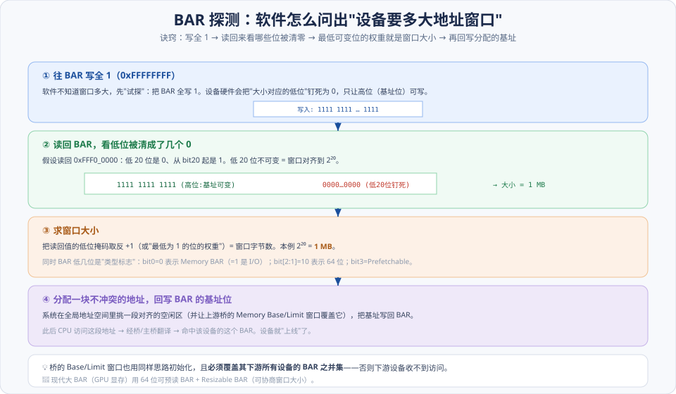
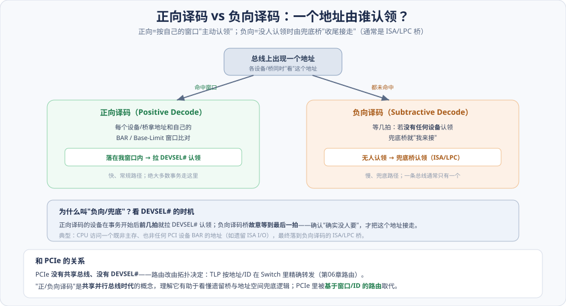
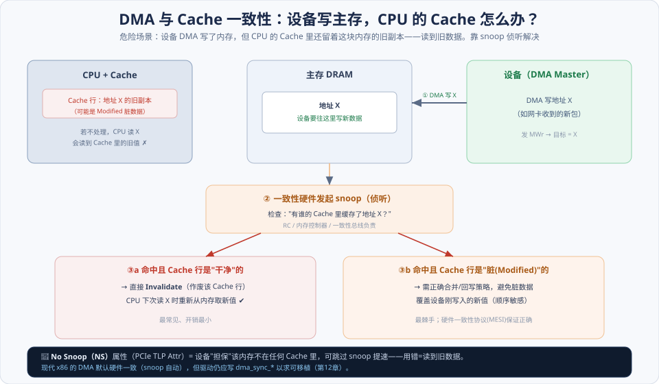
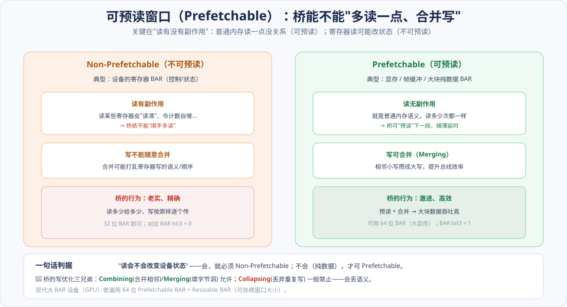

# 第03章　PCI 总线的数据交换

> **导读**：[第02章](第02章-PCI桥与配置.md) 讲完"软件怎么枚举、给设备分配地址"，这一章讲**"设备被配好之后，数据到底怎么搬、怎么搬得对、怎么搬得快"**。链条是：**BAR 空间初始化 → 地址译码 → DMA → Cache 一致性 → 预读优化**。
>
> 其中 **Cache 一致性**和**预读**是全书最容易被忽视、却直接决定 DMA **正确性与性能**的硬骨头——而且它们**跨 PCI/PCIe 通用**。为什么单独强调？因为 PCIe TLP 头里的两个属性位 **`No Snoop`（NS）** 和 **`Relaxed Ordering`（RO）** 正是从本章的 Cache/预读思想里长出来的（[第06章](../第二篇-PCIe体系结构/第06章-事务层.md)、[第11章](../第二篇-PCIe体系结构/第11章-总线的序.md)）。理解本章，才能理解那两个位"为什么存在、什么时候该开、开错了会怎样"。
>
> 本章按 [CLAUDE.md §5.1](../../CLAUDE.md) 八节骨架展开，配 4 张图。

---

## 术语表

| 英文 / 缩写 | 中文 | 一句话释义 |
|-------------|------|-----------|
| BAR | 基地址寄存器 | 设备申请的 MMIO/IO 窗口在总线域的位置与大小 |
| Positive / Subtractive Decode | 正向 / 负向译码 | 按窗口认领地址 / 无人认领时兜底认领 |
| DMA, Direct Memory Access | 直接存储器访问 | 设备作为 Master 直接读写主存 |
| Cache Coherency | Cache 一致性 | 保证 DMA 数据与 CPU Cache 内容一致 |
| Snoop | 侦听 | 硬件检查/使 Cache 行失效以维持一致性 |
| MESI | MESI 协议 | Cache 行的 Modified/Exclusive/Shared/Invalid 状态机 |
| Prefetchable Memory | 可预读窗口 | 可被桥预读、合并、无副作用的存储器区 |
| Combining / Merging / Collapsing | 合并 / 填洞 / 折叠 | 桥对写事务的三类优化（前两者可，后者一般禁止） |
| NS / RO | No Snoop / Relaxed Ordering | PCIe TLP 属性位，放宽一致性/排序以提性能 |
| Atomic Op | 原子操作 | PCIe 的 FetchAdd/Swap/CAS 事务 |

---

## 核心概念：正确性与性能的两条线

本章的所有细节都挂在两个问题上，先把它们立起来：

**① 正确性问题：DMA 搬的数据，各方看到的一致吗？** 设备 DMA 写了主存，但 CPU 的 Cache 里可能还留着这块内存的旧副本——CPU 一读就读到旧值。这就是 **Cache 一致性**问题。它是 DMA **正确性**的命门，硬件靠 **snoop（侦听）** 解决。PCIe 的 `No Snoop` 属性就是"设备担保这块内存不在 Cache 里、可跳过侦听"的显式声明——用对了提速，用错了读到脏数据。

**② 性能问题：桥能不能少跑几趟、多搬一点？** 如果一段内存"读没有副作用"（就是普通数据），桥就可以**预读**下一段、**合并**相邻的写，摊薄延时、提升吞吐。但如果是设备寄存器（读可能改状态），就**绝不能**这么干。这就是 **Prefetchable（可预读）** 属性的由来——它把"这段地址能不能被激进优化"标记出来。

一句话贯穿全章：**DMA 正确性 = 地址转换对 + Cache 一致性对；DMA 性能 = 合并 + 预读。** 而这两条线在 PCIe 里分别对应 `NS`（一致性）和 `Prefetchable/RO`（性能），本章是它们的源头。

---

## 3.1 PCI 设备 BAR 空间的初始化

### 3.1.1 存储器地址与 PCI 总线地址的转换

BAR（Base Address Register）决定设备在 **PCI 总线域**里占用哪段窗口（[第02章](第02章-PCI桥与配置.md) 的域）。软件把 BAR 配好、上游桥的窗口覆盖它之后，CPU 访问对应地址就能命中这个设备。BAR 里还有几个**类型标志位**：bit0 区分 Memory（0）/ I/O（1）BAR，bit[2:1] 标识 32/64 位，bit3 是 **Prefetchable**（3.4 详解）。

### 3.1.2 BAR 与桥 Base/Limit 的初始化：写全 1 探测大小 ⭐

设备不会直接告诉软件"我要多大窗口"，软件得**试探**出来。经典四步：

1. **① 写全 1**：往 BAR 写入 `0xFFFFFFFF`。硬件会把"窗口大小对应的低位"钉死为 0，只让高位（基址位）可写。
2. **② 读回看掩码**：读回 BAR，看低位被清成了几个 0。比如读回 `0xFFF00000`，低 20 位是 0——说明窗口对齐到 2²⁰。
3. **③ 求大小**：低位掩码取反 +1（即"最低为 1 的位的权重"）= 窗口字节数。本例 2²⁰ = **1 MB**。
4. **④ 回写基址**：系统在全局地址空间里挑一段对齐、不冲突的空闲区，把基址写回 BAR，设备就"上线"了。

**桥的 Base/Limit 窗口用同样思路初始化**，但有个硬约束：**桥窗口必须覆盖其下游所有设备 BAR 的并集**——否则下游设备收不到 CPU 的访问。这也是枚举时"先分配下游、再定桥窗口"的原因（[第02章](第02章-PCI桥与配置.md) 的 DFS）。

---

## 3.2 PCI 设备的数据传递

### 3.2.1 正向译码与负向译码

一个地址出现在共享总线上，**由谁认领**？两种机制：

- **正向译码（Positive Decode）**：每个设备/桥拿地址和自己的 BAR/窗口比对，**落在窗口内就在前几拍拉 `DEVSEL#` 认领**。这是常规、快速路径，绝大多数事务走这里。
- **负向译码（Subtractive Decode）**：一条总线上通常有一个"兜底桥"（典型是 ISA/LPC 桥），它**故意等到最后一拍**——若确认没有任何设备认领，才把这个地址接走。典型场景是 CPU 访问一个既非主存、也非任何 PCI 设备 BAR 的地址（如遗留 ISA I/O）。

**为什么叫"负向/兜底"**：正向靠"匹配窗口"主动认领，负向靠"没人要"被动收尾——它看的是 `DEVSEL#` 迟迟无人拉低这个"否定条件"。

> 📘 PCIe **没有共享总线、没有 `DEVSEL#`**——正/负向译码是共享并行总线时代的概念。PCIe 里路由由拓扑决定：TLP 按地址/ID 在 Switch 里精确转发（[第06章](../第二篇-PCIe体系结构/第06章-事务层.md) 的路由）。但理解这套逻辑有助于看懂遗留桥和地址空间的兜底行为。

### 3.2.2 处理器到 PCI 设备的数据传送

**outbound**：CPU 往 MMIO 地址读写 → 经主桥/桥翻译 → 命中设备 BAR。CPU 读设备是 Non-Posted（要等数据回来），写视类型而定。

### 3.2.3 PCI 设备的 DMA 操作

**inbound**：设备作 Master 主动读写主存。**设备写主存 = Posted（快）**，**设备读主存 = Non-Posted（要等完成）**——这个不对称在 [第01章](第01章-PCI总线基础.md) 已讲，是 [第12章](../第二篇-PCIe体系结构/第12章-PCIe应用.md) Capric 卡 DMA 性能账的根。DMA 是数据交换的主战场，也是下面 Cache 一致性问题的来源。

### 3.2.4 PCI 桥的 Combining / Merging / Collapsing

桥为提升写效率会对写事务做优化，但**规则严格**：

- **Combining（合并）**：把**相邻地址**的多个写攒成一个大写——**允许**。
- **Merging（填洞）**：把同一对齐块里**不同字节**的多个写填进一次传输——**允许**。
- **Collapsing（折叠）**：把**对同一地址的多次写**折叠成一次（丢弃中间的写）——**一般禁止**！因为对寄存器"写 3 次"和"写 1 次"语义可能完全不同（如写 FIFO、写自增寄存器），折叠会丢语义。

记住：**前两个改的是"打包方式"、不改语义，可以做；Collapsing 改的是"写的次数"、会丢语义，不能做**。这套规则在 PCIe 里对应对 MMIO 的严格保序要求。

---

## 3.3 与 Cache 相关的 PCI 总线事务

这是本章正确性的核心。DMA 和 CPU Cache 会"打架"，必须有机制协调。

### 3.3.1 Cache 一致性的基本概念

CPU 为提速把内存内容缓存在 **Cache** 里，用 **MESI** 协议管理每个 Cache 行的状态（Modified 脏/Exclusive 独占/Shared 共享/Invalid 无效）。**write-back** 策略下，CPU 改了 Cache 不立刻写回内存——于是**内存里的值可能是旧的、Cache 里才是新的**。**snoop（侦听）** 是硬件"偷看"总线上的访问、据此更新/失效 Cache 行的机制，是维持一致性的关键。

### 3.3.2 对不可 Cache 空间进行 DMA 读写

如果 DMA 的目标内存被标记为**不可缓存**，那 CPU 的 Cache 里根本不会有它的副本——**无需 snoop**，最简单。

### 3.3.3 对可 Cache 空间进行 DMA 读写

现实中 DMA 目标常是**可缓存**的主存（如网络包缓冲），这就需要硬件保证一致性：设备 DMA 时，一致性硬件要 snoop CPU 的 Cache。

### 3.3.4 DMA 写时发生 Cache 命中 ⭐

最关键的场景：**设备 DMA 写地址 X，而 CPU 的 Cache 里正好缓存了 X**。

如图，危险在于：若不处理，设备把新数据写进了内存，但 CPU 的 Cache 里还是旧副本——**CPU 一读就读到旧值**。一致性硬件的处理：

1. **① 设备 DMA 写 X**。
2. **② snoop**：一致性硬件（RC/内存控制器/一致性总线）检查"有谁 Cache 了 X？"。
3. 命中后分两种：
   - **③a 命中且 Cache 行干净**：直接 **Invalidate**（作废该行），CPU 下次读 X 时重新从内存取新值。最常见、开销最小。
   - **③b 命中且 Cache 行是脏（Modified）**：最棘手——需正确的合并/回写策略，避免脏的旧数据覆盖设备刚写的新值。靠 MESI 协议保证顺序正确。

### 3.3.5 DMA 写时命中的优化

snoop 有开销（每个 DMA 都要查 Cache）。优化手段包括：批量 snoop、按 Cache 行粒度对齐 DMA、以及——**让设备声明"这块内存不在 Cache 里，别 snoop 了"**。最后这条正是 PCIe **`No Snoop` 属性**的思想（见 §SPEC 对照）。

---

## 3.4 预读机制

预读是本章的**性能**主题。先从 CPU 侧建立概念，再落到 PCI。

### 3.4.1–3.4.4　CPU 侧的预读

- **指令 Fetch**：CPU 按顺序取指，天然有"下一条大概率要用"的预读价值。
- **数据预读**：把"很可能马上要用"的数据提前读进 Cache。
- **软件预读**：编译器/程序员插入预读指令（如 `prefetch`）。
- **硬件预读**：CPU 检测到顺序访问模式，自动预读后续 Cache 行。

共同思想：**用"提前读"换"少等待"**，前提是**读没有副作用**且**大概率会用到**。

### 3.4.5 PCI 总线的预读机制：Prefetchable ⭐

PCI 把这个思想落到 BAR 的 **Prefetchable（可预读）** 属性上：

判据只有一句：**"读会不会改变设备状态"**。

- **Non-Prefetchable（不可预读）**：典型是**设备寄存器 BAR**。读某些寄存器有副作用（读清、令计数自增），所以桥**绝不能顺手多读**，写也不能随意合并。桥必须"老实、精确"：读多少给多少、写按原样逐个传。对应 **BAR bit3=0**，用 32 位 BAR 即可。
- **Prefetchable（可预读）**：典型是**显存/帧缓冲/大块纯数据**。读无副作用（就是普通内存语义），所以桥可以**预读**下一段、**合并**相邻写，激进优化、大块吞吐高。对应 **BAR bit3=1**，可用 64 位 BAR（容纳大显存）。

**一句话判据**：读会改状态 → 必须 Non-Prefetchable；读是纯数据 → 才可 Prefetchable。这直接呼应 3.2.4 的写优化规则——本质都是"什么时候允许桥自作主张"。

---

## 3.5 小结

一句话收束本章：

> **DMA 正确性 = 地址转换正确（BAR/域）+ Cache 一致性正确（snoop）；DMA 性能 = 合并（Combining/Merging）+ 预读（Prefetchable）。PCIe 把这两条线显式化为 TLP 属性：`No Snoop`（一致性）与 `Relaxed Ordering`/`Prefetchable`（性能）。**

两条线回顾：

1. **正确性线**：BAR 探测（写全 1 → 读掩码 → 求大小 → 回写）定位设备；DMA 写命中 Cache 时靠 snoop + MESI 保证 CPU 不读旧值。
2. **性能线**：桥的 Combining/Merging 可做、Collapsing 禁止；Prefetchable 窗口让桥能预读合并——判据是"读有无副作用"。

至此第Ⅰ篇（PCI 体系结构）三章全部走完。带着 **Posted/Non-Posted**（[第01章](第01章-PCI总线基础.md)）、**配置空间/枚举**（[第02章](第02章-PCI桥与配置.md)）、**Cache 一致性/预读**（本章）这三套地基，即可进入第Ⅱ篇——从 [第04章](../第二篇-PCIe体系结构/第04章-PCIe总线概述.md) 正式开讲 PCIe。你会看到本章的 snoop/预读思想如何变成 TLP 头里可显式控制的 `NS`/`RO` 属性位。

---

## 📘 SPEC 7.0 现代化对照

> 📘 **一致性属性显式化：No Snoop / Relaxed Ordering**。本章的 Cache 一致性和预读，在 PCIe 里升级成 TLP 头 `Attr` 字段里的两个位——**`No Snoop`（NS）**：设备声明"这块内存不在任何 Cache 里，别 snoop 了"，跳过侦听开销（对应 3.3.5 的优化，用错=读到脏数据）；**`Relaxed Ordering`（RO）**：放松排序让 RC 更自由地并发处理（[第11章](../第二篇-PCIe体系结构/第11章-总线的序.md)）。两者都只该用于**无依赖的纯数据流**，**绝不能对控制路径/MSI 开**（[第12章](../第二篇-PCIe体系结构/第12章-PCIe应用.md)）。（Base Spec：TLP Attributes、Transaction Ordering）

> 📘 **Prefetchable + 64 位 BAR + Resizable BAR**。现代设备（GPU 大显存、大 BAR 设备）普遍用 **64 位可预读 BAR**——32 位 BAR 只能表达 4GB 以内的窗口，装不下几十 GB 的显存。**Resizable BAR（可变 BAR）** 进一步让软件与设备**协商 BAR 窗口大小**（如让 CPU 一次映射全部显存，即 "ReBAR/Smart Access Memory"），显著提升某些负载性能。（Base Spec：Resizable BAR Capability）

> 📘 **原子操作：补足 PCI 缺失的原语**。PCI 时代做"读-改-写"要靠锁总线，低效且 PCIe 无此概念。PCIe 新增 **AtomicOp**——`FetchAdd`（取回并加）、`Swap`（交换）、`CAS`（比较并交换）三种原子事务，让设备与主机能无锁地更新共享变量（如队列指针、计数器），是现代多队列/多核协作的重要原语。（Base Spec：Atomic Operations，[第06章](../第二篇-PCIe体系结构/第06章-事务层.md)）

> 📘 **DMA 地址的现代形态：IOVA**。本章的"PCI 总线地址"在开启 IOMMU 的现代系统里变成 **IOVA**，设备发出后由 IOMMU 翻译回物理地址（[第13章](../第二篇-PCIe体系结构/第13章-虚拟化技术.md)）。这在本章的"地址转换"之上又加了一层，带来 DMA 隔离能力——但一致性问题（snoop）依然存在，两者是正交的两件事。

---

## 常见误区 / FAQ

**Q1：BAR 探测为什么要"写全 1"这么绕？软件不能直接问设备要多大吗？**
配置空间里没有"窗口大小"这个字段，只能靠 BAR 的"低位被硬件钉死"这个特性反推。写全 1 后，硬件把大小对应的低位强制为 0、只留基址高位可写；读回来数哪些低位是 0，就知道窗口对齐粒度=大小。这是个巧妙的"用可写性编码大小"的约定，PCIe 也原样沿用。

**Q2：Cache 一致性到底是谁的责任——硬件还是驱动？**
现代 x86/ARM 的 DMA 通常**硬件一致**（snoop 自动做），驱动"看起来"不用管。但为了**可移植**（有些架构 DMA 不一致），驱动仍应在正确时机调用 `dma_sync_*`（[第12章](../第二篇-PCIe体系结构/第12章-PCIe应用.md)）——在硬件一致的平台上它是空操作，在不一致的平台上它就是正确性保障。所以答案是：**硬件尽力，驱动照写不误**。

**Q3：`No Snoop` 既然能提速，为什么不默认全开？**
因为它是"设备向系统担保这块内存不在任何 Cache 里"。一旦这个担保不成立（内存其实被 CPU 缓存着），跳过 snoop 就会导致 **CPU 读到旧数据 / 设备读到旧数据**——极难排查的数据损坏。所以 NS 只能用于**明确不被 CPU 缓存的纯数据缓冲**，且要软硬件配合确认。默认关是安全的选择。

**Q4：Combining、Merging、Collapsing 我总记混，怎么区分？**
看"改了什么"。**Combining**=把相邻地址的写打包（不改次数不改语义，✔）；**Merging**=把同一块里不同字节的写填一起（✔）；**Collapsing**=把对同一地址的多次写折叠成一次（**改了写的次数、丢语义，一般禁止**）。口诀：**前两个改打包、后一个改次数**——改次数的那个危险。

**Q5：Prefetchable 和 Non-Prefetchable 选错会怎样？**
把本该 Non-Prefetchable 的**寄存器**标成 Prefetchable，桥可能"顺手预读"有副作用的寄存器（触发读清、乱了状态），或合并了不该合并的写——导致设备行为异常、极难调试。反过来把纯数据标成 Non-Prefetchable 只是**损失性能**（不能预读合并），但安全。所以判据要严守"读有无副作用"，拿不准就选 Non-Prefetchable。

**Q6：PCIe 都没有共享总线了，学正/负向译码还有用吗？**
概念本身在 PCIe 里被"基于窗口/ID 的路由"取代（无 `DEVSEL#`）。但它帮你理解两件仍然存在的事：**地址空间的兜底逻辑**（无人认领的地址归谁）和**遗留桥/南桥**的行为（LPC 上的老设备）。在混合了 PCIe 与遗留总线的真实平台上，这套认领逻辑依然在底层运作。

---

## 与 SPEC 7.0 章节对照

| 本章主题 | Base Spec 7.0 章节 / 相关规范 |
|----------|-------------------------------|
| BAR / 地址窗口探测 | Base Address Registers（[第02章](第02章-PCI桥与配置.md)） |
| 地址译码 / 路由 | Transaction Routing（PCIe 以窗口/ID 路由，[第06章](../第二篇-PCIe体系结构/第06章-事务层.md)） |
| 桥写优化 / 保序 | Transaction Ordering（Combining/Merging vs Collapsing，[第11章](../第二篇-PCIe体系结构/第11章-总线的序.md)） |
| Cache 一致性 / No Snoop | TLP Attributes（`No Snoop` 位） |
| Relaxed Ordering | Transaction Ordering（`RO` 位） |
| Prefetchable / 64 位 BAR | Base Address Registers / Prefetchable |
| Resizable BAR | Resizable BAR Capability |
| 原子操作 | Atomic Operations（FetchAdd/Swap/CAS，[第06章](../第二篇-PCIe体系结构/第06章-事务层.md)） |
| DMA 地址翻译 | Address Translation Services（IOVA，[第13章](../第二篇-PCIe体系结构/第13章-虚拟化技术.md)） |

> 说明：BAR、No Snoop、Relaxed Ordering、AtomicOp、Resizable BAR 均定义于 Base Spec；Cache 一致性协议（MESI/snoop）属于**处理器架构**，PCI/PCIe 只提供属性位与之协作。具体章节号以工程内 `NCB-PCI_Express_Base_7.0.pdf` 为准。
