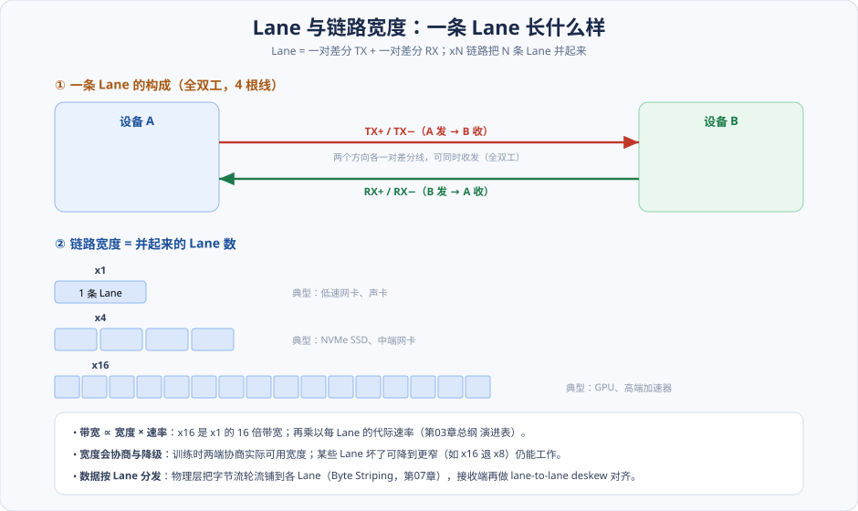
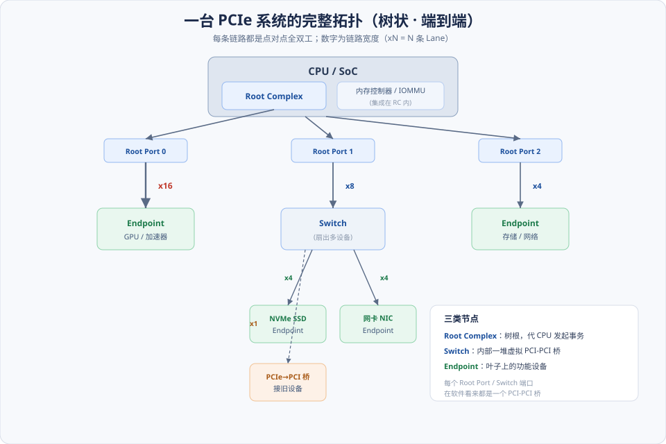
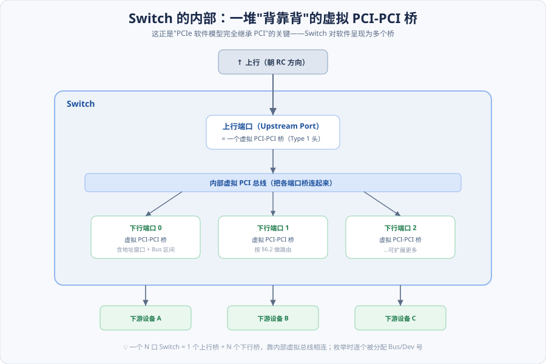
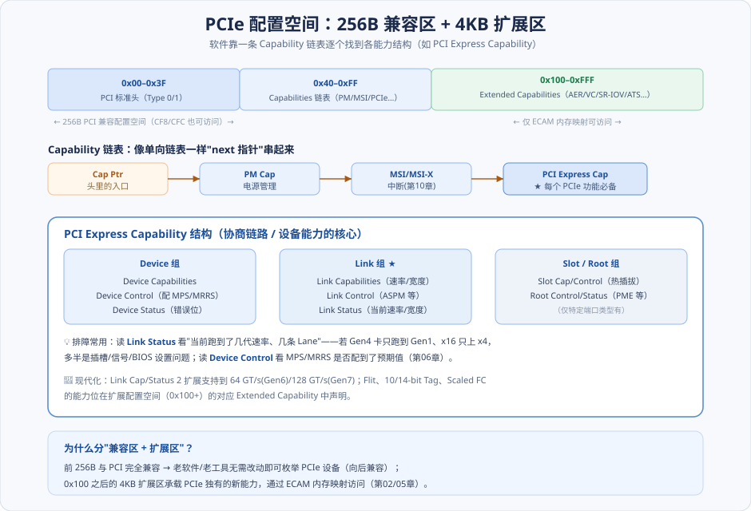

# 第04章　PCIe 总线概述

> **导读**：从这一章起，我们正式进入 PCIe 本身。前三章讲的 PCI，是为了让你带着"总线直觉"来看 PCIe——你会发现，**PCIe 在软件层面几乎完全继承了 PCI**（配置空间、枚举、BAR、Posted/Non-Posted 全都在），但在物理与链路层面**彻底重构**（共享并行总线 → 点对点串行链路、分层协议）。
>
> 本章的目标，是让你在脑子里建立起一张**完整的 PCIe 系统拓扑图**，并知道图上每个部件是干什么的。具体来说：
>
> - **端到端**的通信范式，以及为此付出的信号（差分对）；
> - **三层协议栈**如何分工（这是 [第06](第06章-事务层.md)/[07](第07章-数据链路层与物理层.md)/[08 章](第08章-链路训练与电源管理.md) 的总纲）；
> - **RC、Switch、Endpoint** 三类部件，以及 **Lane / 链路宽度**；
> - **VC 与端口仲裁**（QoS 的入口）；
> - **扩展配置空间**——PCIe 独有的能力都挂在这里。
>
> 读完本章，后面每一章都能对号入座地知道"我现在讲的是这张拓扑图的哪一层、哪个部件"。本章按 [CLAUDE.md §5.1](../../CLAUDE.md) 八节骨架展开，配 4 张图。

---

## 术语表

| 英文 / 缩写 | 中文 | 一句话释义 |
|-------------|------|-----------|
| RC, Root Complex | 根复合体 | 连接 CPU / 内存与 PCIe 拓扑的树根，内含 Root Port |
| Root Port | 根端口 | RC 上朝下引出一条链路的端口（本质是 PCI-PCI 桥） |
| Endpoint | 端点 | 拓扑叶子上的功能设备（网卡 / NVMe / GPU 等） |
| Switch | 交换器 | 由多个虚拟 PCI-PCI 桥组成、扇出多下行端口的部件 |
| Lane | 通道 | 一对差分 TX + 一对差分 RX，链路的最小单位 |
| Link Width | 链路宽度 | x1/x2/x4/x8/x16，多 Lane 聚合 |
| VC, Virtual Channel | 虚拟通道 | 共享物理链路上相互独立的缓冲 / 流控通道 |
| TC, Traffic Class | 流量类别 | TLP 的优先级标签，映射到 VC |
| RCIEP | RC 集成端点 | 直接集成在 RC 内部、不经外部链路的端点 |
| PCI Express Capability | PCIe 能力结构 | 配置空间中协商链路速率 / 宽度 / MPS 等的能力结构 |
| Extended Capability | 扩展能力 | 位于配置空间 0x100 以后的 PCIe 专属能力（AER/SR-IOV…） |

---

## 核心概念：从"一条街"到"一棵树"

理解 PCIe 拓扑，最快的方式是和 PCI 对比。

**PCI 像一条共享的街道**：所有设备挂在同一条并行总线上，谁想说话得先仲裁抢占，同一时刻只有一对设备能通信，而且信号是"广播"给整条街的。街上设备越多、街越长，电气负载越重、频率越上不去——这就是 PCI 的物理天花板（[第01章](../第一篇-PCI体系结构/第01章-PCI总线基础.md)）。

**PCIe 像一棵由专线连成的树**：

- 每两个相邻节点之间是一条**独占的点对点链路**（不再共享、不再仲裁），而且**全双工**（收发同时进行）。
- 树根是 **Root Complex**，树枝的分叉点是 **Switch**，树叶是 **Endpoint**。
- 要扩展更多设备，就加 Switch 来"扇出"，而不是往一条总线上继续挂。

这个转变带来两个直接好处：**每条链路可以独立地跑到极高频率**（因为只有两个端点、负载确定），以及**多对设备可以真正并行通信**（不同链路互不干扰）。代价是需要 Switch 来做转发、需要更复杂的分层协议来管理每条链路——而这，正是第Ⅱ篇后续各章的内容。

**但请记住那句关键的话**：拓扑变了，**软件看到的模型没变**。下面会看到，Root Port 和 Switch 的每个端口，在软件眼里都还是一个"PCI-PCI 桥"，枚举、配置、BAR 分配全部沿用 PCI 的老办法。这种"物理革命、软件兼容"的设计智慧，是 PCIe 能平滑取代 PCI 的根本原因。

---

## 4.1 PCIe 总线的基础知识

### 4.1.1 端到端的数据传递

PCIe 的通信是严格的 **Requester → Completer** 模型（[第06章](第06章-事务层.md) 会细讲）：一个设备发起请求，目标设备（在需要时）回一个完成。中间如果隔着 Switch，报文就一跳一跳地被转发过去——但**逻辑上是端到端的一次事务**。

这和 PCI 的"占用整条总线做一次传输"截然不同。在 PCIe 里，设备 A 和设备 B 通信时，完全不影响设备 C 和设备 D 同时通信（只要它们走的链路不重叠）。这种并行性，是现代高性能 I/O（多路 NVMe、多口网卡同时满速）的基础。

### 4.1.2 PCIe 总线使用的信号

PCIe 用极少的信号就跑起来了，和 PCI 上百根信号形成鲜明对比：

| 信号 | 作用 |
|------|------|
| `TX+ / TX−`、`RX+ / RX−` | 每条 Lane 的差分发送 / 接收对（数据主体） |
| `REFCLK+ / REFCLK−` | 参考时钟（100 MHz 差分） |
| `PERST#` | 基础复位（Fundamental Reset） |
| `WAKE#` | 从低功耗态唤醒系统的边带信号 |
| `CLKREQ#` | 请求参考时钟 / 进入时钟省电（配合 L1 子状态，[第08章](第08章-链路训练与电源管理.md)） |

信号锐减的秘密在于：地址、命令、字节使能这些在 PCI 里需要专用引脚的东西，PCIe 全都**打包进 TLP 用数据线传**（带内传输），不再需要边带引脚。

### 4.1.3 PCIe 总线的层次结构

PCIe 是**分层协议**，一次传输在发送端被逐层封装、在接收端逐层剥离（详见 [总纲 §4](../../CLAUDE.md) 的分层图）：

- **事务层**：生成 / 解析 TLP，负责路由、流控、排序。→ [第06章](第06章-事务层.md)
- **数据链路层**：加序号 + LCRC，ACK/NAK 保证逐跳可靠；用 DLLP 管理链路。→ [第07章](第07章-数据链路层与物理层.md)、[第09章](第09章-流量控制.md)
- **物理层**：编码、串化、差分驱动、链路训练。→ [第07章](第07章-数据链路层与物理层.md)、[第08章](第08章-链路训练与电源管理.md)

本章不展开每一层（那是后面各章的事），只需要建立"三层各司其职"的框架印象。

### 4.1.4 PCIe 链路的扩展：Lane 与链路宽度

**Lane（通道）是 PCIe 链路的最小单位**——它由一对差分发送线（TX±）和一对差分接收线（RX±）组成，共 4 根线，全双工：

把 N 条 Lane 并起来，就构成 **xN 链路**（链路宽度）：x1、x2、x4、x8、x16（规范还定义了 x32）。宽度越大，带宽越高——**总带宽 ∝ 链路宽度 × 每 Lane 速率**。所以一块 GPU 用 x16、一块 NVMe SSD 用 x4、一块低速网卡用 x1，都是按需分配的结果。

两个实用细节：

- **宽度会协商，也会降级**。链路训练（[第08章](第08章-链路训练与电源管理.md)）时两端协商出实际宽度；如果某些 Lane 信号不好，可以降级（如 x16 退到 x8）继续工作，而不是彻底不通。
- **数据按 Lane 分发**。物理层把字节流轮流铺到各条 Lane 上（Byte Striping，[第07章](第07章-数据链路层与物理层.md)），接收端再做 lane-to-lane deskew 把它们对齐重组。

### 4.1.5 PCIe 设备的初始化：从上电到可用

一个 PCIe 设备从插上到能用，经历一条固定的流水线：

> **上电 / 复位（PERST#）→ 链路训练（LTSSM 把物理层带到 L0，[第08章](第08章-链路训练与电源管理.md)）→ 数据链路层流控初始化（[第09章](第09章-流量控制.md)）→ 软件枚举配置空间 → 分配 Bus 号 / BAR / 配置 MPS 等 → 驱动接管**。

前面几步是硬件 / 固件自动完成的（链路先"物理上通"），后面几步是系统软件做的（把设备"逻辑上纳入系统"）。[第14章](../第三篇-Linux与PCI/第14章-Linux-PCI初始化.md) 会从 Linux 视角完整走一遍后半段。

---

## 4.2 PCIe 体系结构的组成部件

现在把整张拓扑图摊开看：

### 4.2.1 基于 PCIe 架构的处理器系统

现代系统里，**RC 已经集成进 CPU / SoC**——内存控制器、Root Port、甚至 IOMMU（[第13章](第13章-虚拟化技术.md)）都在同一颗芯片里。这和原书 [第05章](第05章-平台MCH与ICH.md) 描述的"北桥 MCH + 南桥 ICH"分立时代已经不同（那时 RC 功能分散在北桥）。理解这个演进，有助于你把老书里的概念映射到今天的硬件。

### 4.2.2 RC（Root Complex）的组成结构

RC 是整棵树的根，它的核心职责是**代表 CPU 在 PCIe 拓扑上发起事务**——CPU 的一次 MMIO 读写，由 RC 翻译成 TLP 发下去；设备的 DMA 请求，由 RC 接收并转给内存控制器。

RC 内部包含：

- **一个或多个 Root Port**：每个 Root Port 引出一条链路，**本质上是一个 PCI-PCI 桥**（Type 1 配置头）。这就是为什么软件枚举时，Root Port 看起来和普通桥一模一样。
- **内部路由 / 内存控制器接口 / IOMMU**：把设备的 DMA 定向到内存，并（在虚拟化下）做地址翻译与隔离。
- 有时还有 **RCIEP（RC Integrated Endpoint）**：直接长在 RC 内部、不经外部链路的端点（如芯片组集成的某些功能）。

### 4.2.3 Switch：拓扑的"扇出器"

当 Root Port 不够用、或要在一条链路下挂多个设备时，就用 **Switch**。Switch 内部的结构，是理解 PCIe 路由的关键：

如图，一个 Switch **= 1 个上行端口（Upstream Port）+ N 个下行端口（Downstream Port），每个端口都是一个虚拟 PCI-PCI 桥，它们靠一条内部虚拟总线连在一起**。

- **上行端口**朝 RC 方向，**下行端口**朝设备方向。
- 每个下行端口桥都持有一段**地址窗口**和一段 **Bus 号区间**，据此对 TLP 做路由（[第06章 §6.2](第06章-事务层.md) 讲的地址 / ID / 隐式三种路由）。
- 枚举时，这些虚拟桥会像真实 PCI 桥一样被逐个分配 Bus/Dev 号。

> 💡 **一句话看透 Switch**：它不是什么神秘的交换芯片，而是"**一堆背靠背的 PCI-PCI 桥**"。你在 PCI 学的桥知识（[第02章](../第一篇-PCI体系结构/第02章-PCI桥与配置.md)），在这里全部复用。

### 4.2.4 VC 和端口仲裁：QoS 的入口

前面说每条链路是独占的，但**一条链路上仍可能有多种流量竞争**（比如高优先级的控制流 vs 大块数据 DMA）。**VC（Virtual Channel，虚拟通道）** 就是为此设计的：在同一条物理链路上，划分出多个**逻辑上独立、各有独立缓冲和流控信用**的通道（最多 8 个，VC0–VC7）。

流量怎么进入不同 VC？靠 TLP 头里的 **TC（Traffic Class）→ VC 映射**（[第06章](第06章-事务层.md)）。而当多个流量要竞争同一个出口时，有两级仲裁：

- **端口仲裁（Port Arbitration）**：多个**入口端口**的流量都要进同一个出口 VC 时，谁先走。
- **VC 仲裁（VC Arbitration）**：同一个出口端口上，多个 **VC** 之间谁先走。

绝大多数消费级场景只用 VC0（够用了）；但在需要 QoS 保障的系统（服务器、等时传输、多租户），VC 是提供带宽 / 时延隔离的机制。

### 4.2.5 PCIe-to-PCI/PCI-X 桥片

为了向后兼容还在用的老 PCI/PCI-X 设备，有专门的 **PCIe-to-PCI 桥**，把一段 PCIe 链路"翻译"成一条传统 PCI 总线。它让新平台还能插老卡——又一次体现了 PCIe 对兼容性的重视。

---

## 4.3 PCIe 设备的扩展配置空间

PCIe 把 PCI 的 256 字节配置空间**扩展到了 4 KB**。这多出来的空间，正是 PCIe 各种新能力的容身之所：

配置空间分两段（见上图）：

- **前 256 字节（0x00–0xFF）**：与 PCI **完全兼容**。前 64 字节是标准头（Type 0/1），之后是 **Capabilities 链表**——像单向链表一样，每个能力结构存一个"指向下一个"的指针，软件顺着链表就能发现设备支持哪些能力（PM、MSI/MSI-X、PCI Express Capability…）。这段用传统 CF8/CFC 端口也能访问，所以**老软件无需改动就能枚举 PCIe 设备**。
- **0x100–0xFFF 的扩展区**：承载 **Extended Capabilities**（AER 高级错误报告、VC、Serial Number、ARI、SR-IOV、ATS…）。这段只能通过 **ECAM 内存映射**访问（[第02章](../第一篇-PCI体系结构/第02章-PCI桥与配置.md)、[第05章](第05章-平台MCH与ICH.md)）。

### 4.3.1 Power Management Capability 结构

PCI PM Capability 定义了设备的 **D-state（D0/D1/D2/D3）** 功耗态与切换（[第08章](第08章-链路训练与电源管理.md) 详解）。它是 PCI 时代就有的能力，PCIe 继续沿用。

### 4.3.2 PCI Express Capability 结构（重点）

这是**每个 PCIe 功能都必备**的能力结构，也是你排障时最常读的地方。它把设备 / 链路 / 槽位 / 根的能力，组织成 Capabilities / Control / Status 三类寄存器（见上图展开）：

- **Device 组**：`Device Capabilities`（支持的最大 MPS 等）、`Device Control`（**实际配置的 MPS/MRRS**，[第06章](第06章-事务层.md)）、`Device Status`（错误位）。
- **Link 组** ★：`Link Capabilities`（支持的速率 / 宽度）、`Link Control`（ASPM 等，[第08章](第08章-链路训练与电源管理.md)）、`Link Status`（**当前实际跑到的速率 / 宽度**）。
- **Slot / Root 组**：热插拔、PME 等（仅特定端口类型有）。

> 🔧 **一个高频排障技巧**：读 **Link Status** 就能看到"这条链路当前跑到了第几代速率、用了几条 Lane"。如果一块 Gen4 x16 的卡只跑到了 Gen1 或只上了 x4，那基本能锁定是插槽、信号完整性或 BIOS 设置的问题——而不必去猜。`lspci -vvv` 里看到的 `LnkCap` / `LnkSta` 就是这些寄存器。

### 4.3.3 PCI Express Extended Capabilities 结构

从 0x100 开始的链式扩展能力，同样用"next 指针"串成链表。常见的有 **AER**（错误报告，服务器可靠性的关键）、**VC**（§4.2.4）、**SR-IOV**（[第13章](第13章-虚拟化技术.md)）、**ATS**（地址翻译）、**Resizable BAR** 等。现代 PCIe 的新特性，几乎都以 Extended Capability 的形式在这里"登记上牌"。

---

## 4.4 小结

把这张拓扑图和它的部件锁进记忆：

> **一棵树**：根是 **RC**（代 CPU 发事务、集成内存控制器 / IOMMU），分叉是 **Switch**（一堆背靠背的虚拟 PCI-PCI 桥），叶子是 **Endpoint**。**每条边**是一条点对点、全双工、由 N 条 **Lane** 组成的链路。**每条链路上**跑三层协议（事务 / 数据链路 / 物理）。**每个设备**有 4 KB 配置空间，前 256B 兼容 PCI、后面挂 PCIe 扩展能力。

三句话记忆：

1. **物理革命、软件兼容**：共享总线 → 点对点树，但 Root Port / Switch 端口在软件看来仍是 PCI-PCI 桥，枚举照旧。
2. **带宽 = 宽度 × 速率**：xN 链路并 N 条 Lane；宽度和速率都会协商、可降级。
3. **能力挂在配置空间**：PCI Express Capability（读 Link Status 看当前速率 / 宽度）+ Extended Capabilities（AER/SR-IOV/…）。

从下一章起，我们就沿着这张拓扑图往里钻——先看它落在真实平台上长什么样（[第05章](第05章-平台MCH与ICH.md)），再逐层深入事务层、链路层、物理层。

---

## 📘 SPEC 7.0 现代化对照

> 📘 **链路速率 / 宽度协商**：`Link Capabilities/Status 2` 描述并协商链路速率——当前主流部署的上限是 **32 GT/s（Gen5）**；字段已进一步扩展支持 64/128 GT/s（🔭 Gen6/7）。读 `Link Status` 时要用新版字段解释当前速率。

> 📘 **RC 高度集成**：现代 RC 深度集成 IOMMU；并且 **PCIe 与 CXL 复用同一套物理层（`TX/RX`）**——同一个物理接口，训练时协商是走 PCIe 还是 CXL 协议。CXL 在 PCIe 之上提供内存一致性（[第13章](第13章-虚拟化技术.md)），是异构计算的方向。

> 📘 **新能力的登记位**：**10-bit Tag、Scaled Flow Control** 等现代特性的使能位，都在扩展配置空间的对应 Extended Capability 里声明与协商。

> 🔭 **Gen6/7 展望 · Flit 模式协商**：Gen6+ 在链路训练阶段还要协商是否进入 **Flit 模式**（[第06](第06章-事务层.md)/[07 章](第07章-数据链路层与物理层.md) 的展望），这会影响之后所有报文的封装形式；当前主流的 Gen3–5 链路不涉及。

---

## 常见误区 / FAQ

**Q1：Root Complex 和 Root Port 是一回事吗？**
不是。**RC 是整个"树根部件"**（含内存控制器接口、IOMMU、路由等）；**Root Port 是 RC 上朝下引出一条链路的那个端口**，一个 RC 可以有多个 Root Port。每个 Root Port 在软件看来是一个 PCI-PCI 桥。

**Q2：Switch 是不是像网络交换机那样按 MAC 地址转发？**
不是。Switch 按 PCIe 的三种路由规则转发 TLP：**地址路由**（读写按地址落窗口）、**ID 路由**（Completion / 配置按 Bus:Dev:Fun）、**隐式路由**（消息按类型）。详见 [第06章 §6.2](第06章-事务层.md)。本质上它就是一组按窗口 / Bus 区间转发的 PCI-PCI 桥。

**Q3：我的 x16 显卡插在 x16 插槽里，为什么 `lspci` 显示只跑 x8 / x4？**
读 `Link Status` 确认当前宽度，再对比 `Link Capabilities` 的最大宽度。常见原因：①主板该插槽物理是 x16 但电气只连了 x8/x4（"x16 长度、x4 布线"）；②CPU 的 PCIe Lane 被多个插槽 / M.2 共享分走了；③信号问题导致降级。这是"电气宽度 ≠ 插槽长度"的经典坑。

**Q4：VC 一定要配吗？不配会怎样？**
不配没关系——默认所有流量走 VC0，功能完全正常。VC 是**可选的 QoS 机制**，只有当你需要在同一链路上给不同流量做带宽 / 时延隔离（服务器、等时传输、多租户直通）时才配置多 VC。消费级设备通常只有 VC0。

**Q5：PCIe 配置空间 4KB，是每个设备 4KB 还是每个功能 4KB？**
每个**功能（Function）** 4KB。一个物理设备可以有多个功能（多功能设备，最多 8 个；配合 ARI 可更多），每个功能有自己独立的 4KB 配置空间。SR-IOV 的每个 VF（[第13章](第13章-虚拟化技术.md)）也各有一份。

**Q6：为什么要保留 256B 的 PCI 兼容区，直接全用新格式不行吗？**
为了**向后兼容**——这是 PCIe 设计的核心原则之一。保留前 256B 与 PCI 一致，意味着 BIOS、老操作系统、老诊断工具无需任何修改就能枚举和基本配置 PCIe 设备。新能力则放到 0x100 之后，需要新软件才能访问。这种"渐进增强"让 PCIe 得以平滑接替 PCI。

---

## 与 SPEC 7.0 章节对照

| 本章主题 | Base Spec 7.0 章节（对照回查关键词） |
|----------|--------------------------------------|
| 体系结构总览 / 端到端模型 | Introduction / PCI Express Topology |
| RC / Root Port / Switch / Endpoint | Components — Root Complex / Switch / Endpoint |
| Lane / 链路宽度 | Physical Layer — Link Width |
| VC / TC 映射 / 端口仲裁 | Virtual Channel (VC) Mechanism / Arbitration |
| 配置空间布局 / Capabilities 链表 | Configuration Space / Capabilities |
| PCI Express Capability 结构 | PCI Express Capability Structure |
| Extended Capabilities | Extended Capabilities（AER/VC/SR-IOV…） |
| 链路速率 / Data Rate | Link Capabilities/Status 2 |

> 说明：具体章节号以工程内 `NCB-PCI_Express_Base_7.0.pdf` 目录为准；上表给出定位关键词，便于回查原文。
