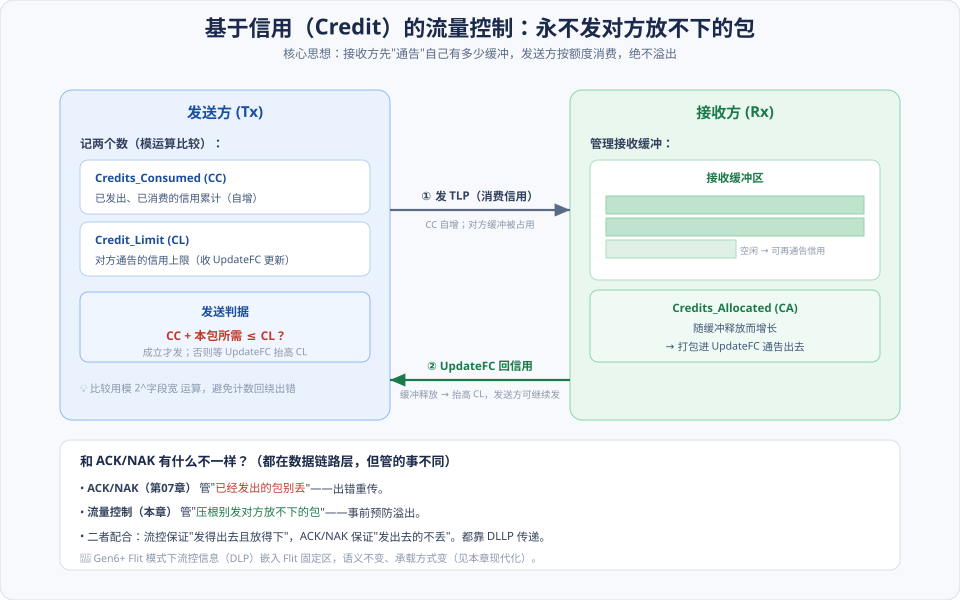
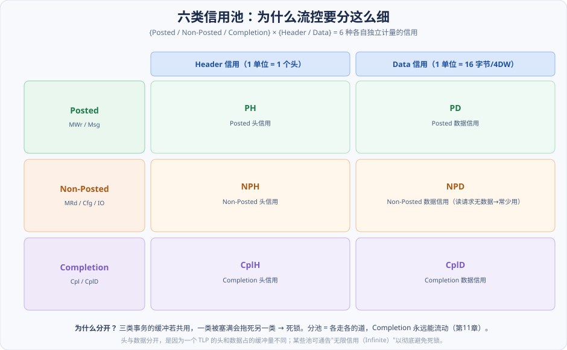
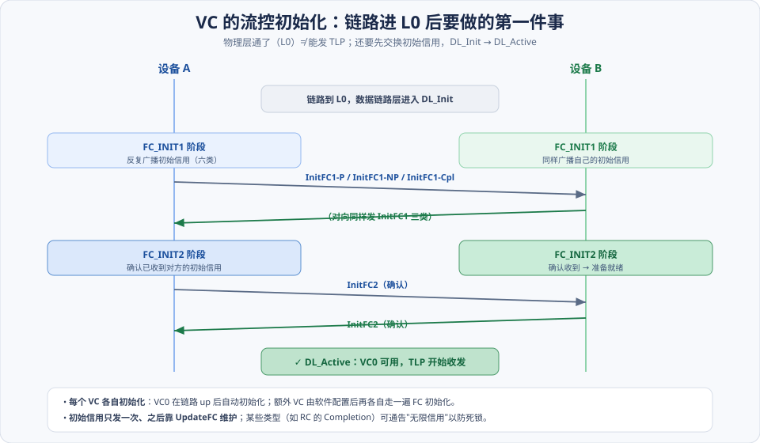
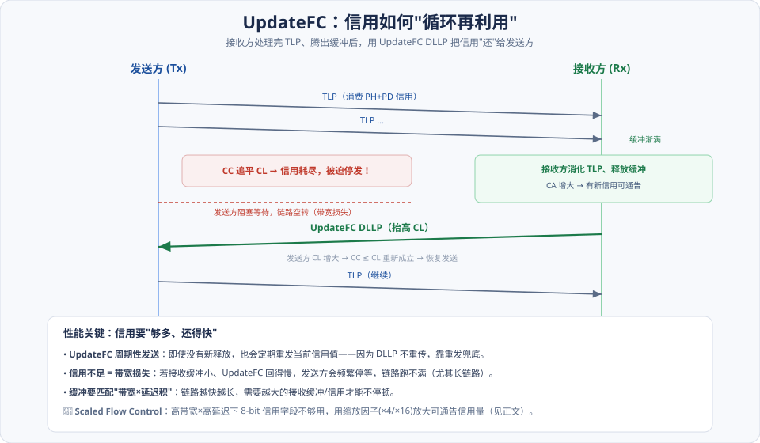

# 第09章　流量控制

> **导读**：上一章末尾我们说，链路训练到 L0 之后，数据链路层要先做"流控初始化"才能真正开始传 TLP。这一章就来讲清楚这件事——**流量控制（Flow Control）**。
>
> 它要解决一个朴素但致命的问题：**发送方发得太快，接收方缓冲塞满了，多出来的包怎么办？** 在很多总线里答案是"丢弃 + 重传"，但那样既浪费带宽又增加延迟。PCIe 选了一条更聪明的路——**基于信用（Credit）的流量控制**：接收方**事先告诉**发送方"我还有多少空位"，发送方**严格按额度**发，**从根上保证永远不会溢出**。这样一来，接收缓冲永不满溢，也就不需要因"满了"而丢包重传。
>
> 注意区分：[第07章](第07章-数据链路层与物理层.md) 的 ACK/NAK 管的是"**已经发出去的包别丢**"；本章的流控管的是"**压根别发对方放不下的包**"。二者都在数据链路层、都靠 DLLP 传递，配合起来才让链路既可靠又不溢出。
>
> **现代化补充**：**Scaled Flow Control**（Gen4/5 就在用的主线）；**Flit 模式下的流控** 作 Gen6+ 展望。本章按 [CLAUDE.md §5.1](../../CLAUDE.md) 八节骨架展开，配 4 张图。

---

## 术语表

| 英文 / 缩写 | 中文 | 一句话释义 |
|-------------|------|-----------|
| Credit | 信用 | 接收方通告的可用缓冲配额 |
| Credit-Based Flow Control | 基于信用的流控 | PCIe 采用：不发对方放不下的包 |
| CC, Credits_Consumed | 已消费信用 | 发送方累计已发出所消耗的信用 |
| CL, Credit_Limit | 信用上限 | 对方通告的信用总额（发送判据的上界） |
| CA, Credits_Allocated | 已分配信用 | 接收方随缓冲释放而增长、待通告的信用 |
| PH/PD · NPH/NPD · CplH/CplD | 六类信用池 | 三类事务 × 头/数据 的独立信用 |
| InitFC1 / InitFC2 | 初始化流控 DLLP | 链路建立后交换初始信用的握手 |
| UpdateFC | 更新流控 DLLP | 周期性通告已释放信用 |
| Infinite Credit | 无限信用 | 某类信用不设限的约定（防死锁） |
| Scaled Flow Control | 缩放流控 | 高带宽×高延迟下放大可通告信用量 |

---

## 核心概念：三个要点定调

**① 流控是"事前预约制"，不是"事后补救制"。** 想象一家餐厅：粗放的做法是"客人随便来，坐不下就赶走"（丢包重传）；PCIe 的做法是"进门前先看还有几个空位，够才让进"（信用）。**接收缓冲永不溢出**，是这套机制的立身之本。

**② 信用要分类管理，不能一锅烩。** PCIe 把信用分成**六类**（三种事务 × 头/数据）。为什么？因为如果三类事务共用一个缓冲池，一类被塞满就会拖死另一类——尤其会让 Completion 流不动，进而**死锁**（[第11章](第11章-总线的序.md)）。分池，就是给每类事务各修一条独立的道。

**③ 信用是"借出去、用完还、循环转"的。** 接收方一开始通告一批初始信用；发送方每发一个 TLP 就"消费"一点；接收方处理完、腾出缓冲后，用 **UpdateFC** 把信用"还"回去。整个系统就靠这个循环维持流动。**信用够不够多、还得够不够快**，直接决定链路能不能跑满带宽。

---

## 9.1 流量控制的基本原理

### 9.1.1 Rate-Based：为什么 PCIe 不用它

一种朴素的思路是 **Rate-Based（基于速率）**：发送方按一个固定或协商的速率限流。但它有个硬伤——**发送方并不知道接收方此刻缓冲的真实占用**。速率设保守了浪费带宽，设激进了照样溢出。它无法精确匹配接收方的实时能力，所以 PCIe 没采用它作为主机制。

### 9.1.2 Credit-Based：PCIe 的选择

PCIe 用的是 **Credit-Based（基于信用）**。核心就一句话：**接收方通告可用缓冲（信用），发送方消费信用，信用不够就不发。**

如上图，这套机制在发送方和接收方各维护几个计数器：

**发送方**记两个数：

- **CC（Credits_Consumed，已消费信用）**：每发一个 TLP 就按它占用的头/数据量自增。
- **CL（Credit_Limit，信用上限）**：对方通告给我的信用总额，收到 UpdateFC 就更新。

发送判据是一个简单的比较：

> **CC + 本包所需 ≤ CL**？成立才发；不成立就等对方发 UpdateFC 抬高 CL。

> ⚠️ 这个比较用**模 2^字段宽度**的运算实现——因为 CC/CL 是会回绕（wrap around）的有限位计数器，直接用普通大小比较会在回绕点出错。理解"模运算比较"是读懂流控实现的关键，也是初学者最容易忽略的细节。

**接收方**记一个数：

- **CA（Credits_Allocated，已分配信用）**：随着接收缓冲被处理、释放而增长，然后打包进 UpdateFC 通告出去。

---

## 9.2 Credit-Based 机制使用的算法

原书用 **N123 / N123+ / N23** 等命名，描述的是"信用计数与回收"的几种具体记账方案。抓住本质即可：它们都是在解决同一个问题——**如何用有限位宽的计数器，正确地追踪"发了多少、还了多少、还能发多少"，并在计数回绕时不出错**。

### 9.2.1 / 9.2.2 N123、N123+、N23 算法

这几种算法的区别在于**记录哪些量、在什么时机更新**（比如是否单独记录"已发送但未被确认释放"的中间量）。实现细节因厂商而异，但对使用者而言，只要理解"CC 追 CL、UpdateFC 抬 CL"这个主循环，就抓住了流控的行为。

### 9.2.3 缓冲管理：Header 与 Data 分开计量

一个容易忽略但很重要的点：**头信用和数据信用是分开的**。

- **1 个 Header 信用 = 1 个 TLP 头**。
- **1 个 Data 信用 = 16 字节（4 个 DWORD）** 的数据。

为什么分开？因为一个 TLP 的**头**（固定 12/16 字节）和**数据**（0 到几 KB 不等）占用的接收缓冲量完全不成比例。分开计量，接收方才能精确地按"头缓冲"和"数据缓冲"各自的实际占用来通告信用——一个只发小配置读的设备和一个狂发大 DMA 写的设备，对头/数据缓冲的压力截然不同。

---

## 9.3 PCIe 总线的流量控制

### 9.3.1 六类信用池

把"三类事务"和"头/数据"两个维度一交叉，就得到 PCIe 流控的**六类信用池**：

| | Header 信用 | Data 信用 |
|---|---|---|
| **Posted**（MWr/Msg） | PH | PD |
| **Non-Posted**（MRd/Cfg/IO） | NPH | NPD |
| **Completion**（Cpl/CplD） | CplH | CplD |

**为什么非要分六池？** 核心是**避免死锁**（[第11章](第11章-总线的序.md) 会正式讲）。设想如果三类共用一个池：大量 Posted 写把缓冲塞满 → Completion 因为没缓冲流不动 → 而前面的读又在等 Completion → 整条链路卡死。分池之后，**Completion 有自己的独立信用，永远能向前流动**，死锁的一个主要成因就被消除了。

> 💡 **无限信用（Infinite Credit）**：某些池可以通告"无限"信用——比如 Root Complex 对 Completion 常通告无限，意思是"你尽管把读完成发回来，我这边永远放得下"，从机制上彻底杜绝 Completion 被卡住。这是防死锁的一记"保险"。

### 9.3.2 Current 节点的 Credit：模运算比较

回到 §9.1.2 的发送判据。因为 CC 和 CL 都是会回绕的有限位计数器，判据实际是：**`(CC + 本包所需 − CL) mod 2^N ≤ 2^(N−1)`** 这类模运算形式（N 为字段位宽）。它保证在计数器回绕时依然能正确判断"还够不够信用"。加上"无限信用"的特殊约定，就构成了完整的信用记账逻辑。

### 9.3.3 VC 的初始化：FC_INIT1 / FC_INIT2

这就回到了本章开头、也是 [第08章](第08章-链路训练与电源管理.md) 末尾留下的钩子——**链路到了 L0，还要做流控初始化才能发 TLP**：

如上图，数据链路层进入 **DL_Init**（[第07章](第07章-数据链路层与物理层.md) 的状态）后，双方分两步交换初始信用：

- **FC_INIT1**：两端各自反复广播自己的**初始信用**——用 `InitFC1` DLLP，六类信用（准确说是三类事务各发 P/NP/Cpl 的初始头与数据信用）都要告诉对方。
- **FC_INIT2**：确认已收到对方的初始信用，用 `InitFC2` DLLP。

两步都完成，链路进入 **DL_Active**，VC0 可用，TLP 正式开始收发。

> 📌 **每个 VC 各自初始化**：VC0 在链路 up 后自动初始化；如果软件配置了额外的 VC（[第04章](第04章-PCIe总线概述.md) 的 QoS 场景），每个 VC 都要各自走一遍这个流控初始化。

### 9.3.4 PCIe 设备如何使用 FCP：UpdateFC 循环

初始信用发完只是开始。运行中，信用靠 **UpdateFC** DLLP **循环再利用**：

如上图的时间线：发送方连续发 TLP 消费信用 → CC 逐渐追平 CL → **信用耗尽、被迫停发**（链路空转、损失带宽）→ 接收方处理完 TLP、释放缓冲、CA 增大 → 发 **UpdateFC** 抬高发送方的 CL → `CC ≤ CL` 重新成立 → 恢复发送。

两个工程要点：

- **UpdateFC 周期性发送**：即使没有新释放的缓冲，也会定期重发当前信用值。因为 DLLP 不重传（[第07章](第07章-数据链路层与物理层.md)），靠周期性重发来兜底"万一某个 UpdateFC 丢了"。
- **信用不足 = 带宽损失**：如果接收缓冲太小、或 UpdateFC 回得太慢，发送方会频繁停等，链路跑不满。这在**长链路**（高延迟）上尤其明显。

---

## 9.4 小结

把流控的全貌收进一句话：

> **接收方先通告信用（初始 InitFC）→ 发送方按 `CC ≤ CL` 消费 → 接收方释放缓冲后用 UpdateFC 还信用 → 循环。信用分六类（三事务 × 头/数据）独立计量，以避免死锁；每个 VC 各自初始化。**

三句话记忆：

1. **信用是预约制**：接收方通告额度，发送方"CC + 本包 ≤ CL"才发——**从根上不溢出**，所以流控层面不需要因满而丢包。
2. **六池防死锁**：P/NP/Cpl × 头/数据 各走各道，Completion 永远能流动（呼应 [第11章](第11章-总线的序.md)）。
3. **UpdateFC 是命脉**：信用够多（缓冲够大）+ 还得够快（UpdateFC 及时），链路才跑得满——否则带宽白白损失。

下一章 [第10章](第10章-MSI和MSI-X中断.md) 我们换个话题，看 PCIe 里"中断"是怎么用一次特殊的存储器写（MSI/MSI-X）来实现的——你会发现它本质就是本章讲的 Posted 写事务的一个应用。

---

## 📘 SPEC 7.0 现代化对照

> 📘 **Scaled Flow Control（缩放流控）**：这是现代高速链路的一个关键补充。原始的信用字段位宽有限（头/数据信用各是几 bit）。在**高带宽 × 高延迟**的链路上，"带宽×延迟积"很大——需要非常多的在途数据才能填满管道，而有限位宽的信用字段**根本表达不了这么大的信用量**，结果链路被信用耗尽卡住、跑不满。Scaled Flow Control 引入**缩放因子（×1 / ×4 / ×16）**，让同样的字段能通告 4 倍或 16 倍的信用量，从而匹配现代链路的缓冲预算——在 Gen4/5 高速链路上就已是实打实的性能手段。它与 [第06章](第06章-事务层.md) 的大 MPS / 10-bit Tag 配套。

> 📘 **与在途请求扩展的协同**：更大的 MPS、更多的在途请求（10-bit Tag，[第06章](第06章-事务层.md)）意味着接收方要备更大的缓冲、通告更多的信用——Scaled FC 正是为此而生。三者是"一套组合拳"，共同把现代 PCIe 的有效带宽推上去（[第12章](第12章-PCIe应用.md) 会算这笔账）。

> 🔭 **Gen6/7 展望 · Flit 模式下的流控**：进入 Flit 模式后（[第06](第06章-事务层.md)/[07 章](第07章-数据链路层与物理层.md) 的展望），流控信息（DLP）不再单独成 DLLP，而是**嵌入 Flit 的固定区**随 Flit 传递。InitFC/UpdateFC 的**语义完全保留**（还是初始通告 + 周期更新），只是承载方式变了、初始化流程适配 Flit。机制思想不变，封装外壳升级。

---

## 常见误区 / FAQ

**Q1：流控和 ACK/NAK 都在数据链路层，到底谁管什么？**
**流控**管"**发之前**"——保证不发对方放不下的包（事前预防溢出）；**ACK/NAK**（[第07章](第07章-数据链路层与物理层.md)）管"**发之后**"——保证已发出的包不因误码而丢（事后重传）。一个防溢出、一个防丢失，互补。都用 DLLP 传递。

**Q2：既然有流控保证不溢出，为什么还会丢包需要 ACK/NAK？**
流控防的是"**缓冲满了放不下**"，但**传输途中的电气误码**它管不了——信号被干扰、LCRC 校验失败，这类丢包只能靠 ACK/NAK 重传。两者防的是完全不同的两种"丢"。

**Q3：为什么要分六类信用池，用一个大池不行吗？**
不行，会**死锁**。若共用一池，大量 Posted 写塞满缓冲后，Completion 就流不动，而前面的读又在等 Completion，链路卡死。分池让 Completion 有独立信用、永远能流动，是防死锁的核心设计（[第11章](第11章-总线的序.md)）。

**Q4：我的链路速率、宽度都对，为什么实测带宽跑不满？**
流控是常见嫌疑之一。检查：①接收方缓冲/信用是否足够（尤其长链路，"带宽×延迟积"大时需要更多信用）；②是否受在途请求数（Tag）限制（[第06章](第06章-事务层.md)）；③是否该开 Scaled Flow Control。当发送方频繁因"信用不足"停等，链路就会空转，带宽自然上不去。

**Q5：无限信用（Infinite Credit）是什么意思，会不会真的溢出？**
"无限"是一种约定：接收方声明某类信用不设上限，发送方就不再为这类做信用检查。它用于那些**接收方保证一定能吸收**的场景（如 RC 对 Completion），目的是从机制上杜绝该类被卡住而死锁。它建立在"接收方确实有能力持续消化"的前提上，并非无中生有。

**Q6：VC 初始化和链路训练（LTSSM）是一回事吗？**
不是，是**接力关系**。LTSSM（[第08章](第08章-链路训练与电源管理.md)）是**物理层**把链路带到 L0；VC 流控初始化（FC_INIT1/2）是**数据链路层**在 L0 之上交换初始信用、把链路带到 DL_Active。物理通了还不够，流控就绪了才能真正发 TLP。

---

## 与 SPEC 7.0 章节对照

| 本章主题 | Base Spec 7.0 章节（对照回查关键词） |
|----------|--------------------------------------|
| 流量控制总体 / Credit 机制 | Transaction Layer — Flow Control |
| 六类信用（P/NP/Cpl × H/D） | Flow Control — Credit Types |
| 信用记账 / 模运算比较 | Flow Control — Tracking / Gating |
| InitFC / FC 初始化 | Flow Control Initialization |
| UpdateFC | Flow Control — Update Flow Control DLLP |
| 无限信用 | Flow Control — Infinite Credits |
| Scaled Flow Control | Scaled Flow Control |
| Flit 模式流控（🔭 Gen6+ 展望） | Flit Mode — Flow Control |
| VC 与流控的关系 | Virtual Channel Mechanism |

> 说明：具体章节号以工程内 `NCB-PCI_Express_Base_7.0.pdf` 目录为准；上表给出定位关键词，便于回查原文。
