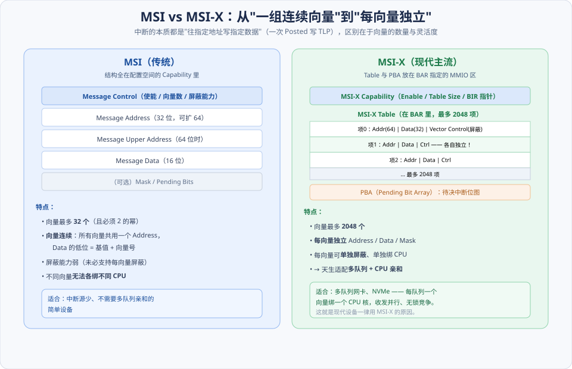
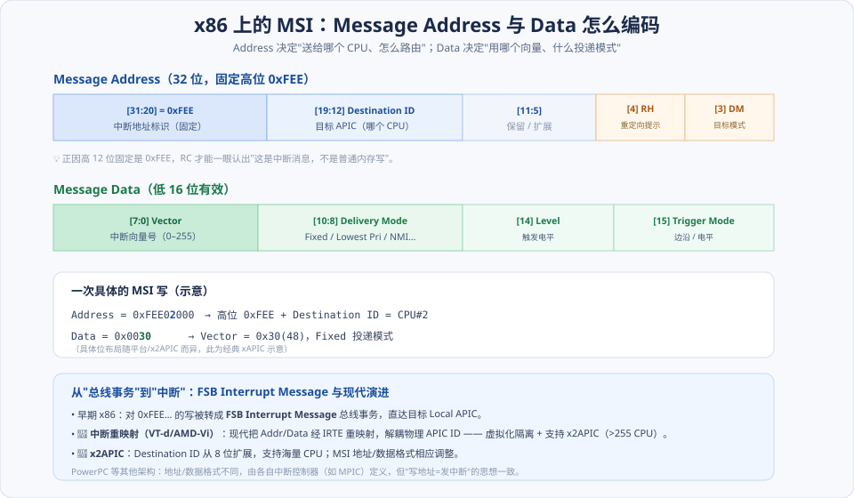
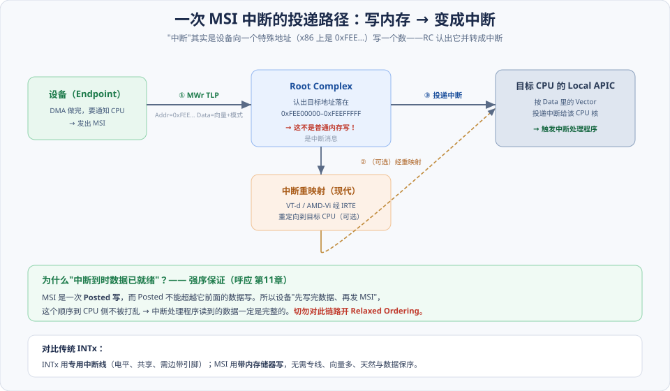

# 第10章　MSI 和 MSI-X 中断机制

> **导读**：设备干完活（比如网卡收到一个包、NVMe 读完一块数据），得有办法通知 CPU"来处理我"。这个"通知"就是**中断**。先亮出本章最关键的一句——**在 PCIe 里，"中断"本质上就是一次特殊的存储器写 TLP**：设备往一个约定好的地址写一个约定好的数，RC 认出"这是中断"，转成对目标 CPU 的中断。这就是 **MSI（Message Signaled Interrupt，消息信号中断）**。（这个"中断也是 Posted 写"的事实，也是下一章 [第11章](第11章-总线的序.md) 讲"序"时的关键前提。）
>
> 为什么要这么设计？回忆 [第01章](../第一篇-PCI体系结构/第01章-PCI总线基础.md) 的 PCI 中断：靠 `INTA#–INTD#` 四根**专用中断线**，电平触发、可共享。这套机制在 PCIe 的"端到端、少引脚"哲学（[第04章](第04章-PCIe总线概述.md)）下格格不入——既要额外引脚，又因共享而难以区分中断源、难以绑定 CPU。MSI 用一次带内的存储器写彻底取代了它：**无需专线、向量数量大、天然与数据保序、可精确绑核**。理解 MSI，是理解现代高性能 I/O（多队列网卡、NVMe）的前提。
>
> 本章讲两种 Capability 结构（MSI 与增强版 MSI-X），以及中断如何从"一次内存写"变成 CPU 上运行的处理程序。本章按 [CLAUDE.md §5.1](../../CLAUDE.md) 八节骨架展开，配 3 张图。

---

## 术语表

| 英文 / 缩写 | 中文 | 一句话释义 |
|-------------|------|-----------|
| MSI, Message Signaled Interrupt | 消息信号中断 | 用一次存储器写代替物理中断线 |
| MSI-X | MSI 扩展 | MSI 的增强版：更多向量、每向量独立配置 |
| MSI-X Table | MSI-X 表 | 放在 BAR 指定 MMIO 区的向量表（Addr/Data/Ctrl） |
| PBA, Pending Bit Array | 挂起位阵列 | 记录待决（被屏蔽期间发生）中断的位图 |
| Vector | 中断向量 | 一个具体中断入口编号（x86 上 0–255） |
| Message Address / Data | 消息地址 / 数据 | 决定投递目标 / 向量与模式的字段 |
| Local APIC | 本地 APIC | 每个 CPU 核上接收并投递中断的部件 |
| Interrupt Remapping | 中断重映射 | IOMMU 把 MSI 重定向到目标 CPU，隔离虚拟化 |
| IMS, Interrupt Message Store | 中断消息存储 | 设备私有中断存储，突破 MSI-X 上限 |

---

## 核心概念：三句话看懂 MSI

**① 中断 = 一次"写地址=发中断"的存储器写。** 这是最反直觉、也最关键的一点。设备并不拉一根线，而是发一个普通形态的 **MWr TLP**，只不过目标地址落在一个**特殊区间**（x86 上是 `0xFEE00000–0xFEEFFFFF`）。RC 一看地址就知道"这不是写内存，是中断消息"，于是转交给中断系统。**Address 决定送给哪个 CPU，Data 决定用哪个向量。**

**② MSI 和 MSI-X 是"同一思想的两代"。** 都基于"写地址发中断"，区别在于**向量的数量和灵活度**：MSI 最多 32 个、连续、共用一个地址、绑核能力弱；MSI-X 最多 2048 个、**每个向量独立配置地址/数据/屏蔽**，因而能把每个中断绑到不同 CPU 核——这正是多队列设备的命脉。

**③ 中断天然与数据保序，是白送的正确性。** 因为 MSI 是 Posted 写、而 Posted 不能超越前面的 Posted 写（[第11章](第11章-总线的序.md)），所以设备"先写完数据、再发 MSI"，CPU 收到中断时数据保证已就绪。这是把中断做成"存储器写"顺带得到的巨大好处。

---

## 10.1 MSI / MSI-X Capability 结构

两种机制都在设备的配置空间里以 Capability 形式存在（[第04章](第04章-PCIe总线概述.md) 的 Capabilities 链表），但组织方式差别很大：

### 10.1.1 MSI Capability 结构

MSI 的全部信息都塞在配置空间的 Capability 里（上图左）：

- **Message Control**（16 位）：使能位、`Multiple Message Capable`（设备支持几个向量，最多 32 且须为 2 的幂）、`Multiple Message Enable`（软件实际启用几个）、64 位地址能力、每向量屏蔽能力。
- **Message Address**（32 位，可扩展到 64 位加一个 Upper Address）：中断写的目标地址。
- **Message Data**（16 位）：中断写的数据。

MSI 的**局限**很明显：

- **向量最多 32 个**，且必须是 2 的幂。
- **向量连续**：所有向量**共用同一个 Address**，靠把 Data 的低几位设成"基值 + 向量号"来区分——这意味着**无法给不同向量指定不同的目标 CPU**。
- 屏蔽能力弱（每向量屏蔽是可选功能，未必支持）。

所以 MSI 适合中断源少、不需要多队列亲和的简单设备。

### 10.1.2 MSI-X Capability 结构

MSI-X 把向量信息**搬出了配置空间**，放进 BAR 指定的一段 MMIO 区（上图右）——这是它能容纳大量向量、且每个都灵活的关键：

- **MSI-X Capability**（配置空间里）只放：使能位、`Table Size`（向量数，最多 **2048**）、以及**两个指针**（`Table BIR/Offset` 和 `PBA BIR/Offset`，告诉软件表和位图在哪个 BAR 的什么偏移）。
- **MSI-X Table**（在 BAR 里）：最多 2048 个表项，**每项 = Message Address（64 位）+ Message Data（32 位）+ Vector Control（屏蔽位）**。关键在于——**每个向量的地址、数据、屏蔽都是独立的**。
- **PBA（Pending Bit Array）**：一个位图，记录"被屏蔽期间发生过、待处理"的中断，解屏蔽后据此补投递。

MSI-X 的**杀手锏**就是"每向量独立"：既然每个向量可以有自己的 Address，就能把**每个中断绑到不同的 CPU 核**。于是一块多队列网卡可以"每个收发队列一个向量、各绑一个核"，多核并行收发、互不加锁——这就是**现代设备一律用 MSI-X** 的根本原因。

---

## 10.2 PowerPC 处理器如何处理 MSI 中断请求

原书用 PowerPC 作为"非 x86"的对照。要点是：**"写地址=发中断"的思想是通用的，但地址/数据的具体格式由各架构的中断控制器定义。**

- **10.2.1 MSI 使用的寄存器**：PowerPC（如 MPC8641）的中断控制器 **MPIC** 提供一组寄存器，接收设备写来的 MSI 并转成对处理器的中断。
- **10.2.2 软件如何初始化设备的 MSI Capability**：系统软件为设备**分配中断向量**，把对应的 Message Address / Data **写进设备的 MSI Capability**，最后置使能位。此后设备发 MSI，就会被 MPIC 正确路由。

---

## 10.3 x86 处理器如何处理 MSI-X 中断请求

x86 是最主流的平台，它的 MSI 地址/数据格式值得看清楚——这也是排障时对着 `lspci` 能看懂的东西。

### 10.3.1 Message Address 与 Data 的格式

**Message Address**（上图上半）：

- **[31:20] = 0xFEE**（固定）：正是这个固定高位，让 RC 能一眼认出"这是中断消息，不是普通内存写"。
- **[19:12] Destination ID**：目标 APIC ID，即**投给哪个 CPU**。
- **[4] RH（Redirection Hint）、[3] DM（Destination Mode）**：控制路由方式（是否重定向、物理/逻辑寻址）。

**Message Data**（上图下半）：

- **[7:0] Vector**：中断向量号（x86 上 0–255）。
- **[10:8] Delivery Mode**：投递模式（Fixed 固定、Lowest Priority 最低优先、NMI…）。
- **[15] Trigger Mode / [14] Level**：触发方式。

一个具体例子：`Address = 0xFEE02000`（送 CPU#2）、`Data = 0x0030`（向量 0x30、Fixed 模式）——设备把这两个值写出去，CPU#2 就会在向量 0x30 上收到中断。

### 10.3.2 FSB Interrupt Message 总线事务

在早期 x86 上，对 `0xFEE…` 的写会被转成一个 **FSB（Front-Side Bus）Interrupt Message** 总线事务，直达目标 CPU 的 **Local APIC**，由它按 Data 里的向量投递中断给该核。整个投递路径见下图：

如图，完整链路是：**① 设备发 MWr TLP（Addr=0xFEE…, Data=向量+模式）→ ② RC 认出中断地址（现代还会经中断重映射）→ ③ 目标 CPU 的 Local APIC 按向量投递 → 触发中断处理程序**。而图下方再次强调了 [第11章](第11章-总线的序.md) 的强序保证——因为 MSI 是 Posted 写，"中断到达时数据已就绪"是白送的。

---

## 10.4 小结

一句话锁定 MSI 的本质：

> **中断 = 设备向特殊地址（x86 上 0xFEE…）写一个数的 Posted 写。Address 选 CPU、Data 选向量。MSI（≤32、连续、绑核弱）→ MSI-X（≤2048、每向量独立地址/数据/屏蔽、可精确绑核）。**

三句话记忆：

1. **写地址=发中断**：不是拉线，是发 MWr TLP；RC 靠固定高位 0xFEE 认出它。
2. **MSI-X 赢在"独立"**：每向量独立配置 → 多队列每队列一个向量绑一个核 → 现代设备标配。
3. **强序白送**：MSI 是 Posted 写，天然不越前面的数据写 → 中断到时数据已就绪（[第11章](第11章-总线的序.md)）。

演进主线：**INTx（专用线、共享）→ MSI（带内、少量向量）→ MSI-X（大量、每向量独立）→（现代）IMS（设备私有、海量）**。下一章 [第11章](第11章-总线的序.md) 会系统讲事务之间的"序"——本章反复引用的"Posted 写不越 Posted 写"正是它的核心规则；之后 [第12章](第12章-PCIe应用.md) 再用一块示例卡把 DMA + MSI 的完整流程走一遍，让本章的中断落到实处。

---

## 📘 SPEC 7.0 现代化对照

> 📘 **中断重映射（Interrupt Remapping）**：现代 x86（Intel VT-d / AMD-Vi）把 MSI 的 Address/Data **经 IRTE（Interrupt Remapping Table Entry）重映射**再投递（见投递路径图的中间环节）。它带来两个关键能力：①**解耦物理 APIC ID**——虚拟机看到的中断被安全地重定向到宿主的真实 CPU，是**虚拟化中断隔离**的基础（[第13章](第13章-虚拟化技术.md)）；②支持 **x2APIC**——Destination ID 从 8 位扩展，才能寻址超过 255 个 CPU 的大系统。没有中断重映射，一个恶意/故障设备可以伪造 MSI 打到任意 CPU，是严重的安全隐患。

> 📘 **IMS（Interrupt Message Store）**：MSI-X 上限 2048 个向量，在**海量虚拟设备**场景（一块 DPU/GPU 要服务成千上万个虚拟队列）还是不够。IMS 让设备用**自己私有的存储**保存中断消息，突破 2048 的限制，是 **Scalable IOV**（[第13章](第13章-虚拟化技术.md)）的配套机制。

> 📘 **MSI-X 仍是绝对主流**：不要被新概念带偏——今天绝大多数高性能设备（网卡、NVMe）的中断骨干仍是 MSI-X，"每队列一向量 + CPU 亲和"是性能与可扩展性的关键。IMS 是 MSI-X 的补充而非替代。

> 📘 **与 IOMMU/PASID 的分工**：一个设备的两条"控制路径"是分开隔离的——**DMA 走地址翻译（IOMMU/ATS）**，**中断走中断重映射**。理解这个分工，才能看懂现代虚拟化下设备直通的完整安全模型（[第13章](第13章-虚拟化技术.md)）。

---

## 常见误区 / FAQ

**Q1：MSI 既然是"内存写"，会不会真的改写了那块内存？**
不会。`0xFEE00000–0xFEEFFFFF` 是**保留给中断的地址区间**，不对应真实 DRAM。RC/中断系统会拦截对这个区间的写，解释成中断消息而非内存访问。所以它是"长得像内存写、实为中断"的特殊事务。

**Q2：为什么现代设备都用 MSI-X 而不是 MSI？**
核心是**多队列 + CPU 亲和**。MSI 所有向量共用一个地址，无法把不同中断绑到不同 CPU；MSI-X 每向量独立地址，能做到"每个收发队列一个向量、各绑一个核"，多核并行处理、避免锁竞争。对多队列网卡/NVMe，这是性能刚需。此外 MSI-X 向量多（2048 vs 32）、屏蔽更灵活。

**Q3：MSI-X Table 放在 BAR 里，会和设备的其他寄存器冲突吗？**
不会，因为 MSI-X Capability 里的 `BIR/Offset` 指针明确指定了 Table 和 PBA 在**哪个 BAR 的什么偏移**。规范建议（某些情况要求）把 MSI-X 结构放在专用的 BAR 区域或对齐页，避免与功能寄存器混叠。软件按指针去访问即可。

**Q4：PBA（Pending Bit Array）是干什么的？**
记录"被屏蔽期间发生的中断"。如果某个向量当前被屏蔽（Vector Control 的 mask 位置 1），此时又来了中断，硬件不能丢，就在 PBA 里对应位置 1 标记"有待决中断"。软件解屏蔽后，检查 PBA 就知道要补投递哪些中断。

**Q5：中断为什么能保证"数据先到、中断后到"？需要我做什么吗？**
不需要你做什么——这是 [第11章](第11章-总线的序.md) 排序规则白送的。MSI 是 Posted 写，Posted 不能越过前面的 Posted 数据写，所以设备"先写数据、再发 MSI"的顺序到 CPU 不被打乱。**你唯一要做的是别破坏它**：绝不能对数据写或 MSI 写开 Relaxed Ordering，否则会出现"中断到了、数据没到"的竞态。

**Q6：Linux 里怎么申请 MSI-X？**
现代内核用统一接口 `pci_alloc_irq_vectors(dev, min, max, PCI_IRQ_MSIX | PCI_IRQ_MSI | PCI_IRQ_INTX)`，它会自动优先选 MSI-X、退而求其次 MSI、再不行 INTx，然后用 `pci_irq_vector()` 取每个向量、`request_irq()` 注册处理函数。细节见 [第15章](../第三篇-Linux与PCI/第15章-Linux-PCI中断处理.md)。

---

## 与 SPEC 7.0 章节对照

| 本章主题 | Base Spec 7.0 章节 / 相关规范 |
|----------|-------------------------------|
| MSI Capability 结构 | MSI Capability Structure |
| MSI-X Capability / Table / PBA | MSI-X Capability Structure |
| 消息地址 / 数据格式 | Message Address / Message Data（架构相关） |
| INTx 模拟消息 | Message Signaled Interrupts / INTx Emulation |
| 中断与排序 | Transaction Ordering（[第11章](第11章-总线的序.md)） |
| 中断重映射 | Intel VT-d / AMD-Vi 规范（Interrupt Remapping） |
| IMS / Scalable IOV | Intel Scalable IOV 规范 |

> 说明：MSI/MSI-X 结构定义在 Base Spec；消息地址/数据的具体位布局与中断重映射属于**架构相关规范**（x86 SDM、VT-d 等）。具体章节以工程内 `NCB-PCI_Express_Base_7.0.pdf` 及相应架构手册为准。
