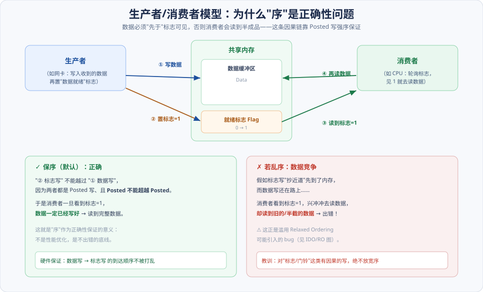
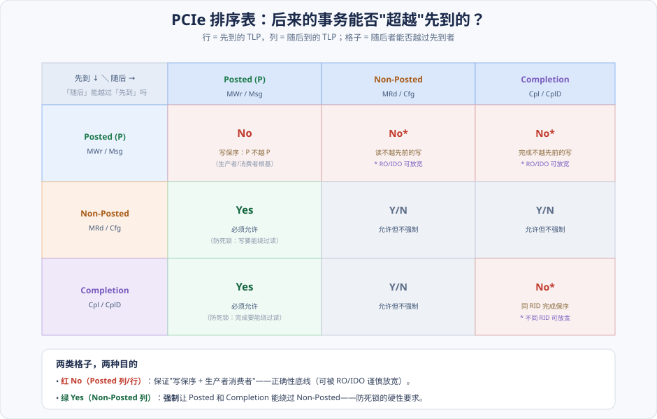
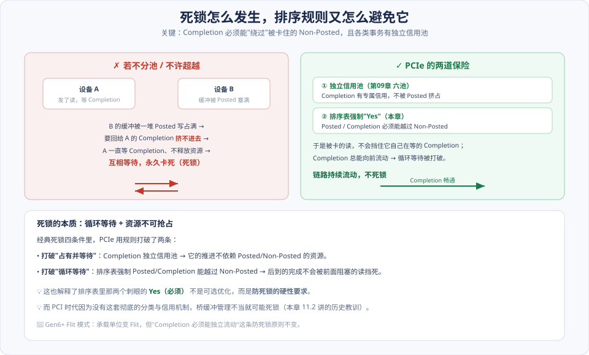
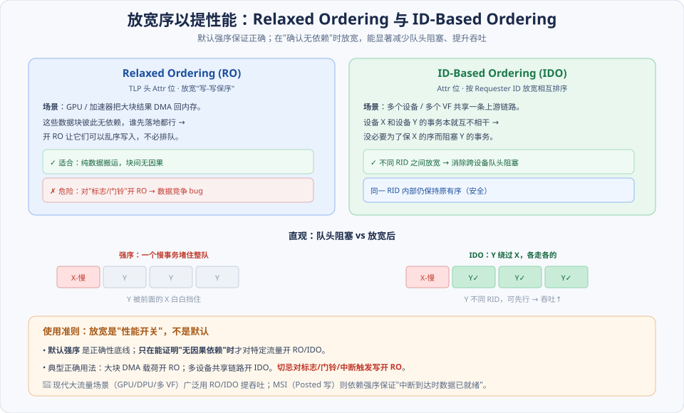

# 第11章　PCI/PCIe 总线的序（Ordering）

> **导读**：这是第Ⅱ篇里"难而重要"的一章，也是一次**总收口**——前面反复埋的伏笔（[第06章](第06章-事务层.md) 的 Posted/Non-Posted 三分类、[第09章](第09章-流量控制.md) 的六信用池防死锁、[第03章](../第一篇-PCI体系结构/第03章-PCI数据交换.md) 的 RO/NS 属性），全都在这一章汇合。
>
> "序"到底在管什么？一句话：**当多个事务在链路和桥里流动时，它们的相对先后要遵守什么规则。** 这件事同时关乎三个层面，缺一不可：
>
> - **正确性**：生产者/消费者模型要求"数据必须先于标志可见"，否则消费者读到半成品——这是 bug，不是性能问题。
> - **无死锁**：如果排序规则设计得不好，事务会互相等待、永久卡死。
> - **性能**：在保证前两者的前提下，还要留出放宽的空间（Relaxed / ID-Based Ordering）来提吞吐。
>
> 看懂本章，你才算真正理解**为什么 [第06章](第06章-事务层.md) 要如此强调 Posted / Non-Posted 的区分**——那个区分正是整套排序规则的地基。本章按 [CLAUDE.md §5.1](../../CLAUDE.md) 八节骨架展开，配 4 张图。

---

## 术语表

| 英文 / 缩写 | 中文 | 一句话释义 |
|-------------|------|-----------|
| Ordering | 序 | 多个事务在链路 / 桥中的相对先后规则 |
| Producer/Consumer | 生产者/消费者模型 | 数据写 → 标志写 → 消费读 的因果链 |
| Ordering Table | 排序表 | P/NP/Cpl 相互能否超越的规则矩阵 |
| Strong Ordering | 强序 | 默认：Posted 之间保持发出顺序 |
| Pass | 超越 | 后到的事务越过先到的事务先被处理 |
| RO, Relaxed Ordering | 松弛排序 | 放宽写-写保序以提吞吐（Attr 位） |
| IDO, ID-Based Ordering | 基于 ID 的排序 | 不同 Requester ID 之间放宽排序 |
| Deadlock | 死锁 | 事务相互等待且无法推进 |
| Head-of-Line Blocking | 队头阻塞 | 队首慢事务拖住后面所有事务 |

---

## 核心概念：三句话把"序"讲透

**① 序首先是正确性，其次才是性能。** 很多人以为排序只是性能调优，其实它的第一使命是**保证生产者/消费者模型不出错**。如果"数据写"和"标志写"的顺序被打乱，消费者会读到没写完的数据——这是实打实的数据损坏。所以默认必须**强序**。

**② Posted / Non-Posted 的区分，就是为了序。** 回忆 [第06章](第06章-事务层.md)：Posted（写）"发了就走"、Non-Posted（读）"要等回信"、Completion 是"回执"。排序规则正是按这三类分别定义的——**因为它们对顺序的要求根本不同**：写必须保序（正确性），而完成必须能绕过被卡的读（防死锁）。

**③ 死锁不是"可能发生"，是"设计时必须主动排除"。** PCIe 的排序表里有几个"必须 Yes"的格子，它们不是性能优化，而是**防死锁的硬性要求**——强制让某些事务能超越另一些，打破循环等待。理解这几个"Yes"为什么必须，就理解了排序表的另一半。

---

## 11.1 生产/消费者模型

### 11.1.1 工作原理：为什么"数据必先于标志"

生产者/消费者是并发系统里最基本的协作模式，PCIe 里随处可见（网卡收包写内存、DMA 引擎搬数据…）：

如上图，流程是：**① 生产者写数据 → ② 生产者置"就绪"标志 → ③ 消费者轮询到标志=1 → ④ 消费者去读数据**。

这里的**因果链是致命的**：消费者是看到标志=1 才去读数据的。所以**必须保证"数据写"在"标志写"之前真正落地**。否则——如上图右侧——万一标志写"抄近道"先到了内存，而数据写还在路上，消费者看到标志就去读，读到的是旧的或半截的数据。**这不是慢，是错。**

### 11.1.2 在 PCI/PCIe 中如何实现

PCIe 怎么保证这条因果链？靠 **Posted 写的强序**：数据写和标志写都是 Posted 写（MWr），而排序规则规定 **Posted 不能超越 Posted**（§11.4）。于是两个写严格按发出顺序到达，消费者一旦看到标志，数据必已就绪。

> 💡 这就是"序"作为**正确性保证**的完整含义——它把程序员脑子里"先写数据、再置标志"的意图，落实成了硬件层面不可打乱的顺序。

---

## 11.2 PCI 总线的死锁

原书先从 PCI 讲死锁，是因为 PCI 时代的桥缓冲管理如果设计不当，**真的会死锁**——这是 PCIe 后来用"分类 + 独立信用池"彻底解决的历史教训。

- **11.2.1 缓冲管理引发的死锁**：桥的缓冲被一类事务占满，另一类事务（尤其是要回程的完成/应答）挤不进去，双方互等。
- **11.2.2 数据传送序引发的死锁**：桥两侧的事务因为排序约束互相阻塞，谁也推进不了。

这些场景的共同点是：**某个必须向前流动的事务（比如回执），被它并不依赖的其他事务挡住了。** 记住这个"病根"，下面看 PCIe 怎么根治它。

---

## 11.3 PCI 总线的序

PCI 定义了一套排序规则，PCIe 基本继承并系统化。核心几条：

- **11.3.1 通用规则**：Posted 写之间保序；Posted 不应被 Non-Posted 无限期阻塞。
- **11.3.2 Delayed 事务规则**：PCI 用 Delayed 处理 Non-Posted 读（[第01章](../第一篇-PCI体系结构/第01章-PCI总线基础.md)），有其专门的排序约束。
- **11.3.3 通过 PCI 桥的顺序**：事务穿过桥时如何保持/放宽顺序。
- **11.3.4 LOCK / Delayed / Posted 之间的关系**：带锁事务的特殊排序（现代 PCIe 已弱化 LOCK 的使用）。

这些规则在 PCIe 里被提炼成了一张清晰的排序表——我们直接看 PCIe 的版本。

---

## 11.4 PCIe 总线的序

### 11.4.1 排序表：后来的能否超越先到的

PCIe 把所有排序规则浓缩成一张表。理解它的读法是关键：**行 = 先到的 TLP，列 = 随后到的 TLP，格子回答"随后者能否越过先到者"**：

表里的格子分两类目的，看懂这两类就看懂了全表：

**🔴 红色 No（Posted 相关）—— 保正确性：**

- **Posted 不能越 Posted**（P 行 P 列 = No）：写保序，这是生产者/消费者模型的地基（§11.1）。
- **Non-Posted / Completion 不能越先前的 Posted**（No*）：保证"读请求"和"读完成"都不会跑到"先前的写"前面——同样服务于生产者/消费者。这两个带星号，**可被 RO/IDO 谨慎放宽**。

**🟢 绿色 Yes（Non-Posted 列，必须）—— 防死锁：**

- **Posted 必须能越 Non-Posted**（Yes）。
- **Completion 必须能越 Non-Posted**（Yes）。

这两个"必须 Yes"是**硬性要求**：因为如果 Completion 被前面一个卡住的 Non-Posted 读挡住，而那个读又在等这个 Completion，就会死锁（§11.4 后详解）。强制让完成能绕过读，循环等待就被打破。

> 💡 **一句话记忆整张表**：**"Posted 保序（红 No）、完成必须能绕过读（绿 Yes）、其余放宽靠 RO/IDO（Y/N）"**。

### 11.4.2 排序规则如何避免死锁

把 §11.2 的病根和排序表合起来看，就明白 PCIe 是怎么根治死锁的：

如上图左侧，**死锁的典型剧本**：设备 A 发了读、在等 Completion；设备 B 的缓冲被一堆 Posted 写塞满，导致要回给 A 的 Completion 挤不进去；A 拿不到 Completion 就一直占着资源不放……循环等待，永久卡死。

PCIe 用**两道保险**打破它（上图右侧）：

1. **独立信用池**（[第09章](第09章-流量控制.md) 的六池）：Completion 有**专属信用**，不会被 Posted 挤占——打破了"占有并等待"。
2. **排序表强制 Yes**（本章）：Posted / Completion **必须能越过** Non-Posted——打破了"循环等待"。

于是，被卡住的读永远不会挡死它自己在等的 Completion，链路持续流动。**这正是排序表里那两个"必须 Yes"的深层原因——它们不是优化，是防死锁的结构性设计。**

### 11.4.3 MSI 报文的序

这里有一个绝妙的应用，把本章和 [第10章](第10章-MSI和MSI-X中断.md) 串起来：**MSI 中断本质是一次 Posted 写**。

设备做完 DMA 写、要发中断通知 CPU"数据好了"，这个 MSI 就是一次 MWr。由于 **Posted 不能越 Posted**，MSI 写不会超越它前面的数据写。于是 **CPU 收到中断时，DMA 数据保证已经落地**——中断处理程序可以放心读数据。这正是生产者/消费者模型的又一实例，只不过"标志"换成了"中断"。

> ⚠️ 反过来说，这也是为什么**绝不能对 MSI 写或它前面的数据写滥用 Relaxed Ordering**——一旦放宽，就可能出现"中断到了、数据还没到"的竞态。

---

## 11.5 小结

把"序"的三个层面收进一张记忆卡：

> **正确性**：Posted 保序（P 不越 P）→ 支撑生产者/消费者（数据先于标志/中断可见）。
> **防死锁**：Completion 必须能越 Non-Posted + 独立信用池 → 打破循环等待。
> **性能**：默认强序，仅在"确认无依赖"时用 RO/IDO 放宽。

三句话记忆：

1. **一张表两类格**：红 No 保正确（写保序）、绿 Yes 防死锁（完成绕过读）、Y/N 留放宽空间。
2. **死锁靠两保险**：六信用池（[第09章](第09章-流量控制.md)）+ 排序强制 Yes，让 Completion 永远能流动。
3. **MSI 借强序**：中断是 Posted 写，天然不越数据写 → "中断到时数据已就绪"。

至此第Ⅱ篇的核心机制（事务层→链路层→物理层→训练→流控→中断→序）已成体系。下一章 [第12章](第12章-PCIe应用.md) 把它们**合龙**——用一块示例卡走通"硬件→TLP→驱动→带宽延时"的完整链路，是一次实战总演练。

---

## 📘 SPEC 7.0 现代化对照

放宽序（RO/IDO）在现代高带宽场景里是**日常操作**，值得单独展开：

> 📘 **Relaxed Ordering（RO）实战**：GPU / 加速器把大块计算结果 DMA 回内存时，这些数据块**彼此无因果依赖**，谁先落地都行。开 RO 让它们可以乱序写入、不必排队，显著提升吞吐。**但代价是必须小心**：如上图，对"标志 / 门铃 / 中断触发写"这类有因果的写**绝不能开 RO**，否则就是 §11.1 讲的数据竞争 bug。RO 是"确认无依赖"时才用的性能开关。

> 📘 **ID-Based Ordering（IDO）**：多个设备 / 多个 VF（[第13章](第13章-虚拟化技术.md)）共享一条上游链路时，不同 **Requester ID** 的事务本就互不相干，没必要为了保设备 X 的序而阻塞设备 Y。IDO 允许**不同 RID 之间放宽排序**，消除跨设备的**队头阻塞**（上图对比），而同一 RID 内部仍保持原有序（安全）。在多 VF 直通的云场景收益尤其明显。

> 📘 **原子操作的排序**：AtomicOp（[第06章](第06章-事务层.md)）作为 Non-Posted，相对 Posted / Non-Posted 有其特定的排序约束，需按规范单独查阅——核心仍是"不破坏生产者/消费者、不引入死锁"。

> 🔭 **Gen6/7 展望 · Flit 模式下的序**：进入 Flit 模式后（[第06](第06章-事务层.md)/[07 章](第07章-数据链路层与物理层.md) 的展望），**排序规则的语义完全保持一致**——排序表、生产者/消费者、防死锁原则一个都没变。变的只是承载单位（Flit）和实现层的重放/调度粒度。机制思想不变，封装外壳升级。

---

## 常见误区 / FAQ

**Q1：排序表怎么读？总是记混行和列。**
记住一句话：**行是"先到的"，列是"随后到的"，格子回答"随后者能不能越过先到者"**。比如 P 行 NP 列 = Yes，意思是"一个随后到的 Non-Posted……"——等等，方向别搞反：更稳妥的记法是直接记结论——**Posted 之间不能乱序（No）；Posted/Completion 必须能绕过 Non-Posted（Yes）；带 Posted 的那几个 No 可被 RO 放宽**。

**Q2：为什么偏偏要求"Completion 能越过 Non-Posted"？**
防死锁。设想设备发了很多读（Non-Posted），它们排在队列里等 Completion；如果 Completion 不能越过这些还没完成的读，就会出现"读在等完成、完成被读挡住"的循环等待。强制让 Completion 能绕过 Non-Posted，这个环就断了。

**Q3：Relaxed Ordering 能提性能，为什么不默认全开？**
因为它会破坏生产者/消费者的正确性。默认强序是**正确性底线**，RO 只能用在"能证明无因果依赖"的流量上（如纯数据 DMA 载荷）。对标志、门铃、中断触发写开 RO，会导致"标志先于数据可见"的数据竞争——这类 bug 极难复现和定位。

**Q4：MSI 中断为什么能保证"中断到时数据已就绪"？**
因为 MSI 就是一次 **Posted 写**，而 Posted 不能越过它前面的 Posted 数据写。所以设备"先写完数据、再发 MSI"，到 CPU 侧这个顺序不会被打乱，中断处理程序读到的一定是完整数据。这是排序规则最实用的一个保证。

**Q5：IDO 和 RO 有什么区别？**
**RO** 放宽的是"写-写之间的顺序"（不管谁发的）；**IDO** 放宽的是"**不同 Requester ID 之间**的顺序"（同一 RID 内部仍保序）。RO 针对"数据块无依赖"，IDO 针对"不同设备互不相干"。二者可以配合使用，也各自解决不同的队头阻塞。

**Q6：这些排序规则在软件里需要我手动处理吗？**
大部分不需要——硬件按排序表自动保证。软件层面你需要关心的是：①**别乱开 RO/IDO**（默认不开最安全）；②在需要"确保写生效"的地方用**读回（read-back）作栅栏**（[第06章](第06章-事务层.md) FAQ）；③理解 MSI 的强序保证，从而知道中断处理里数据是可信的。

---

## 与 SPEC 7.0 章节对照

| 本章主题 | Base Spec 7.0 章节（对照回查关键词） |
|----------|--------------------------------------|
| 事务排序总体 / 排序表 | Transaction Ordering — Transaction Ordering Rules |
| 生产者/消费者模型 | Transaction Ordering — Producer/Consumer |
| 死锁避免 | Transaction Ordering — Deadlock Avoidance |
| Relaxed Ordering | Transaction Ordering — Relaxed Ordering |
| ID-Based Ordering | Transaction Ordering — IDO |
| MSI 与排序 | Transaction Ordering / MSI（Message Signaled Interrupts） |
| 原子操作排序 | Atomic Operations — Ordering |
| Flit 模式排序（🔭 Gen6+ 展望） | Flit Mode — Ordering |

> 说明：具体章节号以工程内 `NCB-PCI_Express_Base_7.0.pdf` 目录为准；上表给出定位关键词，便于回查原文。
