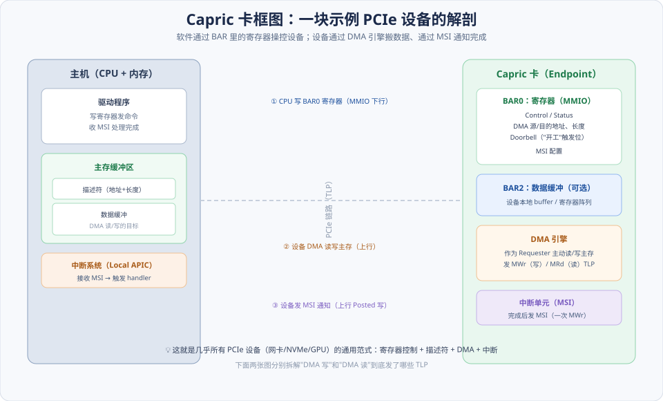
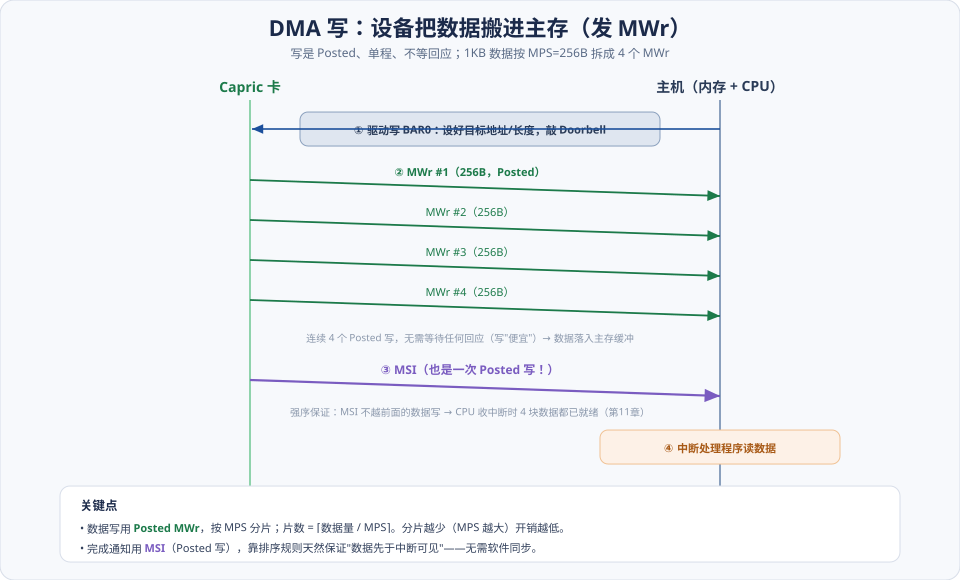
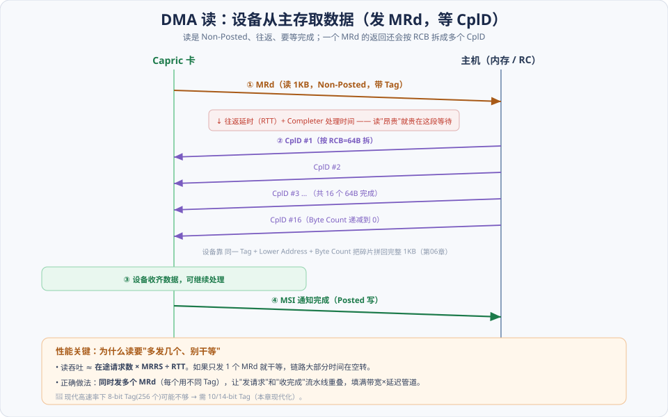
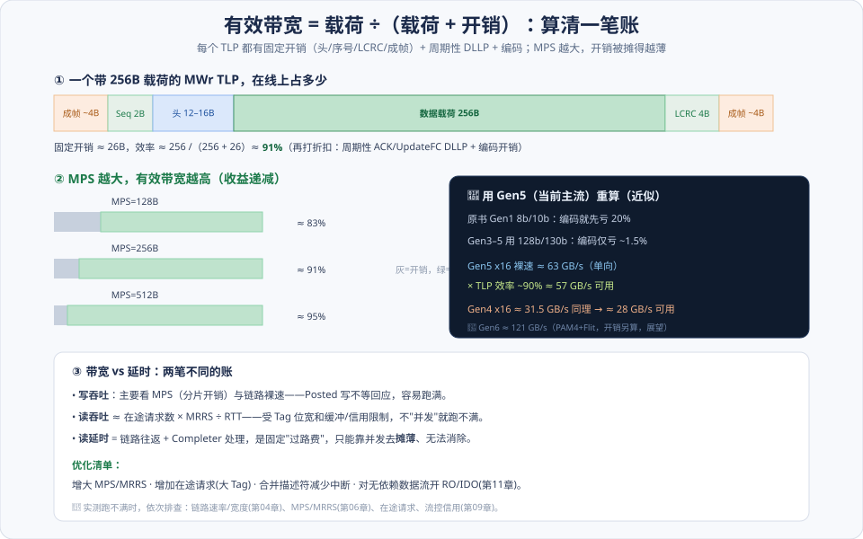

# 第12章　PCIe 总线的应用

> **导读**：前十一章我们把 PCIe 拆成一层一层来讲——事务层的 TLP（[第06章](第06章-事务层.md)）、数据链路层的 ACK/NAK（[第07章](第07章-数据链路层与物理层.md)）、链路训练与电源（[第08章](第08章-链路训练与电源管理.md)）、流量控制（[第09章](第09章-流量控制.md)）、中断（[第10章](第10章-MSI和MSI-X中断.md)）、序（[第11章](第11章-总线的序.md)）。这些知识像零件一样散落各处；这一章负责**合龙**——把它们装进一块能跑的设备里。
>
> 原书的做法很聪明：虚构一块示例卡 **Capric 卡**，从它的硬件框图讲起，一路走到"设备发了哪些 TLP、驱动怎么写、带宽和延时怎么算"。这块卡没有任何花哨功能，恰恰因此，它暴露出的正是**几乎所有 PCIe 设备（网卡、NVMe、GPU）的通用范式**：`寄存器控制 + 描述符 + DMA + 中断`。看懂 Capric 卡，就看懂了一大类真实设备的骨架。
>
> **现代化补充**：原书成书于 Gen1/2，带宽账是按 8b/10b（编码先亏 20%）算的。本章用当代主流速率（**Gen4/5**）重算带宽与延时的数量级，并说明为什么高速率下 **10-bit Tag**（[第06章](第06章-事务层.md)）成了跑满读吞吐的前提。本章按 [CLAUDE.md §5.1](../../CLAUDE.md) 八节骨架展开，配 4 张图。

---

## 术语表

| 英文 / 缩写 | 中文 | 一句话释义 |
|-------------|------|-----------|
| Capric | Capric 卡 | 原书用于贯穿讲解的虚拟示例 PCIe 设备 |
| DMA Engine | DMA 引擎 | 设备内主动搬运数据的逻辑，作为 Requester 读写主存 |
| Descriptor | 描述符 | 描述一次 DMA 的地址/长度等的内存结构 |
| Doorbell | 门铃寄存器 | 驱动写它触发设备"开工"的寄存器位 |
| Effective Bandwidth | 有效带宽 | 载荷 ÷（载荷 + 开销），与 MPS 正相关 |
| Outstanding Requests | 在途请求数 | 未完成的 Non-Posted 请求个数（受 Tag 数限制） |
| RTT, Round-Trip Time | 往返延时 | 请求发出到完成返回的时间 |
| Coherent / Streaming DMA | 一致性/流式映射 | 内核 DMA 映射的两种模型 |
| Top / Bottom Half | 中断上/下半部 | 中断处理的即时部分与延后部分 |
| IOVA, I/O Virtual Address | I/O 虚拟地址 | IOMMU 下设备看到的虚拟 DMA 地址 |

---

## 核心概念：一块 PCIe 设备只做三件事

不管设备叫网卡、NVMe 还是 GPU，站在 PCIe 的角度，它和主机的全部交互可以归成**三条通道**，方向和"谁主动"各不相同：

**① 下行控制：CPU 写设备寄存器（MMIO）。** 驱动要让设备干活，靠的是往设备 BAR 空间里的寄存器写值——"数据地址在哪、长度多少、现在开工"。这是 CPU 主动、设备被动，走的是**下行**的存储器写。设备的寄存器是一张"控制面板"，`Doorbell`（门铃）是上面那个"启动"按钮。

**② 上行搬运：设备 DMA 读写主存。** 真正的大数据量搬运**绝不**由 CPU 一个字一个字地搬（那叫 PIO，慢且占满 CPU），而是设备自己充当 **Requester**，发 `MWr`/`MRd` TLP 直接读写主存。这是设备主动、走**上行**。这条通道是性能的主战场——本章的带宽/延时账全算在这里。

**③ 上行通知：设备发 MSI 报告完成。** 设备干完活，发一次 MSI（本质是一次 Posted 存储器写，[第10章](第10章-MSI和MSI-X中断.md)）通知 CPU"来收货"。因为 MSI 是 Posted 写、不越前面的数据写（[第11章](第11章-总线的序.md)），所以"中断到达时数据已就绪"是白送的正确性。

把这三条通道记牢，下面每一节都是它们的展开。**一句话：CPU 用寄存器发号施令，设备用 DMA 干活，用中断交差。**

---

## 12.1 Capric 卡的工作原理

先看这块卡长什么样、软硬件怎么分工：



如图，Capric 卡内部就三块：一段**寄存器 BAR（BAR0）**、（可选的）**数据缓冲 BAR（BAR2）**、以及**DMA 引擎 + 中断单元**。主机侧则是驱动、主存缓冲区（放描述符和数据）、中断系统。三条通道（图中标 ①②③）正是上面「核心概念」的三件事。

### 12.1.1 BAR 空间：寄存器 BAR + 数据缓冲 BAR

设备通过 **BAR（Base Address Register，基地址寄存器）**（[第02章](../第一篇-PCI体系结构/第02章-PCI桥与配置.md) 讲过其探测机制）向系统申请一段地址窗口，被映射进 CPU 的物理地址空间后即为 **MMIO**：

- **BAR0——寄存器空间**：设备的"控制面板"。里面是一组功能寄存器：`Control/Status`（启停、状态）、`DMA 源/目的地址`、`长度`、`Doorbell`（触发位）、`MSI 配置`。驱动读写这些寄存器就是在操控设备。它通常**不可预取（Non-Prefetchable）**——因为读寄存器可能有副作用（读清、状态自增），不能被桥随意预读或合并。
- **BAR2——数据缓冲空间（可选）**：一段设备本地 buffer 或寄存器阵列，可预取。很多真实设备（如带板载内存的 GPU）会有；纯 DMA 搬运的设备则未必需要。

### 12.1.2 Capric 卡的初始化

设备上电后并不能立刻干活，驱动要按顺序把它"叫醒"配好（细节在 12.3 的驱动视角再讲一遍）：

1. **使能 Memory Space**：置 Command 寄存器的 `Memory Space Enable`，BAR 才响应 MMIO 访问；置 `Bus Master Enable`，设备才被允许发起 DMA（作 Requester）。**忘了置 Bus Master，DMA 会被静默丢弃**——这是驱动最经典的坑之一。
2. **协商 MPS / MRRS**：读设备与链路路径上各节点的 `Max_Payload_Size` 能力，取最小值写入 `Device Control`（[第06章](第06章-事务层.md)）；设置 `Max_Read_Request_Size` 决定单个读请求最大能要多少数据。这两个值直接决定后面的带宽账。
3. **配置 MSI/MSI-X**：分配中断向量，把 Message Address/Data 写进设备的中断 Capability（[第10章](第10章-MSI和MSI-X中断.md)）。

### 12.1.3 / 12.1.4　DMA 写与 DMA 读：设备作为 Requester

这是全章的核心动作。注意方向：**"读"和"写"都是站在设备的角度说的**——

- **DMA 写**：设备把自己的数据**写进**主存（如网卡收到网络包，搬进主机内存）。用 `MWr` TLP，是 **Posted**，发出去不等回应。
- **DMA 读**：设备从主存**读出**数据（如网卡要发包，先从主机内存取数据）。用 `MRd` TLP，是 **Non-Posted**，发出后必须等 `CplD`（带数据的完成）返回。

一"便宜"（写，单程）一"昂贵"（读，往返），是理解带宽/延时的分水岭，12.2 两张时序图专门拆解。

### 12.1.5 中断请求

DMA 完成后，设备的中断单元发一次 **MSI**（一次目标地址落在中断区间的 Posted 写）通知 CPU。呼应 [第10章](第10章-MSI和MSI-X中断.md)：这不是拉一根线，而是发 `MWr` TLP，RC 靠地址认出它是中断。

---

## 12.2 Capric 卡的数据传递：到底发了哪些 TLP

框图讲清了"谁干什么"，这一节把它落到**线上的报文序列**——这正是把 [第06章](第06章-事务层.md) 的 TLP 知识用起来的地方。

### 12.2.1 DMA 写使用的 TLP



以"设备把 1KB 数据搬进主存、MPS=256B"为例，如图的时间线是：

1. **① 驱动写 BAR0**：设好目标地址与长度，敲 `Doorbell`（下行 MMIO 写）。
2. **② 连发 4 个 MWr**：1KB ÷ 256B = 4 片，每片一个 `MWr` TLP。**分片数 = ⌈数据量 / MPS⌉**——这就是 MPS 越大、分片越少、开销越低的由来。四个写都是 **Posted**，不等任何回应，一个接一个发出去（写"便宜"就便宜在这）。
3. **③ 发 MSI**：也是一次 Posted 写。
4. **④ CPU 中断处理程序读数据**。

关键正确性：**MSI 排在 4 个数据写之后发出，而 Posted 写不能超越 Posted 写（[第11章](第11章-总线的序.md)），所以 CPU 收到中断时那 4 块数据保证都已落入主存**。软件不需要任何额外同步——这是排序规则白送的。

### 12.2.2 DMA 读使用的 TLP



读比写复杂，因为它是**往返**的，而且返回还会被拆片。以"设备读 1KB、RCB=64B"为例：

1. **① 发一个 MRd**（Non-Posted，带一个 `Tag`），请求读 1KB。
2. **等待**：一段无法回避的 **RTT（往返延时）+ Completer 处理时间**——读"昂贵"就贵在这段干等。
3. **② 多个 CplD 返回**：一个读请求的数据，Completer 会按 **RCB（Read Completion Boundary，读完成边界）** 拆成多个 `CplD` 返回（[第06章](第06章-事务层.md)）。1KB 按 64B 拆，最多 16 个完成。设备靠**同一个 Tag + Lower Address + 递减的 Byte Count** 把碎片拼回完整的 1KB。
4. **③④ 收齐后发 MSI 通知完成**。

**性能要害就在这里**：如果设备只发 1 个 MRd 然后干等完成，链路在整个 RTT 里几乎空转。正确做法是**同时发多个 MRd（每个用不同 Tag）**，让"发请求"和"收完成"流水线重叠——即用**在途请求**填满"带宽 × 延迟"这条管道。读吞吐的近似公式：

> **读吞吐 ≈ 在途请求数 × MRRS ÷ RTT**

在途请求数受 **Tag 数**限制（8-bit Tag = 256 个），高速率×高延迟链路下 256 个可能不够——这正是 Gen4 起主流启用 10-bit Tag 的现代化动因（见 §SPEC 补充）。

### 12.2.3 Capric 卡的中断请求与保序

上面两张图末尾的 MSI 都不是随便发的：它必须排在**本次 DMA 的数据写之后**。对 DMA 写，这天然成立（MSI 和数据都是 Posted，按发出顺序）；对 DMA 读，设备要**先确认 CplD 全部收齐、数据已可用，再发 MSI**。这条纪律的另一面是——**绝不能对数据流和 MSI 同时开 Relaxed Ordering**，否则会制造"中断到了、数据没到"的竞态（[第11章](第11章-总线的序.md) 的反例）。

---

## 12.3 基于 PCIe 总线的设备驱动

同一套动作，换到 Linux 驱动的视角再走一遍——这是把硬件模型对应到真实内核 API 的地方。（更完整的初始化调用链见 [第14章](../第三篇-Linux与PCI/第14章-Linux-PCI初始化.md)、中断处理见 [第15章](../第三篇-Linux与PCI/第15章-Linux-PCI中断处理.md)。）

### 12.3.1 驱动的加载与卸载

Linux 的 PCI 驱动是一个 `pci_driver` 结构，匹配到设备后进入 `probe`：

```c
static int capric_probe(struct pci_dev *pdev, const struct pci_device_id *id)
{
    pci_enable_device(pdev);          // 使能设备（含 Memory Space）
    pci_request_regions(pdev, "capric");
    void __iomem *regs = pci_iomap(pdev, 0, 0);  // 把 BAR0 映射进内核虚拟地址
    pci_set_master(pdev);             // 关键：置 Bus Master，允许 DMA
    ...
}
```

`remove` 里按逆序释放（free irq → unmap → release regions → disable device）。要点：**`pci_set_master()` 对应硬件里的 `Bus Master Enable`——不调它，设备发的 DMA 会被丢弃**。

### 12.3.2 初始化与关闭

- **设 DMA mask**：`dma_set_mask_and_coherent(dev, DMA_BIT_MASK(64))` 告诉内核设备能寻址多少位的地址（老设备只能 32 位，会强制走 bounce buffer 或 IOMMU 翻译到低地址）。
- **申请中断**：现代统一接口 `pci_alloc_irq_vectors(pdev, 1, n, PCI_IRQ_MSIX | PCI_IRQ_MSI | PCI_IRQ_INTX)`，自动优先 MSI-X（[第10章](第10章-MSI和MSI-X中断.md)），再用 `pci_irq_vector()` + `request_irq()` 挂上处理函数。

### 12.3.3 DMA 读写操作：两种映射模型

驱动不能直接把内核虚拟地址给设备——设备看到的是**总线地址**（现代还可能是 IOMMU 下的 **IOVA**）。DMA API 负责这层翻译，分两种模型：

- **一致性映射（Coherent / Consistent）**：`dma_alloc_coherent()` 分配一块 CPU 和设备看到的内容始终一致的内存。适合**长期存在、双方频繁读写**的结构（如描述符环 descriptor ring）。代价是这块内存通常不可缓存或需硬件维护一致性，访问较慢。
- **流式映射（Streaming）**：`dma_map_single()/dma_map_sg()` 把一块**已有**的缓冲临时映射给设备用一次，用完 `dma_unmap_*` 解除。适合**一次性大数据传输**（如网络包、块 I/O 数据）。它显式地在映射/解除时机做 Cache 同步，效率更高。

一个铁律：**流式映射期间，那块 buffer 的所有权归设备**，CPU 不得触碰，直到 `unmap`（或 `dma_sync`）把所有权交还。

### 12.3.4 中断处理：上半部与下半部

MSI 到达触发注册的 handler。为了不长时间关中断，Linux 把处理拆成两半：

- **上半部（Top Half）**：中断上下文里跑，只做最紧急的事——确认中断、读一下状态、把重活排队，尽快返回。
- **下半部（Bottom Half）**：用 softirq / tasklet / `threaded IRQ` 在稍后跑真正的数据处理。

对 MSI-X 多队列设备，每个队列一个向量、各绑一个 CPU 核（中断亲和），多核并行处理、互不加锁——这是高性能设备的命脉（[第10章](第10章-MSI和MSI-X中断.md)）。

### 12.3.5 存储器地址到 PCI 总线地址的转换

驱动手里的地址有三种，别混淆：**CPU 虚拟地址**（`ioremap`/`kmalloc` 得到）、**物理地址**、**总线/DMA 地址**（设备发 TLP 时用的）。三者不一定相等——桥可能做地址窗口平移（[第02章](../第一篇-PCI体系结构/第02章-PCI桥与配置.md) 的地址域），IOMMU 更是把它变成完全不同的 IOVA。**驱动绝不能把 CPU 地址直接塞进设备的 DMA 地址寄存器**，必须用 DMA API 返回的 `dma_addr_t`。

### 12.3.6 存储器与 Cache 的同步

流式映射下，如果不用一致性内存，就要在恰当时机手动同步 Cache：

- 设备**读**主存前（CPU 刚写完数据）：`dma_sync_single_for_device()`——把 CPU Cache 里的新数据刷回内存，设备才读得到最新值。
- 设备**写**完主存后（CPU 要读）：`dma_sync_single_for_cpu()`——让 CPU 的 Cache 失效，重新从内存读设备写入的新数据。

在 Cache 一致的体系（现代 x86 DMA 本身一致）这些多为空操作，但驱动**照写不误**才可移植（呼应 [第03章](../第一篇-PCI体系结构/第03章-PCI数据交换.md) 的 DMA 与 Cache 一致性）。

---

## 12.4 Capric 卡的延时与带宽

设备能不能跑满一条 Gen4/5 链路？这一节算两笔账——**带宽账**（能传多快）和**延时账**（一次读要等多久），以及它们各自的优化手段。



### 12.4.1 TLP 的传送开销 → 有效带宽

一个 TLP 在线上不只有载荷。如图 ①，一个带 256B 载荷的 `MWr` 还要背上：**成帧（~4B×2）+ 序号 Seq（2B）+ 头（12–16B）+ LCRC（4B）**，固定开销约 26B。于是：

> **有效带宽 = 载荷 ÷（载荷 + 开销）**

256B 载荷 ÷（256 + 26）≈ **91%**。再叠加周期性的 ACK / UpdateFC DLLP 和物理层编码开销，实际略低。图 ② 画出了 **MPS 的杠杆**：MPS=128B 时 ≈83%，256B ≈91%，512B ≈95%——固定开销被更大的载荷摊薄，所以**增大 MPS 是提升写效率最直接的手段**（收益递减）。

### 12.4.2 DMA 读写延时与在途并发

- **写吞吐**：主要看 MPS（分片开销）和链路裸速。Posted 写不等回应，容易跑满。
- **读吞吐 ≈ 在途请求数 × MRRS ÷ RTT**：受 Tag 位宽、接收缓冲/信用（[第09章](第09章-流量控制.md)）限制。**不并发就跑不满**——只发一个读就干等，链路空转。
- **读延时 = 链路往返 + Completer 处理**：是一笔固定"过路费"，只能靠并发**摊薄**、无法消除。降低单次延时靠更快的链路和更近的 Completer；提高吞吐靠多发在途请求。

### 12.4.3 Capric 卡的优化清单

把跑不满时的排查手段收成一张单子：

1. **增大 MPS / MRRS**——降低分片开销、让单次读拿更多数据。
2. **增加在途请求（更大 Tag）**——填满带宽×延迟管道，读吞吐的第一杠杆。
3. **合并描述符、减少中断**——用中断合并（interrupt coalescing）降低每次传输的通知开销。
4. **对无依赖的数据流开 RO / IDO**（[第11章](第11章-总线的序.md)）——放松排序让 RC 更好地并发处理，但**绝不能对 MSI/控制路径开**。

> 🔧 实测跑不满时，依次排查：**链路速率/宽度（[第04章](第04章-PCIe总线概述.md)）→ MPS/MRRS（[第06章](第06章-事务层.md)）→ 在途请求数 → 流控信用（[第09章](第09章-流量控制.md)）**。

---

## 12.5 小结

Capric 卡把全书零件装成了一台能跑的设备。一句话锁定它的范式：

> **CPU 写寄存器（下行 MMIO）发号施令 → 设备用 DMA（上行 MWr/MRd）搬数据 → 用 MSI（上行 Posted 写）交差。写便宜（Posted 单程）、读昂贵（Non-Posted 往返），带宽靠 MPS、读吞吐靠并发在途请求，中断保序白送正确性。**

三句话记忆：

1. **三条通道**：寄存器控制、DMA 搬运、MSI 通知——这是所有 PCIe 设备的通用骨架。
2. **读写不对称**：写单程可跑满、读往返要并发；`读吞吐 ≈ 在途请求 × MRRS ÷ RTT`。
3. **有效带宽 = 载荷 /（载荷 + 开销）**：MPS 是最直接的杠杆；开销被摊得越薄，越接近裸速。

下一章 [第13章](第13章-虚拟化技术.md) 会给这块卡加上"虚拟化"的维度——当多台虚拟机要共享同一块设备、当 DMA 地址要经过 IOMMU 翻译成 IOVA 时，本章的 DMA 通道会发生什么变化。

---

## 📘 SPEC 7.0 现代化对照

> 📘 **带宽重算：从 8b/10b 到 128b/130b**。原书按 Gen1 的 **8b/10b** 编码算账——编码层就先亏掉 20%。Gen3 起改用 **128b/130b**（[第07章](第07章-数据链路层与物理层.md)），编码开销骤降到约 **1.5%**。所以现代的带宽账要换基数：**Gen5 x16 裸速 ≈ 63 GB/s（单向），乘以 TLP 效率 ~90% ≈ 57 GB/s 可用**；Gen4 x16 ≈ 31.5 GB/s 同理 ≈ 28 GB/s 可用。图中深色面板给出了这组近似值（🔭 Gen6 ≈ 121 GB/s，属展望）。

> 📘 **在途并发：10-bit Tag 是跑满读吞吐的前提**。`读吞吐 ≈ 在途请求 × MRRS ÷ RTT`，而在途请求数受 Tag 数封顶。原书 8-bit Tag 只有 256 个；在高速率×高延迟（尤其经 Retimer/长链路）下，256 个在途根本填不满"带宽×延迟"管道。SPEC 引入 **10-bit Tag（1024 个）**（[第06章](第06章-事务层.md)），Gen4/5 高性能设备普遍启用，正是为了让现代高带宽链路的读也能跑满（🔭 Gen6 Flit 模式下还有 14-bit Tag = 16384 个）。（Base Spec §2.2.6.2 Tag 相关）

> 🔭 **Gen6/7 展望 · Flit 模式的开销结构完全不同**。Gen6 起强制 **Flit（Flow Control Unit）模式**（[第06/07章](第06章-事务层.md) 的展望）：TLP 不再各自带成帧和 LCRC，而是被打包进定长 Flit，CRC 与 **FEC（前向纠错）** 按 Flit 固定占比。本章"每个 TLP 26B 固定开销"的模型适用于**当前主流的非 Flit 模式（Gen5 及以前）**；Flit 模式下开销是**每 Flit 摊销**的固定百分比，带宽账需按 Flit 结构另算。这也是为什么图中特别注明 Gen6 数字属展望。

> 📘 **驱动侧的现代化：IOMMU 让 DMA 地址变成 IOVA**。开启 IOMMU（Intel VT-d / AMD-Vi）后，`dma_map_*` 返回的不再是裸物理地址，而是 **IOVA**——设备发 TLP 用 IOVA，由 IOMMU 翻译回物理地址（[第13章](第13章-虚拟化技术.md)）。这带来 DMA 隔离与设备直通能力，但也引入翻译开销，可用 **ATS（地址翻译服务）** 让设备缓存翻译结果来缓解（下一章展开）。

---

## 常见误区 / FAQ

**Q1：DMA 的"读/写"到底是谁读谁？我老是搞反。**
一律**站在设备的角度**说。**DMA 写 = 设备写主存**（把数据推进内存，如网卡收包入内存）用 `MWr`；**DMA 读 = 设备读主存**（从内存取数据，如网卡发包前取数据）用 `MRd`。记住"主语永远是设备"就不会反。

**Q2：为什么读比写慢那么多？都在一条链路上啊。**
因为**方向和往返性不同**。写是 Posted、单程——发出去就不管了，能一个接一个连发，容易跑满带宽。读是 Non-Posted、往返——发出请求后必须**干等** `CplD` 回来，这段 RTT 是纯延时。若只发一个读就等，链路空转；必须靠多发在途请求把等待重叠起来，才能把读吞吐拉上去。

**Q3：`pci_set_master()` 忘了调会怎样？**
设备发的所有 DMA（`MWr`/`MRd`）会被**静默丢弃**——因为没置 `Bus Master Enable`，设备根本没被授权发起总线事务。现象是"寄存器读写正常、就是 DMA 不动、数据不搬、也不报错"。这是新手驱动最经典的坑，排查 DMA 不工作时先查这一项。

**Q4：MPS 设越大越好吗？为什么不直接拉满？**
效率上确实越大越省（开销被摊薄），但 MPS 是**整条路径的短板决定的**——链路上任一节点（Switch、RC）支持的 MPS 更小，就得取全路径最小值，否则会出错。而且大 MPS 需要更大的接收缓冲和更多流控信用（[第09章](第09章-流量控制.md)），也会略微增大单个 TLP 的传输延时（对延时敏感的小包不利）。所以 MPS 是**按路径能力协商**、按负载特性权衡的结果，不是一味拉满。

**Q5：一致性映射和流式映射到底怎么选？**
看**生命周期和访问模式**。**描述符环**这类长期存在、CPU 和设备都要频繁读写的结构，用**一致性映射**（`dma_alloc_coherent`），省得反复同步。**一次性的大块数据**（网络包、块 I/O 缓冲）用**流式映射**（`dma_map_single/sg`），用完即解，效率更高。流式映射期间那块内存"归设备所有"，CPU 别碰。

**Q6：中断合并（coalescing）为什么能提性能？不是延迟中断吗？**
高吞吐场景下，若每完成一个小传输就发一个中断，中断处理本身（进出中断、Cache 抖动）的开销会压垮 CPU。中断合并让设备"攒几个完成再发一个中断"或"等一小段时间再发"，用**略微增加单次延迟**换**大幅降低中断频率**，总吞吐反而更高。延时敏感的负载则可调低合并阈值——这是吞吐与延迟的经典权衡。

---

## 与 SPEC 7.0 章节对照

| 本章主题 | Base Spec 7.0 章节 / 相关规范 |
|----------|-------------------------------|
| TLP 格式与开销 | Transaction Layer Packet Rules（[第06章](第06章-事务层.md)） |
| MPS / MRRS 协商 | Max_Payload_Size / Max_Read_Request_Size（Device Control） |
| 读完成拆分 / RCB | Completion Rules / Read Completion Boundary |
| Tag 扩展（在途并发） | 10-bit Tag（主线）/ 14-bit Tag（🔭 Flit 模式） |
| 有效带宽 / 性能 | Performance 相关（TLP 开销模型） |
| Flit 模式开销（🔭 Gen6+ 展望） | Flit Mode（与非 Flit 开销结构不同） |
| DMA 与中断保序 | Transaction Ordering（[第11章](第11章-总线的序.md)） |
| BAR / MMIO / Bus Master | Configuration Space / Command Register |
| IOMMU / IOVA / ATS | Address Translation Services（[第13章](第13章-虚拟化技术.md)） |

> 说明：TLP 结构、Tag、Completion、Flit 定义于 Base Spec；具体的带宽数值、驱动 API（`pci_*`/`dma_*`）与 Cache 同步属于**实现/内核相关**，随平台而定。章节号以工程内 `NCB-PCI_Express_Base_7.0.pdf` 为准。
