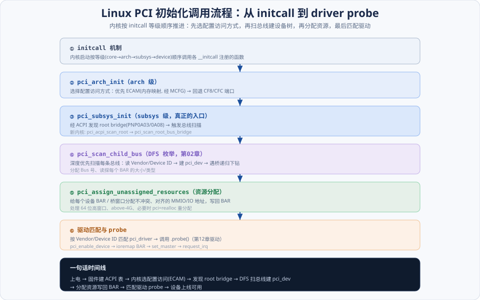
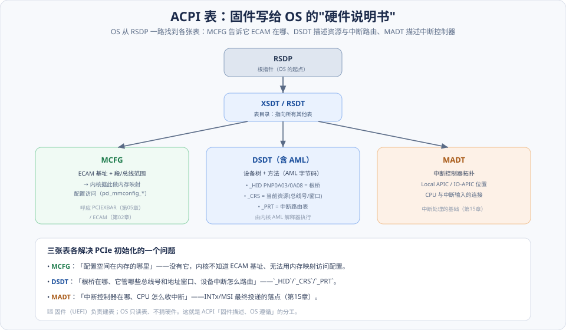
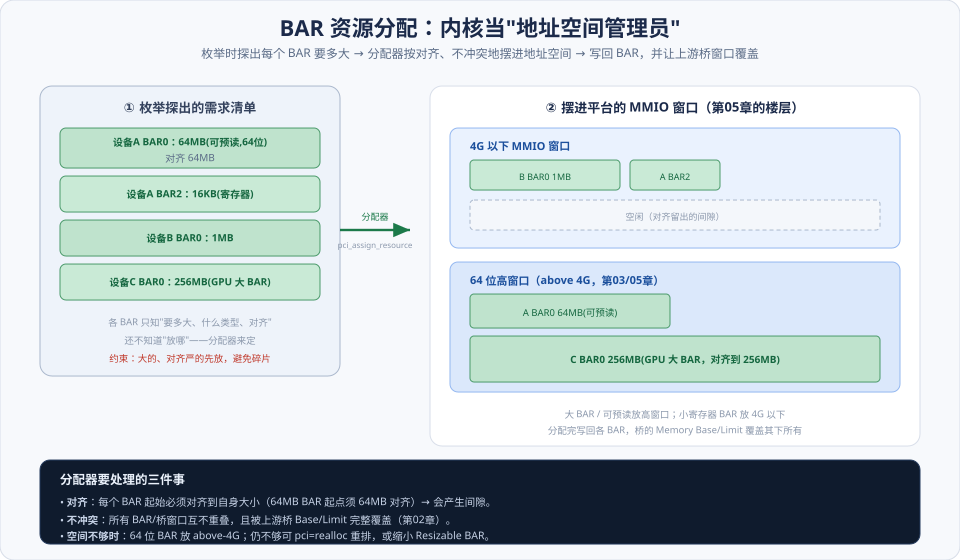

# 第14章　Linux PCI 的初始化过程

> **导读**：前面十三章讲的都是硬件"**能做什么**"——TLP、链路、配置空间、DMA、虚拟化。这一章转到软件侧，讲操作系统"**怎么把这一切跑起来**"。以 Linux 为例，走一遍完整的代码路径：**PCI 子系统初始化 → ACPI 提供拓扑与资源 → 枚举总线 → 分配 BAR → 匹配驱动**。
>
> 这是把前面所有硬件概念"落到软件"的一章——你会看到 [第02章](../第一篇-PCI体系结构/第02章-PCI桥与配置.md) 的 DFS 枚举、[第03章](../第一篇-PCI体系结构/第03章-PCI数据交换.md) 的 BAR 探测、[第05章](../第二篇-PCIe体系结构/第05章-平台MCH与ICH.md) 的 ECAM 基址，如何一个个变成内核函数调用。
>
> **现代化提示**：原书基于较早的内核，部分函数名/路径已经演进。本章**保留原书的调用链**（帮你读懂经典资料），同时**标注"新内核对应"**（如 host bridge 抽象为 `pci_host_bridge`）。重点理解**流程与职责**，而非记死某个函数名。
>
> 本章按 [CLAUDE.md §5.1](../../CLAUDE.md) 八节骨架展开，配 3 张图。

---

## 术语表

| 英文 / 缩写 | 中文 | 一句话释义 |
|-------------|------|-----------|
| initcall | 初始化调用 | 内核按等级顺序调用的初始化函数机制 |
| ACPI | 高级配置与电源接口 | 固件向 OS 描述硬件的表与方法 |
| ACPI MCFG | MCFG 表 | 上报 ECAM 基址（供内存映射配置访问） |
| DSDT / AML | 差分系统描述表 / AML | 描述设备与方法的表，方法用 AML 字节码写成 |
| `_HID` / `_CRS` / `_PRT` | 硬件 ID / 当前资源 / 中断路由 | 声明根桥 / 资源窗口 / 中断路由的 ACPI 方法 |
| Host Bridge (PNP0A03/0A08) | 根桥 | ACPI 声明的 PCI 根桥 |
| MADT | 多 APIC 描述表 | 描述中断控制器拓扑 |
| DFS | 深度优先枚举 | 递归扫描分配 Bus 号（呼应 [第02章](../第一篇-PCI体系结构/第02章-PCI桥与配置.md)） |
| Resource Assignment | 资源分配 | 为设备/桥窗口分配 MMIO/IO 地址 |
| Device Tree (OF) | 设备树 | 非 x86（PowerPC/ARM）描述硬件的机制 |

---

## 核心概念：一条从上电到设备可用的流水线

整章其实在描述**一条流水线**，先把它立起来，后面每一节都是它的某一段：

如图，六段接力：

**① initcall 排班** → **② 选配置访问方式（ECAM/CF8）** → **③ 发现 root bridge、触发扫描** → **④ DFS 枚举建 `pci_dev`** → **⑤ 分配资源写回 BAR** → **⑥ 匹配驱动 probe**。

贯穿这条线的是**两条"分工原则"**：

- **固件描述、OS 遵循**：硬件长什么样（拓扑、ECAM 基址、中断路由）由**固件通过 ACPI 表**告诉 OS，OS **只读表、不猜硬件**。这是现代平台的铁律，也是本章 14.2/14.3 的主线。
- **枚举与分配分离**：内核**先扫一遍**建立所有设备的模型、探出每个 BAR 要多大（枚举），**再统一分配**地址（资源分配）。分两步是因为——不先知道所有需求，就没法无冲突地摆放。

记住这两条，就抓住了 Linux PCI 初始化的骨架。

---

## 14.1 Linux x86 对 PCI 总线的初始化

Linux 用 **initcall** 机制按等级顺序（core → arch → subsys → device）推进初始化。PCI 相关的几个关键函数按这个顺序登场：

### 14.1.1 `pcibus_class_init` 与 `pci_driver_init`

这两个是**模型注册**：`pcibus_class_init` 注册 PCI 总线类型（sysfs 里 `/sys/bus/pci` 的由来），`pci_driver_init` 建立**设备-驱动模型**的基础结构。它们让后续"设备"和"驱动"能挂进内核的统一设备模型、并按 ID 匹配。

### 14.1.2 `pci_arch_init`

**选择配置空间的访问方式**——这直接呼应 [第02章](../第一篇-PCI体系结构/第02章-PCI桥与配置.md)/[第05章](../第二篇-PCIe体系结构/第05章-平台MCH与ICH.md)：优先用 **ECAM（内存映射，基址来自 ACPI MCFG 表）**，若不可用则回退到 **CF8/CFC 端口**。选定后，内核所有配置读写都走这条通道。

### 14.1.3 `pci_slot_init` 与 `pci_subsys_init` ⭐

`pci_subsys_init` 是**真正触发总线扫描的入口**。它在 subsys 级 initcall 里，经 ACPI 发现 root bridge 后开始枚举整棵总线树（14.3 详解）。

> 📘 **新内核对应**：现代内核里这条路径重构为 `acpi_pci_root_add` → `pci_acpi_scan_root` → `pci_scan_root_bus_bridge`，root bridge 抽象成 `pci_host_bridge` 结构。名字变了，但"发现根桥 → 扫描"的职责不变。

### 14.1.4 相关的其他函数：initcall 顺序

这些函数的**先后由 initcall 等级严格约束**：必须先注册模型（core/arch）、再选访问方式（arch）、才能扫总线（subsys）。顺序错了就会"还没选好配置访问方式就去读配置"——所以 initcall 等级是这条流水线的"时钟"。

---

## 14.2 x86 处理器的 ACPI

现代 PCIe 初始化**离不开 ACPI**。这一节讲 ACPI 如何把硬件信息交给 OS。

### 14.2.1 ACPI 驱动程序与 AML 解释器

ACPI 是**固件向 OS 描述硬件的标准**。它不仅有静态的"表"，还有用 **AML（ACPI Machine Language）** 字节码写成的**方法**——OS 内置一个 **AML 解释器**执行这些方法，动态获取资源、控制电源等。核心思想：**硬件细节封装在固件里，OS 通过标准接口查询，不必硬编码某颗芯片的寄存器**。

### 14.2.2 ACPI 表：MCFG / DSDT / MADT ⭐

如图，OS 从 **RSDP（根指针）** 出发 → **XSDT（表目录）** → 找到各张表。对 PCIe 初始化最关键的三张：

- **MCFG**：告诉内核 **ECAM 基址**（及段/总线范围）——没有它，内核不知道去内存的哪里访问配置空间。这正是 [第05章](../第二篇-PCIe体系结构/第05章-平台MCH与ICH.md) `PCIEXBAR` 的标准化上报形式。
- **DSDT（含 AML）**：描述设备树与方法，其中三个方法最重要：
  - **`_HID` = PNP0A03/0A08**：标识 **PCI 根桥**（0A08 是 PCIe 根桥）。
  - **`_CRS`（Current Resource Settings）**：根桥管辖的**总线号范围和地址窗口**。
  - **`_PRT`（PCI Routing Table）**：**中断路由表**（INTx → 中断控制器输入，[第15章](第15章-Linux-PCI中断处理.md)）。
- **MADT**：描述**中断控制器拓扑**（Local APIC / IO-APIC 位置）——中断最终投递的落点，是 [第15章](第15章-Linux-PCI中断处理.md) 的基础。

三张表各解决一个问题：**MCFG 管"配置空间在哪"、DSDT 管"根桥/资源/中断路由"、MADT 管"中断控制器在哪"**。

### 14.2.3 ACPI 表的使用实例

初始化时，内核：读 **MCFG** → 建立 ECAM 映射；执行根桥的 **`_CRS`** → 得到它的总线号范围和 MMIO/IO 窗口（这些窗口就是后面资源分配的"可用池"）；执行 **`_PRT`** → 建立中断路由（[第15章](第15章-Linux-PCI中断处理.md)）。**OS 全程只读表、执行方法，不猜硬件。**

---

## 14.3 基于 ACPI 机制的 Linux PCI 的初始化

把 14.1 的流水线和 14.2 的 ACPI 表接起来，就是完整的初始化：

### 14.3.1 基本的准备工作：发现 root bridge

内核扫描 ACPI 命名空间，找 `_HID` 为 **PNP0A03（PCI）/ PNP0A08（PCIe）** 的对象——它们就是 **PCI 根桥**。每发现一个根桥，就为它建立一个 `pci_host_bridge`，并读它的 `_CRS` 得到总线号范围与资源窗口。

### 14.3.2 初始化 PCI 总线号：DFS 枚举

从根桥的起始总线号开始，**深度优先枚举**（[第02章](../第一篇-PCI体系结构/第02章-PCI桥与配置.md) 的 DFS）：读每个位置的 Vendor/Device ID 判断设备是否存在，为存在的设备建 `pci_dev`；遇到桥就分配 Secondary Bus 号、递归下钻、回填 Subordinate。扫完整棵树，内核就有了所有设备的模型。对应函数 `pci_scan_child_bus`。

### 14.3.3 检查 PCI 设备使用的 BAR 空间

枚举每个设备时，对它的每个 BAR 做 [第03章](../第一篇-PCI体系结构/第03章-PCI数据交换.md) 的**探测**（写全 1 → 读回掩码 → 求大小与类型）。此时内核**只是记下"这个 BAR 要多大、什么类型、什么对齐"**，还没分配地址。

### 14.3.4 分配 PCI 设备使用的 BAR 寄存器 ⭐

这是"分配"阶段。内核当**地址空间管理员**，把所有 BAR 需求摆进根桥 `_CRS` 给出的可用窗口：

如图，分配器（`pci_assign_resource` / `pci_assign_unassigned_resources`）要处理三件事：

1. **对齐**：每个 BAR 起始地址必须**对齐到自身大小**（64MB 的 BAR 起点须 64MB 对齐）——这会产生间隙。
2. **不冲突**：所有 BAR 和桥窗口互不重叠，且被上游桥的 `Memory Base/Limit` 完整覆盖（[第02章](../第一篇-PCI体系结构/第02章-PCI桥与配置.md)）。
3. **空间安排**：小寄存器 BAR 放 4G 以下；**大 BAR / 可预读 BAR 放 64 位高窗口（above 4G）**（[第03章](../第一篇-PCI体系结构/第03章-PCI数据交换.md)、[第05章](../第二篇-PCIe体系结构/第05章-平台MCH与ICH.md)）。空间不够时可 `pci=realloc` 重排，或缩小 Resizable BAR。

分配完，把基址**写回各 BAR**，设备就"上线"了——之后驱动 probe（[第12章](../第二篇-PCIe体系结构/第12章-PCIe应用.md)）就能 `ioremap` 这些窗口来操控设备。

---

## 14.4 Linux PowerPC 如何初始化 PCI 总线树

x86 靠 ACPI，但**非 x86 平台（PowerPC、多数 ARM）不用 ACPI，而用设备树（Device Tree, OF）**。设备树是一份描述硬件拓扑与资源的静态数据结构（`.dts` 编译成 `.dtb`），随内核/固件提供。

对照来看：**ACPI 的 `_CRS`/`_PRT` ≈ 设备树的 `ranges`/`interrupt-map` 属性**——都是"固件告诉 OS 根桥管哪些总线、地址窗口怎么映射、中断怎么路由"。**枚举与资源分配的核心逻辑（DFS、BAR 探测、分配）是平台无关的**，区别只在"拓扑/资源信息从哪读"：x86 从 ACPI 表，PowerPC/ARM 从设备树。理解这一点，就明白初始化的"骨架"通用、只有"信息源"因平台而异。

---

## 14.5 小结

一张时间线收束本章：

> **上电 → 固件建 ACPI 表（MCFG/DSDT/MADT）→ 内核 initcall 排班 → 选配置访问方式（ECAM）→ 经 ACPI 发现 root bridge、读 `_CRS` 得资源池 → DFS 枚举建 `pci_dev`、探测 BAR 大小 → 资源分配器按对齐/不冲突摆放、写回 BAR → 匹配驱动 probe → 设备可用。**

三个要点：

1. **固件描述、OS 遵循**：拓扑/ECAM 基址/中断路由由 ACPI 表（或设备树）提供，OS 只读不猜。
2. **枚举与分配分离**：先扫一遍建模型、探需求，再统一无冲突地分配地址——两步走是无冲突摆放的前提。
3. **骨架通用、信息源因平台而异**：DFS 枚举 + BAR 探测 + 资源分配是平台无关的；x86 从 ACPI、PowerPC/ARM 从设备树读拓扑。

设备初始化完成、驱动 probe 之后，最后一个环节是**中断**——设备干完活如何通知 CPU、Linux 如何把一次中断变成运行的处理函数。这就是最后一章 [第15章](第15章-Linux-PCI中断处理.md) 的主题。

---

## 📘 现代内核 / SPEC 对照

> 📘 **ECAM 经 MCFG 落地**。内核的 `pci_mmconfig_*` 一系列函数使用 **ACPI MCFG 表**提供的 ECAM 基址来做内存映射配置访问（呼应 [第02章](../第一篇-PCI体系结构/第02章-PCI桥与配置.md) ECAM、[第05章](../第二篇-PCIe体系结构/第05章-平台MCH与ICH.md) PCIEXBAR）。没有 MCFG，内核只能退回 CF8/CFC，够不着扩展配置空间（Extended Capabilities，[第13章](../第二篇-PCIe体系结构/第13章-虚拟化技术.md)）。

> 📘 **函数演进要认流程不认名字**。原书的部分函数在新内核已重构：root bridge 抽象为 `pci_host_bridge`、扫描入口是 `pci_scan_root_bus_bridge`、资源分配是 `pci_assign_unassigned_resources`。学习时**抓"发现根桥 → 枚举 → 分配 → probe"这条流程**，函数名只是流程的标签，随版本变化。

> 📘 **现代资源分配要处理 64 位与 above-4G**。大 BAR 设备（GPU 几十 GB 显存）迫使分配器必须会用 **64 位 BAR + above-4G 高窗口**，并支持 **Resizable BAR** 协商（[第03章](../第一篇-PCI体系结构/第03章-PCI数据交换.md)）。当 4G 以下窗口不够时，内核会把可预读 64 位 BAR 优先放到高窗口。

> 📘 **热插拔与 `pci=` 调参**。现代平台支持 **PCIe 原生热插拔（pciehp）**——设备可运行时插入/移除，触发**重新枚举与资源分配**。当固件预留的窗口不足以容纳热插拔设备时，可用 `pci=realloc` 让内核重排资源。这是原书未覆盖、现代数据中心/工作站常见的场景。

---

## 常见误区 / FAQ

**Q1：为什么 PCIe 初始化非要 ACPI/设备树？内核自己扫不行吗？**
配置空间内核确实能自己扫（DFS 枚举），但有些信息**扫不出来**：ECAM 基址在哪、根桥管哪些总线号和地址窗口、INTx 中断怎么路由到中断控制器——这些是**平台布线/固件决策**，硬件寄存器里没有。必须由固件通过 ACPI 表（或设备树）告诉 OS。所以是"内核枚举设备 + 固件描述平台"两者配合。

**Q2：`_CRS` 和 `_PRT` 分别管什么？**
都是 DSDT 里根桥的方法。**`_CRS`（Current Resource Settings）**=根桥管辖的**总线号范围和地址窗口**（资源分配的"可用池"从这里来）。**`_PRT`（PCI Routing Table）**=**中断路由表**，描述每个设备的 INTx 引脚最终连到中断控制器的哪个输入（[第15章](第15章-Linux-PCI中断处理.md)）。一个管地址资源，一个管中断路由。

**Q3：为什么要"先枚举再分配"，不能边扫边分配？**
因为**无冲突摆放需要先知道所有需求**。BAR 有对齐约束（大 BAR 要大对齐），若边扫边分配，可能把大 BAR 该占的对齐位置先给了小 BAR，导致碎片化、大 BAR 无处安放。先扫一遍收集所有需求，再从大到小、按对齐统一摆放，才能高效无冲突。这就是枚举与分配分两阶段的原因。

**Q4：原书的函数名和我现在内核里的对不上，怎么办？**
正常——内核演进快，函数会重构、改名、合并。**别纠结具体函数名，抓流程**："initcall 排班 → 选配置访问 → 发现根桥 → DFS 枚举 → 探测 BAR → 分配资源 → probe"这条链是稳定的。拿到新内核代码，按这个流程去 `drivers/pci/` 里找对应实现即可（如 `probe.c` 的 `pci_scan_*`、`setup-bus.c` 的资源分配）。

**Q5：BAR 分配失败（"BAR: no space"）通常是什么原因？**
多半是**固件预留的 MMIO 窗口不够**，尤其有大 BAR 设备（GPU）或多个热插拔槽时。4G 以下窗口紧张、64 位高窗口没开或太小都会导致。对策：BIOS 里开启 "Above 4G Decoding"/"Resizable BAR"，或内核加 `pci=realloc` 让它重排资源，把大的可预读 BAR 挪到 above-4G 高窗口。

**Q6：ACPI 和设备树能同时用吗？**
一般是**二选一**。x86 平台用 ACPI；多数嵌入式 ARM/PowerPC 用设备树；部分服务器级 ARM 也支持 ACPI。两者角色相同（向 OS 描述硬件拓扑与资源），只是格式和生态不同。内核的 PCI 核心枚举/分配逻辑是共用的，上层通过不同的"host bridge 驱动"从 ACPI 或设备树取信息。

---

## 与 SPEC / 规范对照

| 本章主题 | 规范 / 内核实现 |
|----------|-----------------|
| ECAM / MCFG | ACPI 规范（MCFG）；Base Spec Enhanced Config（[第02章](../第一篇-PCI体系结构/第02章-PCI桥与配置.md)） |
| 根桥 `_HID` / `_CRS` | ACPI 规范（PNP0A03/0A08、Resource Templates） |
| 中断路由 `_PRT` / MADT | ACPI 规范（[第15章](第15章-Linux-PCI中断处理.md)） |
| DFS 枚举 | Base Spec Configuration；Linux `drivers/pci/probe.c` |
| BAR 探测 / 资源分配 | Base Spec Base Address Registers；Linux `setup-bus.c`/`setup-res.c` |
| 64 位 / Resizable BAR | Base Spec Resizable BAR（[第03章](../第一篇-PCI体系结构/第03章-PCI数据交换.md)） |
| 热插拔 | Base Spec Hot-Plug；Linux `pciehp` |
| 设备树（非 x86） | Device Tree（OF）规范 |

> 说明：ECAM/BAR/Resizable BAR 等定义于 Base Spec；MCFG/DSDT/`_CRS`/`_PRT`/MADT 定义于 **ACPI 规范**；具体函数属于 **Linux 内核 `drivers/pci/`**，随版本演进。章节号以工程内 `NCB-PCI_Express_Base_7.0.pdf` 及 ACPI/内核文档为准。
