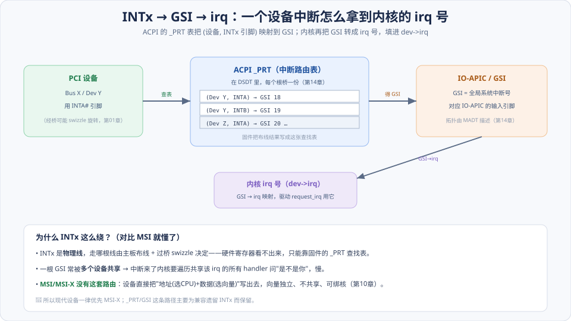
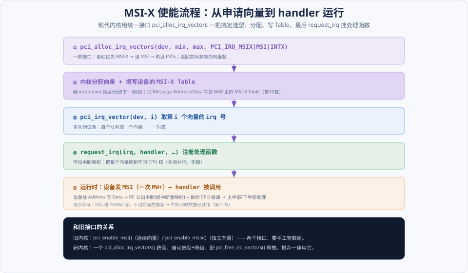
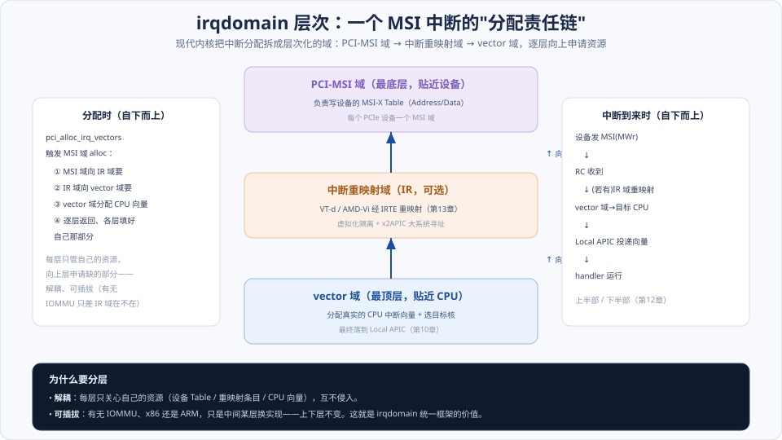

# 第15章　Linux PCI 的中断处理

> **导读**：这是全书的**收尾章**。[第14章](第14章-Linux-PCI初始化.md) 把设备枚举、配好、驱动 probe 起来了；最后一个环节是——**设备干完活，如何通知 CPU？一次中断怎么最终变成 CPU 上运行的 handler？**
>
> 本章讲两条路径：**传统 INTx 中断路由**（irq 号从哪来、为什么这么绕）和**现代 MSI/MSI-X 向量申请**（内核 API 怎么用）。它是把 [第10章](../第二篇-PCIe体系结构/第10章-MSI和MSI-X中断.md) 的**硬件机制**落到**内核 API** 的收尾章——你会看到"中断=一次存储器写"这个硬件事实，如何变成驱动里的 `pci_alloc_irq_vectors` + `request_irq` 几行代码。
>
> **现代化提示**：现代内核用 **irqdomain（层次化中断域）** 统一管理所有中断映射，MSI 走通用框架。旧的 `pci_enable_msi/msix` 已被统一接口取代。
>
> 本章按 [CLAUDE.md §5.1](../../CLAUDE.md) 八节骨架展开，配 3 张图。

---

## 术语表

| 英文 / 缩写 | 中文 | 一句话释义 |
|-------------|------|-----------|
| irq | 中断号 | 内核层面标识一个中断源的编号 |
| ACPI `_PRT` | PCI 中断路由表 | 把 (设备, INTA–D) 映射到 GSI |
| GSI, Global System Interrupt | 全局系统中断 | ACPI 下统一编号的中断线（对应 IO-APIC 输入） |
| INTx Swizzle | INTx 旋转 | INTx 经桥旋转的路由规则（呼应 [第01章](../第一篇-PCI体系结构/第01章-PCI总线基础.md)） |
| IRQ Affinity | 中断亲和 | 把中断向量绑定到特定 CPU 核 |
| irqdomain | 中断域 | 内核层次化管理中断映射的框架 |
| `pci_alloc_irq_vectors` | 统一向量申请 | 自动在 MSI-X/MSI/INTx 间选型的接口 |
| Managed IRQ | 托管中断 | 内核按队列自动分配并绑核的中断 |
| Top / Bottom Half | 上/下半部 | 中断处理的即时部分与延后部分 |

---

## 核心概念：两条路径，一个终点

设备中断要变成 CPU 上运行的 handler，有两条截然不同的路径，但终点相同（都拿到一个 `irq` 号、挂上处理函数）：

**① INTx 路径（传统、绕）**：INTx 是**物理中断线**，走哪根线由主板布线 + 过桥 swizzle 决定——**硬件寄存器里看不出来**。所以必须靠固件的 **ACPI `_PRT` 表**做一次查找：`(设备, INTx 引脚) → GSI → irq`。而且多个设备常**共享**同一根线，中断来了内核要挨个问"是不是你"，慢。

**② MSI/MSI-X 路径（现代、直接）**：没有物理线、没有路由表。设备直接把"**地址（选哪个 CPU）+ 数据（用哪个向量）**"写出去（[第10章](../第二篇-PCIe体系结构/第10章-MSI和MSI-X中断.md) 的"中断=存储器写"），每个向量**独立、不共享、可绑核**。内核用统一接口 `pci_alloc_irq_vectors` 分配向量、写 MSI-X Table、`request_irq` 挂 handler。

**一句话对比**：INTx 靠"固件查表 + 共享线"，MSI-X 靠"设备自报地址/向量 + 独立绑核"。理解了"为什么 INTx 绕"，就理解了"为什么现代设备一律优先 MSI-X"。本章 15.1 讲第一条路径（主要为兼容遗留），15.2 讲第二条（现代主流）。

---

## 15.1 PCI 总线的中断路由

### 15.1.1 PCI 设备如何获取 irq 号

驱动 `request_irq` 时用的是 `dev->irq`——这个 irq 号是怎么填进去的？对 **INTx**，它来自固件的中断路由信息：内核在初始化时（`pci_enable_device` 前后）根据设备的 INTx 引脚，查 ACPI `_PRT` 得到 GSI，再把 GSI 转成 irq，填进 `dev->irq`。对 **MSI/MSI-X**，则是 `pci_alloc_irq_vectors` 之后用 `pci_irq_vector()` 取（15.2）。

### 15.1.2 PCI 中断路由表：`_PRT` 与 swizzle ⭐

如图，INTx 的 irq 号要经过一次**查表映射**：

1. **设备的 INTx 引脚**：设备用 INTA#（过桥时可能被 **swizzle 旋转**成别的，[第01章](../第一篇-PCI体系结构/第01章-PCI总线基础.md)）。
2. **ACPI `_PRT`（PCI Routing Table）**：放在 DSDT 里、每个根桥一份（[第14章](第14章-Linux-PCI初始化.md)）。它是固件把"主板布线 + swizzle 结果"固化成的**查找表**：`(Dev, INTx) → GSI`。
3. **GSI（Global System Interrupt）**：对应 **IO-APIC** 的某个输入引脚，拓扑由 **MADT** 描述（[第14章](第14章-Linux-PCI初始化.md)）。
4. **GSI → irq**：内核把 GSI 转成内部 irq 号，填进 `dev->irq`。

**为什么这么绕？** 因为 INTx 走哪根线是**物理布线决定的、硬件寄存器读不出来**——只能靠固件用 `_PRT` 告诉 OS。这正是 [第14章](第14章-Linux-PCI初始化.md) 强调"固件描述、OS 遵循"的又一例。

### 15.1.3 PCI 插槽使用的 irq 号

物理插槽与中断线的对应也在 `_PRT` 里——同一个槽位，插不同设备，其 INTx 经相同的 swizzle 和路由到达相同的 GSI。这让"插槽的中断布线"独立于具体插了什么卡，是主板设计层面的约定。

> 📘 **共享的代价**：一根 GSI 常被多个设备共享，中断来了内核要**遍历共享该 irq 的所有 handler**，逐个问"是不是你触发的"。这既慢又难以做 CPU 亲和——正是下一节 MSI-X 要解决的痛点。

---

## 15.2 使用 MSI/MSI-X 中断机制申请中断向量

MSI/MSI-X 把上面那套物理路由**整个抛弃**：设备直接发一次带内存储器写（[第10章](../第二篇-PCIe体系结构/第10章-MSI和MSI-X中断.md)），Address 选 CPU、Data 选向量，无需 `_PRT`、无需共享。

### 15.2.1 Linux 如何使能 MSI 中断机制

旧接口 `pci_enable_msi()` 为设备分配**连续的**中断向量、把 Message Address/Data 写进 MSI Capability。MSI 所有向量共用一个地址、连续排布——绑核能力弱（[第10章](../第二篇-PCIe体系结构/第10章-MSI和MSI-X中断.md)）。

### 15.2.2 Linux 如何使能 MSI-X 中断机制 ⭐

旧接口 `pci_enable_msix()` 按 **MSI-X Table** 分配**独立**向量，每个向量可设不同地址（因而可绑不同 CPU）。现代内核推荐**统一接口**：

如图，五步走：

1. **① `pci_alloc_irq_vectors(dev, min, max, PCI_IRQ_MSIX | PCI_IRQ_MSI | PCI_IRQ_INTX)`**：一把接口，**自动优先 MSI-X → 退 MSI → 再退 INTx**，返回实际拿到的向量数。
2. **② 内核分配向量 + 填 MSI-X Table**：经 irqdomain 逐层分配（15.3 图），把 Message Address/Data 写进设备 BAR 里的 MSI-X Table（[第10章](../第二篇-PCIe体系结构/第10章-MSI和MSI-X中断.md)）。
3. **③ `pci_irq_vector(dev, i)`**：取第 i 个向量的 irq 号。多队列设备每队列取一个。
4. **④ `request_irq(irq, handler, …)`**：注册处理函数，并可设**中断亲和**——把每个向量绑到不同 CPU 核，多核并行、无锁。
5. **⑤ 运行时**：设备发 MSI（一次 MWr）→ RC 认出（经中断重映射）→ 目标 CPU 投递 → handler 运行（上半部/下半部，[第12章](../第二篇-PCIe体系结构/第12章-PCIe应用.md)）。**强序保证**：MSI 是 Posted 写、不越前面数据写，中断到时数据已就绪（[第11章](../第二篇-PCIe体系结构/第11章-总线的序.md)）。

这就是**多队列网卡/NVMe 的中断骨干**：每队列一个 MSI-X 向量、各绑一个核，收发并行、互不加锁。

---

## 15.3 小结

一句话收束本章、也收束全书的软件侧：

> **两条中断路径殊途同归。INTx 靠固件 `_PRT` 查表得 GSI→irq、多设备共享、慢且难绑核（仅为兼容遗留保留）；MSI/MSI-X 设备自报"地址选 CPU、数据选向量"，向量独立、可绑核，用统一接口 `pci_alloc_irq_vectors` 申请。现代设备一律优先 MSI-X。**

三个要点：

1. **INTx 为什么绕**：物理线的路由硬件读不出，只能靠固件 `_PRT` 表把 `(Dev,INTx)→GSI→irq`；且共享 → 慢。
2. **MSI-X 为什么快**：无路由表、无共享，每向量独立地址/数据 → 可精确绑核 → 多队列并行。
3. **统一接口**：`pci_alloc_irq_vectors`（自动选型降级）+ `pci_irq_vector` + `request_irq`，取代旧的 `pci_enable_msi/msix`。

**全书至此完结。** 从 [第01章](../第一篇-PCI体系结构/第01章-PCI总线基础.md) 的 PCI 共享总线，到 PCIe 的分层协议（TLP/DLLP/PHY）、链路训练、流控、序、中断、虚拟化，再到 Linux 的初始化与中断处理——一次软件的读写请求，如何被逐层封装成链路上的比特、又如何在对端逐层还原、最终以一次中断回到 CPU，这条完整链路我们走通了。带着这张"装配总图"（[CLAUDE.md §4](../../CLAUDE.md)），再回头读官方 Spec 或调真实设备，每个字段和状态都会有它的位置。

---

## 📘 现代内核 / SPEC 对照

> 📘 **统一 API 取代旧接口**。现代内核用一个 **`pci_alloc_irq_vectors(dev, min, max, flags)`** 取代旧的 `pci_enable_msi()` / `pci_enable_msix()`——`flags` 里给 `PCI_IRQ_MSIX | PCI_IRQ_MSI | PCI_IRQ_INTX`，内核**自动优先选 MSI-X、逐级降级**，返回实际拿到的向量数；用 `pci_irq_vector()` 取每个向量、`pci_free_irq_vectors()` 释放。**新驱动一律用它**，无需手工判断设备支持哪种、无需管理向量数组。（Linux `drivers/pci/msi/`）

> 📘 **irqdomain 层次化中断域**。现代内核把中断分配拆成**层次化的域**，一个 MSI 中断的分配是一条"责任链"：

> 如图，三层自下而上：**PCI-MSI 域**（写设备 MSI-X Table）→ **中断重映射域**（VT-d/AMD-Vi 经 IRTE 重映射，可选，[第13章](../第二篇-PCIe体系结构/第13章-虚拟化技术.md)）→ **vector 域**（分配真实 CPU 向量、选目标核）。分配时逐层向上申请、逐层返回填好各自那部分。好处是**解耦**（每层只管自己的资源）+ **可插拔**（有无 IOMMU、x86 还是 ARM，只是中间某层换实现）。这就是 irqdomain 统一框架的价值。

> 📘 **多队列亲和与托管中断**。高性能设备（NVMe、多队列网卡）用 **`irq_set_affinity_hint`** 或**托管中断（managed IRQ）** 把每个队列的向量**自动绑到不同 CPU 核**。托管中断让内核按队列数自动分配、绑核、并在 CPU 热插拔时妥善迁移——驱动无需手工管理亲和。这是"每队列一向量一核"（[第10章](../第二篇-PCIe体系结构/第10章-MSI和MSI-X中断.md)）在内核侧的落地。

> 📘 **IMS：超大规模虚拟设备的中断**。MSI-X 上限 2048 向量，海量虚拟设备（一块 DPU/GPU 服务上万虚拟队列）不够用。**IMS（Interrupt Message Store）** 让设备用私有存储保存中断消息、突破上限，是 **Scalable IOV** 的配套（[第10章](../第二篇-PCIe体系结构/第10章-MSI和MSI-X中断.md)、[第13章](../第二篇-PCIe体系结构/第13章-虚拟化技术.md)）。内核的中断框架也在向支持 IMS 演进。

---

## 常见误区 / FAQ

**Q1：INTx 为什么需要 `_PRT` 表这么麻烦，MSI 就不用？**
因为 INTx 是**物理线**——它经过主板布线和过桥 swizzle 到达中断控制器，走哪根线**硬件寄存器里读不出来**，只能靠固件用 `_PRT` 表告诉 OS。MSI 根本没有物理线：设备直接把"地址+数据"写出去，地址里就编码了目标 CPU、数据里编码了向量，一切自带、无需查表。这就是 MSI 简洁的根本原因。

**Q2：`pci_alloc_irq_vectors` 和旧的 `pci_enable_msi/msix` 该用哪个？**
一律用 `pci_alloc_irq_vectors`。它一个接口统管选型（自动 MSI-X → MSI → INTx 降级）、分配、返回向量数，配 `pci_free_irq_vectors` 释放。旧的两个接口要驱动手工判断设备能力、管理向量数组，容易出错，已不推荐。看到老代码用 `pci_enable_msix` 可以照 `pci_alloc_irq_vectors` 的模式重构。

**Q3：GSI 和 irq 号是一回事吗？**
不是，是两层。**GSI（全局系统中断）** 是 ACPI/固件层面的统一中断编号，对应 IO-APIC 的输入引脚（硬件视角）。**irq 号**是**内核内部**标识中断源的编号（软件视角）。内核把 GSI 映射成 irq，驱动只跟 irq 打交道。对 INTx，`dev->irq` 就是从 GSI 转来的；对 MSI，irq 由 `pci_irq_vector` 取。

**Q4：中断亲和（affinity）到底解决什么？**
把中断固定投递到**特定 CPU 核**。对多队列设备，让"队列 i 的中断只打到核 i"，则该核处理该队列的收发，**数据和中断都在同一核、缓存局部性好、无需跨核加锁**。若不绑核，中断可能乱投到任意核、引发缓存抖动和锁竞争。MSI-X 每向量独立地址才使精确绑核成为可能——这是它相对 MSI 的核心优势。

**Q5：为什么现代设备几乎不用 INTx 了？**
三个硬伤：**共享**（多设备一根线，中断来了要遍历 handler 问"是不是你"，慢）、**难绑核**（物理线固定路由，做不了 CPU 亲和）、**需边带引脚**（与 PCIe 少引脚哲学冲突）。MSI-X 全部解决：不共享、每向量独立可绑核、带内无需专线。所以现代高性能设备一律 MSI-X，INTx 仅作兼容后备（PCIe 里还退化成"虚拟 INTx 消息"）。

**Q6：irqdomain 分层看着复杂，对写驱动有影响吗？**
基本没有——**驱动只调 `pci_alloc_irq_vectors` + `request_irq`，分层是内核内部的事**。分层是为了内核自己解耦：加不加 IOMMU（中断重映射域在不在）、x86 还是 ARM（vector 域实现不同），对驱动完全透明。了解它有助于**排查中断问题**（如虚拟化下中断不到，可能是重映射域配置问题），但日常写驱动不必关心其内部。

---

## 与 SPEC / 规范对照

| 本章主题 | 规范 / 内核实现 |
|----------|-----------------|
| INTx 路由 / `_PRT` / GSI | ACPI 规范（`_PRT`）；Base Spec Message（INTx 模拟，[第01章](../第一篇-PCI体系结构/第01章-PCI总线基础.md)） |
| 中断控制器拓扑 / MADT | ACPI 规范（MADT，[第14章](第14章-Linux-PCI初始化.md)） |
| MSI / MSI-X Capability | Base Spec MSI/MSI-X（[第10章](../第二篇-PCIe体系结构/第10章-MSI和MSI-X中断.md)） |
| 统一向量申请 | Linux `pci_alloc_irq_vectors` / `drivers/pci/msi/` |
| irqdomain 层次 | Linux `kernel/irq/`（irq_domain 框架） |
| 中断重映射 | Intel VT-d / AMD-Vi（[第13章](../第二篇-PCIe体系结构/第13章-虚拟化技术.md)） |
| 中断与排序 | Base Spec Transaction Ordering（[第11章](../第二篇-PCIe体系结构/第11章-总线的序.md)） |
| IMS / Scalable IOV | Intel Scalable IOV 规范（[第13章](../第二篇-PCIe体系结构/第13章-虚拟化技术.md)） |

> 说明：MSI/MSI-X 结构定义于 Base Spec；`_PRT`/GSI/MADT 定义于 **ACPI 规范**；`pci_alloc_irq_vectors`、irqdomain 属于 **Linux 内核**，随版本演进。中断重映射属**架构相关规范**（VT-d 等）。章节号以工程内 `NCB-PCI_Express_Base_7.0.pdf` 及 ACPI/内核文档为准。
