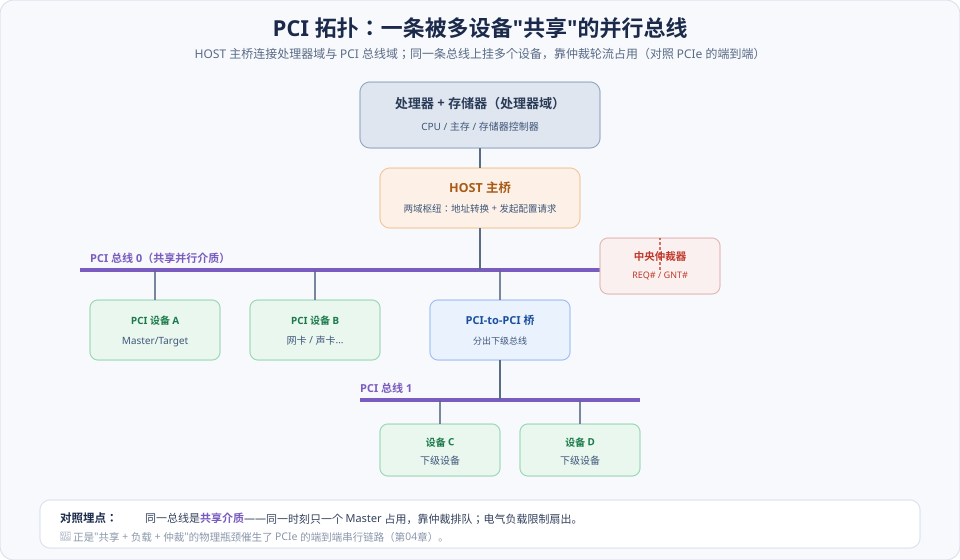
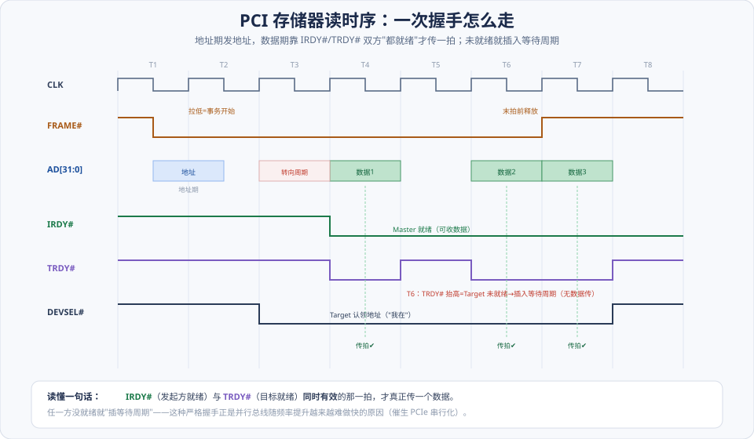
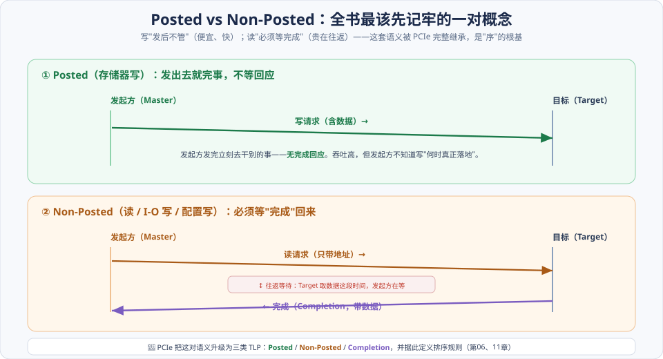
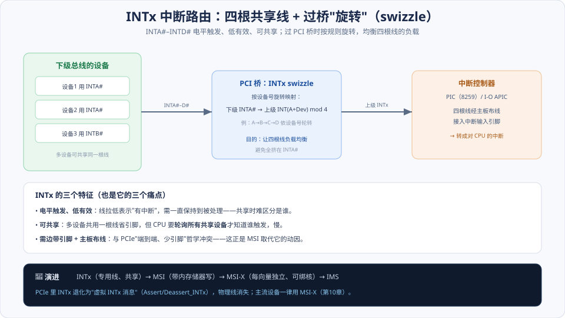

# 第01章　PCI 总线的基本知识

> **导读**：这是全书的第一章，也是**地基章**。你可能会问：都要学 PCIe 了，为什么还要回头看已经过时的 PCI？因为 **PCIe 的软件模型几乎完全继承自 PCI**——配置空间、BAR、Posted/Non-Posted 语义、中断编号，这些概念在后续每一个 PCIe 章节里都会复用。原书的策略很清楚：先把 PCI 这套"直觉"打牢，再看 PCIe 如何在**保留软件视图**的前提下，把底层从"共享并行总线"换成"端到端串行链路"。
>
> 本章讲清四件事：PCI 的**组成结构**（谁连谁）、**信号定义**（线怎么握手）、**总线事务**（读写怎么走，尤其 ⭐Posted/Non-Posted）、**中断机制**（INTx 怎么路由）。学完你会带着两个最重要的行囊进入 PCIe：**① Posted/Non-Posted 语义**（是"序"的根基，[第11章](../第二篇-PCIe体系结构/第11章-总线的序.md)）和 **② 请求/完成模型**（PCI-X 的 Split 事务正是 PCIe TLP 的前身）。
>
> 本章按 [CLAUDE.md §5.1](../../CLAUDE.md) 八节骨架展开，配 4 张图。

---

## 术语表

| 英文 / 缩写 | 中文 | 一句话释义 |
|-------------|------|-----------|
| Host Bridge | HOST 主桥 | 连接处理器/存储器域与 PCI 总线域的枢纽 |
| Master / Target | 发起方 / 目标 | 总线事务的发起方 / 响应方 |
| Arbitration | 仲裁 | `REQ#`/`GNT#` 决定谁占用共享总线 |
| Posted | Posted 事务 | 发出后不等完成响应（如存储器写） |
| Non-Posted | Non-Posted 事务 | 需要完成响应（如读、I/O 写、配置写） |
| Delayed Transaction | Delayed 事务 | PCI 对 Non-Posted 读的"延迟"处理方式 |
| Split Transaction | Split 事务 | PCI-X 中接收方主动回完成，是 PCIe 请求/完成模型的前身 |
| INTA#–INTD# | INTx 中断 | 电平触发、低有效、可共享的物理中断线 |
| Swizzle | 中断旋转 | 过桥时对 INTx 编号轮转以均衡负载 |
| DEVSEL# | 设备选择 | Target 认领地址的应答信号 |

---

## 核心概念：PCI 留给 PCIe 的四份遗产

在钻进信号和时序之前，先建立一张"哪些会被 PCIe 继承、哪些会被替换"的地图。PCI 有四大要素，PCIe 对它们的态度截然不同：

| PCI 要素 | 本质 | PCIe 的态度 |
|----------|------|-------------|
| **共享并行总线 + 仲裁** | 多设备共享一条总线，靠 `REQ#/GNT#` 排队 | ❌ **替换**：改成端到端串行链路，无仲裁、无共享 |
| **INTx 中断线** | 四根物理线，电平触发、可共享 | ❌ **替换**：改成 MSI/MSI-X（带内消息）；INTx 退化为虚拟消息 |
| **Posted / Non-Posted 语义** | 写不等回应、读要等完成 | ✅ **继承**：升级为三类 TLP，成为"序"的根基 |
| **配置空间 + BAR** | 软件枚举、分配地址的统一视图 | ✅ **继承**：几乎原样保留，软件无感 |

一句话：**PCIe 换掉了 PCI 的"物理层"（怎么传比特），却几乎原样搬走了它的"软件层"（软件怎么看设备）。** 所以学 PCI 不是学历史，是学一套至今仍在用的软件模型。带着这张表读下去，每个概念都能对号入座。

---

## 1.1 PCI 总线的组成结构

如图，PCI 系统的骨架是"**处理器域 — HOST 主桥 — PCI 总线域**"三段式，总线上可通过 PCI 桥再分出下级总线，形成树状层级。

### 1.1.1 HOST 主桥

**HOST 主桥（Host Bridge）** 是两个世界的枢纽：一边是处理器/存储器域（CPU、主存），一边是 PCI 总线域（设备）。它的职责有二：**地址空间转换**（把 CPU 发出的地址映射到 PCI 地址空间，反之亦然）和**发起配置请求**（枚举设备时由它产生配置事务）。可以把它理解成"PCI 世界的入口和翻译官"。这个角色在 PCIe 里演化为 **Root Complex（RC）**（[第04章](../第二篇-PCIe体系结构/第04章-PCIe总线概述.md)）。

### 1.1.2 PCI 总线

PCI 总线是**并行、多设备共享**的介质——这是它与 PCIe 最根本的区别。所有挂在同一条总线上的设备**共用同一组信号线**，任一时刻只能有一个 Master 占用总线传输，其余的排队等仲裁。这带来两个后果：**带宽被所有设备分摊**，**频率越高越难保证信号同步**。埋一个对照点：PCIe 用**端到端点对点链路 + 交换（Switch）**彻底抛弃了共享介质，每条链路独享带宽、全双工。

### 1.1.3 PCI 设备

每个 PCI 设备在事务里扮演两种角色之一：**Master（发起方）** 主动发起事务，**Target（目标）** 被动响应。一个设备可以在不同事务里切换角色（如网卡既能被 CPU 配置=Target，又能主动 DMA=Master）。设备还分**单功能**与**多功能**（一个物理设备最多 8 个 Function，各有独立配置空间）——这个"最多 8 个 Function"的约束到了 SR-IOV 时代要靠 ARI 扩展（[第13章](../第二篇-PCIe体系结构/第13章-虚拟化技术.md)）。

### 1.1.4 HOST 处理器

站在 CPU 的角度，PCI 设备的寄存器和内存被映射进它的地址空间，CPU 通过普通的读写指令（或 I/O 指令）访问它们——这就是**下行（outbound）**访问。CPU 不需要知道设备挂在哪条总线的物理细节，HOST 主桥负责翻译。

### 1.1.5 PCI 总线的负载

这一小节看似不起眼，却是 **PCIe 诞生的物理动因**。共享并行总线上每多挂一个设备，就多一份电气负载（电容），信号的上升沿被拖慢、反射加剧。所以 PCI 总线的**频率和挂载设备数**是互相制约的——想快就不能挂多、挂多就快不了。33/66 MHz 的 PCI、133 MHz 的 PCI-X 已接近并行共享总线的物理极限。**正是这个"负载 vs 频率"的死结，逼出了 PCIe 的串行差分点对点方案**：一条链路只连两个设备，负载固定，频率可以一路飙到 Gen6 的 64 GT/s。

---

## 1.2 PCI 总线的信号定义

PCI 靠一组共享信号线完成握手。不必背全部引脚，抓住"地址/数据、控制握手、仲裁、中断"四组的**含义**即可。

### 1.2.1 地址和数据信号

- **`AD[31:0]`**：**地址/数据复用**——同一组线，地址期传地址、数据期传数据（省引脚，但也是并行总线的复杂之处）。
- **`C/BE#[3:0]`**：命令/字节使能复用。地址期表示总线命令（是存储器读？I/O 写？配置读？），数据期表示哪些字节有效。
- **`PAR`**：奇偶校验。

### 1.2.2 接口控制信号

这五根是**握手的核心**，读时序图就是读它们：

- **`FRAME#`**：Master 拉低表示"事务开始"，末拍前释放表示"要结束了"。
- **`IRDY#`（Initiator Ready）**：**发起方**就绪（写时数据已备好、读时可接收）。
- **`TRDY#`（Target Ready）**：**目标**就绪。
- **`DEVSEL#`（Device Select）**：Target 认出"这地址是我的"，应答"我在"。
- **`STOP#`**：Target 请求中止事务。

关键规则：**只有 `IRDY#` 和 `TRDY#` 同时有效的那一拍，才真正传一个数据**。任一方没准备好就"插入等待周期"。

### 1.2.3 仲裁信号

共享总线必须解决"谁能用"的问题。每个 Master 有一对专线连到**中央仲裁器**：`REQ#`（我要用总线）和 `GNT#`（准你用）。仲裁器决定把总线授予谁——这是共享介质的固有开销，PCIe 端到端后**彻底不需要仲裁**。

### 1.2.4 中断请求等其他信号

`INTA#–INTD#` 四根中断线，**电平触发、低有效、可共享**（1.4 详解），此外还有时钟 `CLK`、复位 `RST#` 等。

---

## 1.3 PCI 总线的存储器读写总线事务

这一节是本章的重心。先看时序骨架，再讲最重要的 Posted/Non-Posted 语义。

### 1.3.1 PCI 总线事务的时序

一次事务分**地址期**和**数据期**。如图：Master 拉低 `FRAME#` 开始，在 `AD` 上发地址、`C/BE#` 发命令（地址期）；Target 认领后拉低 `DEVSEL#`；随后进入数据期，**每当 `IRDY#` 与 `TRDY#` 同时有效就传一拍数据**。图中 T6 处 `TRDY#` 抬高，表示 Target 还没准备好数据，于是**插入一个等待周期**，那一拍不传数据。读事务在地址期与数据期之间还有一个**转向周期**（总线方向从 Master 驱动切到 Target 驱动）。

这种"双方逐拍握手"的机制正确但**难提速**——频率越高，让共享总线上所有设备在同一拍达成一致越困难。这是并行同步总线的天花板。

### 1.3.2 Posted 和 Non-Posted 传送方式 ⭐

**这是全书最该先记牢的一对概念**，请务必吃透：

- **Posted（存储器写）**：Master 把地址和数据发出去，**不等任何完成响应**就认为事务结束、去干别的（图上半）。好处是**吞吐高、延时低**；代价是发起方不知道写"何时真正落地"。
- **Non-Posted（读、I/O 写、配置写）**：Master 发出请求后，**必须等对方回一个"完成"**才算结束（图下半）。读尤其如此——发出去只是地址，数据要等 Target 取好后回传。所以读**贵在往返等待**。

为什么这对概念这么重要？因为**它决定了事务之间能不能互相超越**——Posted 写不能被后面的事务随意超越，Non-Posted 读的完成必须保序返回……这套规则在 PCI 里已现雏形，到 PCIe 演化成完整的**排序规则**（[第11章](../第二篇-PCIe体系结构/第11章-总线的序.md)），并且是 **MSI 中断"数据先于中断可见"** 正确性的根源（[第10章](../第二篇-PCIe体系结构/第10章-MSI和MSI-X中断.md)）。**记住一句：写便宜（Posted）、读昂贵（Non-Posted）。**

### 1.3.3 HOST 处理器访问 PCI 设备

**下行路径（outbound）**：CPU 发起，经 HOST 主桥翻译地址，到达目标设备。CPU 读设备寄存器是 Non-Posted（要等数据回来），CPU 写设备寄存器视类型而定（存储器写可 Posted）。

### 1.3.4 PCI 设备读写主存储器

**上行路径（DMA）**：设备作 Master 主动读写主存。**设备写主存 = Posted（快，一路推）**；**设备读主存 = Non-Posted（要等完成）**。这正是上一篇 [第12章](../第二篇-PCIe体系结构/第12章-PCIe应用.md) 里 Capric 卡 DMA 写/读不对称的根源——在 PCI 时代就已如此。

### 1.3.5 Delayed 传送方式

Non-Posted 读有个效率难题：Target（如慢速设备）取数据要时间，若让总线一直等，就白白占着共享介质。PCI 的对策是 **Delayed Transaction（延迟事务）**：Target 先"记下"这个读请求、让 Master 撤退，自己慢慢准备数据；Master 过一会儿**重试**同样的请求，这次 Target 已备好数据直接返回。

Delayed 的局限很明显：**Master 要反复重试、总线利用率不高，且难以支持多个未完成请求并发**。PCI-X 用 **Split 事务**取而代之（1.5.1），而 Split 正是 **PCIe 请求/完成模型的直接前身**——这是本章埋下的最重要伏笔。

---

## 1.4 PCI 总线的中断机制

### 1.4.1 中断信号与中断控制器的连接关系

PCI 设备用 `INTA#–INTD#` 四根线表达中断，最终接到系统的**中断控制器**（早期的 8259 PIC，或 I/O APIC），由它转成对 CPU 的中断。这些线**电平触发、低有效**：设备拉低线表示"我有中断"，并保持到被处理。

### 1.4.2 中断信号与 PCI 总线的连接关系：swizzle

如果所有设备都把中断挂在 `INTA#` 上，这根线会严重拥挤、其余三根闲置。PCI 的解法是 **swizzle（旋转）**：如图，中断信号**过 PCI 桥时按设备号轮转映射**（下级的 INTA# 依设备号旋转到上级的 INTA#/B#/C#/D#），从而把负载**均摊到四根线**上。系统软件必须知道这套旋转规则，才能算出某设备的中断最终落到控制器的哪个输入——这也是后来 ACPI `_PRT`（中断路由表，[第15章](../第三篇-Linux与PCI/第15章-Linux-PCI中断处理.md)）要描述的东西。

### 1.4.3 中断请求的同步

电平触发 + 共享带来两个麻烦：**共享**意味着一根线上多个设备，CPU 收到中断后要**轮询所有共享该线的设备**才知道是谁触发（慢）；**电平触发**要求正确的去抖与同步，避免误触发或丢失。这些痛点——加上 INTx **需要边带引脚和主板布线**，与 PCIe"端到端、少引脚"哲学冲突——正是 **MSI/MSI-X 取代 INTx** 的动因（[第10章](../第二篇-PCIe体系结构/第10章-MSI和MSI-X中断.md)）。

---

## 1.5 PCI-X 总线简介

PCI-X 是 PCI 到 PCIe 的**过渡形态**，它引入的机制几乎被 PCIe 全盘继承，值得单看。

### 1.5.1 Split 总线事务

**Split 事务**用来替代 Delayed。区别在于：Delayed 靠 Master **反复重试**；Split 则是——Master 发一次读请求就**撤离总线去干别的**，Target 准备好数据后**主动发起一个"完成"事务**把数据送回来。

这个"**请求与完成解耦、由接收方主动回完成**"的模型，**就是 PCIe 的 Request/Completion 模型**。理解了 Split，你已经理解了 PCIe TLP 里 `MRd → CplD` 的核心思想（[第06章](../第二篇-PCIe体系结构/第06章-事务层.md)）。区别只在于 PCIe 用**带标签（Tag）的 TLP** 在串行链路上实现它，支持大量请求并发在途。

### 1.5.2 总线传送协议

PCI-X 增加了**属性阶段（Attribute Phase）**：在地址之后携带发起方 ID、事务大小等属性，并**强化了按序规则**。这些属性信息对应 PCIe TLP 头里的 Requester ID、Tag、Attr 等字段。

### 1.5.3 基于数据块的突发传送

PCI-X 面向**数据块突发**优化，发起方预先声明传输长度，接收方据此更高效地调度——这与 PCIe 按 MPS 分片传输的思路一脉相承（[第06章](../第二篇-PCIe体系结构/第06章-事务层.md)）。

---

## 1.6 小结

一句话收束本章：

> **PCI 换成 PCIe，换的是"物理层"（共享并行 → 端到端串行、仲裁/DEVSEL# 消失、INTx → MSI），留的是"软件层"（配置空间、BAR、Posted/Non-Posted 语义、请求/完成模型）。学 PCI 就是学这套至今通用的软件视图。**

四份遗产的去留（回看核心概念表）：

1. **共享总线 + 仲裁** → 被端到端链路替换（[第04章](../第二篇-PCIe体系结构/第04章-PCIe总线概述.md)）。
2. **INTx 中断线** → 被 MSI/MSI-X 替换（[第10章](../第二篇-PCIe体系结构/第10章-MSI和MSI-X中断.md)）。
3. **Posted / Non-Posted** → 继承并升级为三类 TLP，是"序"的根基（[第11章](../第二篇-PCIe体系结构/第11章-总线的序.md)）。
4. **Split 请求/完成模型** → 继承为 PCIe 的 `Request/Completion`（[第06章](../第二篇-PCIe体系结构/第06章-事务层.md)）。

带着"写便宜、读昂贵"和"请求/完成解耦"这两个直觉，下一章 [第02章](第02章-PCI桥与配置.md) 进入 **配置空间与桥**——软件如何枚举、给设备分配地址空间。

---

## 📘 SPEC 7.0 现代化对照

> 📘 **共享总线 → 端到端链路**。PCIe **没有仲裁、没有 `DEVSEL#`、没有地址/数据复用**——它是点对点全双工串行链路，用 **Switch** 替代共享介质（[第04章](../第二篇-PCIe体系结构/第04章-PCIe总线概述.md)）。1.1.5 的"负载 vs 频率"死结就此解开：每条链路只连两端，负载固定，速率可持续翻倍到 Gen6 的 64 GT/s、Gen7 的 128 GT/s。

> 📘 **INTx → MSI/MSI-X →（现代）IMS**。物理中断线在 PCIe 里退化为**虚拟 INTx 消息**（`Assert_INTx`/`Deassert_INTx` 的 Message TLP），仅为兼容遗留软件；主流设备一律用 **MSI-X**（每向量独立、可绑核），海量虚拟化场景再用 **IMS**（[第10章](../第二篇-PCIe体系结构/第10章-MSI和MSI-X中断.md)、[第13章](../第二篇-PCIe体系结构/第13章-虚拟化技术.md)）。

> 📘 **Posted/Non-Posted 概念保留并升级**。PCIe 把它明确为三类 **TLP**：**Posted**（存储器写、Message）、**Non-Posted**（读、I/O 写、配置）、**Completion**（完成）。三者之间的可否超越关系构成 PCIe 的**排序规则**（[第11章](../第二篇-PCIe体系结构/第11章-总线的序.md)），是死锁避免与生产者-消费者正确性的基础。（Base Spec：Transaction Ordering）

> 📘 **Delayed → Split → PCIe Completion**。延迟事务的"重试"低效模型被 PCI-X 的 Split 取代，再到 PCIe 用**带 Tag 的 Completion TLP** 完整实现——支持大量请求并发在途（配合 10/14-bit Tag，[第06章](../第二篇-PCIe体系结构/第06章-事务层.md)），这是现代高带宽×高延迟链路能跑满的前提。

---

## 常见误区 / FAQ

**Q1：都 2020 年代了，学 PCI 这种老总线还有意义吗？**
非常有。PCIe 换的是底层物理传输，**软件模型（配置空间、BAR、枚举、Posted/Non-Posted、中断编号）几乎原样继承自 PCI**。写驱动、调设备、看 `lspci`，用的全是 PCI 时代定下的抽象。学 PCI 不是学历史，是学一套至今仍在运行的软件视图——它是理解 PCIe 的必经地基。

**Q2：Posted 和 Non-Posted 到底怎么快速区分？**
一句口诀：**"要不要等回话"**。要等对方回一个完成的，是 Non-Posted（读、I/O 写、配置写）；发出去就不管的，是 Posted（存储器写、Message）。再记一句直觉：**写便宜（Posted、单程）、读昂贵（Non-Posted、往返）**。这对概念是全书"序"的根，务必吃透。

**Q3：为什么并行总线反而比串行慢？直觉上并行不是更宽吗？**
并行总线的瓶颈不在"位宽"而在"同步"。几十根线要在同一拍到达、且频率越高偏移（skew）越难控制，还叠加共享介质的电气负载——导致**频率提不上去**。串行差分链路每对线独立、点对点、负载固定，频率可以飙得极高（Gen6 64 GT/s），再用多 Lane 并起来，总带宽远超并行总线。所以是"**高频串行 × 多 Lane**"赢了"低频并行"。

**Q4：INTx 的 swizzle（旋转）到底解决什么问题？**
负载均衡。若所有设备的中断都挤在 `INTA#`，这根线拥挤而其余三根闲置。swizzle 让中断过桥时按设备号轮转映射到四根线，把负载摊开。代价是软件要知道这套旋转规则才能算出中断最终落点——这后来由 ACPI 的中断路由表 `_PRT` 描述（[第15章](../第三篇-Linux与PCI/第15章-Linux-PCI中断处理.md)）。

**Q5：PCI-X 的 Split 事务和 PCIe 是什么关系？**
Split 是 PCIe 请求/完成模型的**直接前身**。二者思想一致：Master 发请求后撤离，Target 备好数据主动回"完成"。理解了 Split，就理解了 PCIe 的 `MRd → CplD`。差别在于 PCIe 用**带 Tag 的 TLP** 在串行链路上实现，支持大量请求并发在途（[第06章](../第二篇-PCIe体系结构/第06章-事务层.md)）。

**Q6：设备 DMA 写主存为什么比 DMA 读快？**
因为方向的语义不同。**DMA 写 = 设备写主存 = Posted**，一路推、不等回应，容易跑满带宽；**DMA 读 = 设备读主存 = Non-Posted**，发出请求后要等数据往返回来，贵在 RTT。这在 PCI 时代就已如此，PCIe 只是继承——正是 [第12章](../第二篇-PCIe体系结构/第12章-PCIe应用.md) 里"读要靠多发在途请求才能跑满"的根源。

---

## 与 SPEC 7.0 章节对照

| 本章主题 | Base Spec 7.0 章节 / 相关规范 |
|----------|-------------------------------|
| Posted / Non-Posted / Completion | Transaction Ordering / TLP 分类（[第11章](../第二篇-PCIe体系结构/第11章-总线的序.md)） |
| 请求 / 完成模型（Split 前身） | Transaction Layer（Request/Completion，[第06章](../第二篇-PCIe体系结构/第06章-事务层.md)） |
| 配置空间 / BAR（本章埋点） | Configuration Space（[第02章](第02章-PCI桥与配置.md)） |
| INTx（虚拟中断消息） | Message Signaled Interrupts / INTx Emulation（[第10章](../第二篇-PCIe体系结构/第10章-MSI和MSI-X中断.md)） |
| 中断路由 / swizzle | ACPI `_PRT` / 中断路由（[第15章](../第三篇-Linux与PCI/第15章-Linux-PCI中断处理.md)） |
| 共享总线 → 端到端 | Physical Layer / Link（[第04章](../第二篇-PCIe体系结构/第04章-PCIe总线概述.md)、[第07章](../第二篇-PCIe体系结构/第07章-数据链路层与物理层.md)） |

> 说明：PCI/PCI-X 的信号与时序属于**历史基线**，PCIe Base Spec 已不再定义并行总线信号；本章的 Posted/Non-Posted、请求/完成、配置空间等**继承概念**在 Base Spec 有对应章节。具体章节号以工程内 `NCB-PCI_Express_Base_7.0.pdf` 为准。
