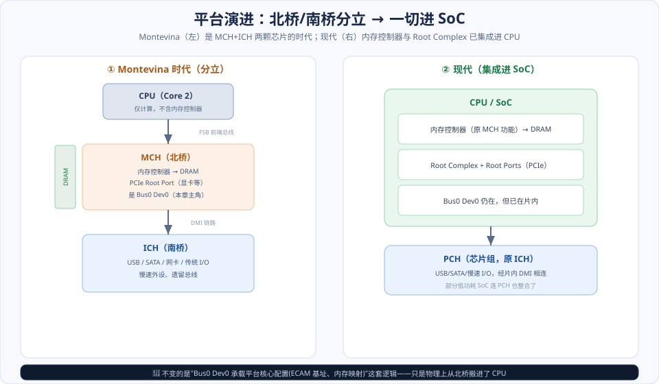
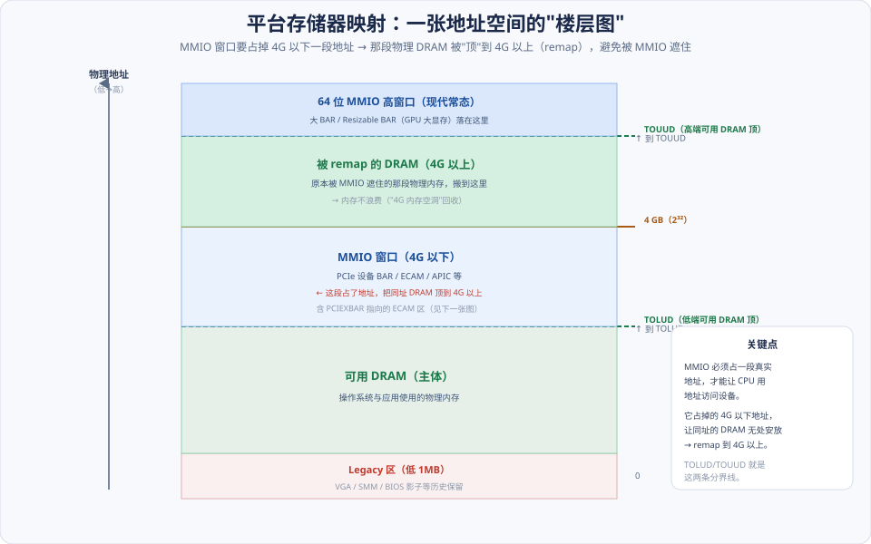
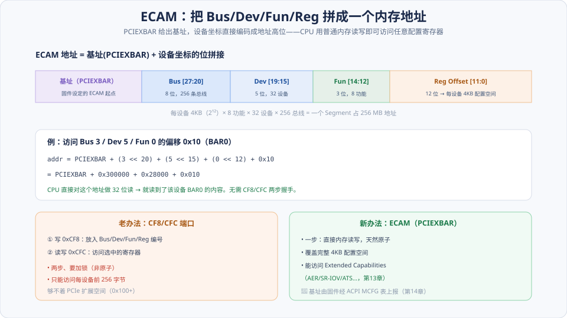

# 第05章　Montevina 平台的 MCH 与 ICH

> **导读**：前面几章讲的都是"抽象规则"——配置空间怎么组织、地址怎么分域、ECAM 怎么映射。这一章是原书的**案例课**：用一套真实芯片组（Intel **Montevina** 平台：**MCH 北桥 + ICH 南桥**）把这些抽象落到**具体寄存器**上，看平台固件到底是怎么划分存储器空间、把 PCIe 配置空间映射进来的。
>
> 但这里有个时代落差要交代清楚：**Montevina 属于"北桥/南桥分立"的时代，今天早已过去**——MCH 的内存控制器和 PCIe Root Port 已经**集成进 CPU（Root Complex 内建）**。所以本章用**"历史案例 + 现代对照"双轨**来讲：既讲原书的 MCH/ICH 具体寄存器（帮你读懂老资料和平台手册的思路），又对照说明"同样的功能今天在 SoC 里由谁承担"。**你要记住的是这套"平台如何组织地址空间"的思路，而不是 Montevina 的具体寄存器地址。**
>
> 本章按 [CLAUDE.md §5.1](../../CLAUDE.md) 八节骨架展开，配 3 张图。

---

## 术语表

| 英文 / 缩写 | 中文 | 一句话释义 |
|-------------|------|-----------|
| MCH, Memory Controller Hub | 存储器控制器中心 | 北桥，含内存控制器与 PCIe Root Port |
| ICH, I/O Controller Hub | I/O 控制器中心 | 南桥，接慢速外设与传统 I/O |
| PCH, Platform Controller Hub | 平台控制器中心 | 现代南桥，ICH 的后继 |
| PCIEXBAR | ECAM 基址寄存器 | 定义 ECAM 基址、把配置空间映射进内存 |
| MCHBAR / EPBAR / DMIBAR | 内部寄存器窗口 BAR | 定位 MCH 内部/Egress/DMI 寄存器块 |
| TOLUD / TOUUD | 低/高端可用 DRAM 顶 | 划分可用 DRAM 上界，处理 4G 内存空洞 |
| Legacy Address Space | Legacy 地址空间 | 低 1MB、VGA、SMM 等历史保留区 |
| MMIO | 存储器映射 I/O | 用存储器地址访问设备寄存器 |
| ACPI MCFG | MCFG 表 | 固件上报 ECAM 基址的 ACPI 表 |
| Memory Remap | 内存重映射 | 把被 MMIO 遮住的 DRAM 搬到 4G 以上 |

---

## 核心概念：Bus0 Dev0 是"平台配置的总开关"

在钻进寄存器之前，先立一个贯穿全章的认知：

**在每个 PCIe 平台上，`Bus 0 / Device 0` 这个特殊设备承载着"整个平台如何组织地址空间"的核心配置。** 它不是普通外设——在 Montevina 时代它就是 **MCH（北桥）本身**，今天则是 **CPU 里集成的 Root Complex**。平台固件通过它的一组特殊寄存器（BAR），告诉系统：
- **ECAM 配置空间放在哪**（`PCIEXBAR`）；
- **内部管理寄存器放在哪**（`MCHBAR`/`EPBAR`/`DMIBAR`）；
- **可用 DRAM 到哪、MMIO 窗口在哪**（`TOLUD`/`TOUUD`）。

所以本章其实在回答一个问题：**"CPU 一上电，是怎么知道内存有多大、设备寄存器在哪、配置空间怎么访问的？"** 答案就藏在 Bus0 Dev0 的这几个寄存器里。物理载体从北桥搬进了 CPU，但**这套逻辑一字未变**——这就是"双轨讲"的价值。

---

## 5.1 PCI 总线 0 的 Device 0 设备

先看这块"平台主角"长什么样、以及它演进到今天的形态：

如图左侧，Montevina 是三段式：**CPU（仅计算）— MCH（北桥，含内存控制器 + PCIe Root Port）— ICH（南桥，接慢速 I/O）**，CPU 与 MCH 之间是 FSB 前端总线，MCH 与 ICH 之间是 DMI 链路。**MCH 就是 Bus0 Dev0**。右侧是现代形态：内存控制器和 Root Complex 都进了 CPU/SoC，南桥变成 **PCH** 经片内 DMI 相连。

MCH 的配置空间里有一组关键 BAR，指向它内部的各寄存器块：

### 5.1.1 EPBAR 寄存器

**EPBAR（Egress Port BAR）** 定位 RC 的 **Egress Port** 内部寄存器块——Egress Port 是 RC 内部通往下游的出口，其配置/状态寄存器由 EPBAR 指向的窗口访问。

### 5.1.2 MCHBAR 寄存器

**MCHBAR** 指向 MCH 的**内部配置寄存器窗口**——内存时序、通道配置、各种平台控制位都在这块。它是"北桥的控制面板"，固件初始化内存和平台时大量读写它。

### 5.1.3 其他寄存器：DMIBAR 与 PCIEXBAR

- **DMIBAR**：定位 **DMI 链路**（MCH↔ICH 之间那条链路）的寄存器块。
- **PCIEXBAR**：⭐**本章最重要的寄存器**——它定义 **ECAM 基址**，把整个 PCIe 配置空间映射进内存地址（5.3.2 详解）。

这些 BAR 的共同点：**它们不是给外设用的，而是平台把自己的"内部机构"暴露成 MMIO 窗口**，让固件/软件能配置平台本身。

---

## 5.2 Montevina 平台的存储器空间的组成结构

平台的物理地址空间不是一整块 DRAM，而是被切成好几段。理解这张"楼层图"是本章的核心：

### 5.2.1 Legacy 地址空间

最低的 **1MB** 及若干历史区域是**传统保留区**：实模式的低 1MB、**VGA** 帧缓冲区间、**SMM（系统管理模式）** 内存、BIOS 影子区等。这些是从 PC 诞生沿袭下来的固定约定，现代平台仍要兼容保留。

### 5.2.2 DRAM 域与 remap ⭐

这里有个新手最困惑的点：**MMIO 窗口要占掉 4G 以下的一段地址空间**（设备 BAR、ECAM、APIC 都要落地址），于是**物理内存里"地址与 MMIO 重叠"的那一段 DRAM 就无处安放**——如果不管，这段 DRAM 就被 MMIO 遮住、白白浪费（这就是著名的"**4G 内存空洞**"：装了 4GB 内存却只能用 3GB 多）。

平台的解法是 **remap（重映射）**：把被遮住的那段 DRAM **搬到 4G 以上**的地址去。两条分界线标出可用 DRAM 的范围：

- **TOLUD（Top of Low Usable DRAM）**：4G 以下可用 DRAM 的顶——再往上就是 MMIO 窗口。
- **TOUUD（Top of Upper Usable DRAM）**：4G 以上可用 DRAM 的顶——被 remap 上来的 DRAM 落在这里。

如图，从下到上的楼层是：`Legacy(低1M) → 可用DRAM主体 → [TOLUD] → 4G以下MMIO → [4G] → remap的DRAM → [TOUUD] → 64位MMIO高窗口`。

### 5.2.3 存储器域

把 DRAM 和 MMIO 合起来看，就是 CPU 眼中的完整**存储器域**（[第02章](../第一篇-PCI体系结构/第02章-PCI桥与配置.md) 的域概念）——一个地址落下去，可能命中 DRAM、可能命中某设备的 BAR、可能命中 ECAM。谁在哪一层，由上面这些寄存器界定。

---

## 5.3 存储器域的 PCI 总线地址空间

### 5.3.1 PCI 设备使用的地址空间

设备的 **MMIO 窗口**（BAR）就落在 5.2 图里"4G 以下 MMIO"和"64 位高窗口"两段。其中 **Prefetchable 区**（[第03章](../第一篇-PCI体系结构/第03章-PCI数据交换.md)）现代普遍放到 **64 位高窗口**，因为大 BAR（GPU 显存）4G 以下装不下。平台固件在枚举时（[第02章](../第一篇-PCI体系结构/第02章-PCI桥与配置.md) 的 BAR 分配）把设备 BAR 安排进这些窗口，并让上游桥的 Base/Limit 覆盖它们。

### 5.3.2 PCIe 总线的配置空间：PCIEXBAR 定义 ECAM ⭐

这是本章与 [第02章](../第一篇-PCI体系结构/第02章-PCI桥与配置.md) ECAM 的接点。**`PCIEXBAR` 就是那个"ECAM 基址"寄存器**——它规定了配置空间被映射到内存的哪个起点，之后设备坐标直接编码进地址高位：

如图，ECAM 地址的拼接公式是：

> **ECAM 地址 = PCIEXBAR(基址) + (Bus << 20) + (Dev << 15) + (Fun << 12) + Reg**

各位段：Bus 占 8 位（256 条总线）、Dev 占 5 位（32 设备）、Fun 占 3 位（8 功能）、Reg 占 12 位（每设备 **4KB** 配置空间）。一个 Segment 因此占 `256 × 32 × 8 × 4KB = 256MB` 地址。

举例：访问 `Bus 3 / Dev 5 / Fun 0` 的偏移 `0x10`（BAR0），地址就是 `PCIEXBAR + 0x300000 + 0x28000 + 0x010`——CPU 直接对这个地址做一次内存读，就读到了该设备的 BAR0。

**对比老办法 CF8/CFC**（[第02章](../第一篇-PCI体系结构/第02章-PCI桥与配置.md)）：端口机制要"两步、加锁、只能碰前 256 字节"；ECAM 一步到位、天然原子、覆盖完整 4KB、能访问 Extended Capabilities（AER/SR-IOV，[第13章](第13章-虚拟化技术.md)）。**PCIEXBAR 就是让这一切成立的那把钥匙。**

---

## 5.4 小结

一句话收束本章：

> **平台的核心是 `Bus0 Dev0`（Montevina 的 MCH / 现代的片内 RC）——它的几个特殊 BAR 界定了整个地址空间：`PCIEXBAR` 定 ECAM 基址、`MCHBAR/EPBAR/DMIBAR` 定内部寄存器、`TOLUD/TOUUD` 定可用 DRAM 与 MMIO 窗口的分界（并靠 remap 回收 4G 内存空洞）。物理载体从北桥搬进了 CPU，这套组织逻辑一字未变。**

三个要点：

1. **Bus0 Dev0 是总开关**：平台通过它的 BAR 暴露"内部机构"，配置平台自身。
2. **地址空间是分层的**：Legacy / DRAM / MMIO / ECAM 各占其位；MMIO 遮住的 DRAM 靠 remap（TOLUD/TOUUD）搬到 4G 以上。
3. **PCIEXBAR = ECAM 基址**：把设备坐标编码成内存地址，是 [第02章](../第一篇-PCI体系结构/第02章-PCI桥与配置.md) ECAM 的平台落地。

带着"平台如何组织地址空间"的认知，第Ⅲ篇会从软件侧接上：[第14章](../第三篇-Linux与PCI/第14章-Linux-PCI初始化.md) 讲 Linux 如何读 ACPI（含 **MCFG 表**，正是固件上报 PCIEXBAR/ECAM 基址的地方）来初始化 PCI 子系统。

---

## 📘 SPEC 7.0 现代化对照

> 📘 **北桥消失，RC 进 CPU**。Montevina 的 MCH 是独立芯片；现代平台把**内存控制器和 PCIe Root Complex 都集成进 CPU/SoC**，南桥变成 **PCH**，通过**片内互联**（DMI 的后继，或直接片上网络）相连。变化的是物理封装，**不变的是"Bus0 Dev0 承载平台核心配置"这套逻辑**——`lspci` 里你仍能看到 Bus0 上代表 RC/内存控制器的设备。（对照本章框图右侧）

> 📘 **ECAM 基址由 ACPI MCFG 表上报**。Montevina 用 `PCIEXBAR` 寄存器给 ECAM 基址；现代平台由 **UEFI 固件通过 ACPI 的 MCFG 表**把 ECAM 基址（可能多个 Segment）告诉 OS。OS 启动时解析 MCFG，才知道去哪访问配置空间（[第14章](../第三篇-Linux与PCI/第14章-Linux-PCI初始化.md)）。**PCIEXBAR 的"思想"仍在，只是上报方式标准化成了 ACPI 表。**

> 📘 **64 位 MMIO 高窗口成为常态**。原书时代设备 BAR 主要挤在 4G 以下；现代 GPU/加速器动辄几十 GB 显存，必须用 **64 位 MMIO 高窗口 + 64 位可预读 BAR + Resizable BAR**（[第03章](../第一篇-PCI体系结构/第03章-PCI数据交换.md)）。5.2 图顶部的"64 位高窗口"就是为此而设。TOUUD 之上的巨大地址空间正好容纳它们。

> 📘 **平台描述全面转向 UEFI + ACPI**。Montevina 的具体寄存器（MCHBAR/EPBAR/DMIBAR 的偏移与位定义）**仅作历史参考**——现代平台用 UEFI + ACPI（MCFG、DMAR、SRAT 等表）以**标准化、可移植**的方式描述这些窗口和拓扑，OS 不再需要硬编码某颗北桥的寄存器细节。

---

## 常见误区 / FAQ

**Q1：都用 SoC 了，学 Montevina 的 MCH/ICH 还有意义吗？**
有，但要抓对重点。**不要背** Montevina 的具体寄存器偏移——那些确实过时了。**要学**的是"平台如何组织地址空间"这套思路：Bus0 Dev0 承载核心配置、ECAM 基址如何定义、MMIO 与 DRAM 如何分层、内存空洞如何 remap。这套逻辑在现代 SoC 里一字未变，只是物理载体从北桥搬进了 CPU、上报方式换成了 ACPI。

**Q2：什么是"4G 内存空洞"？为什么装 4GB 内存只能用 3GB 多？**
因为 MMIO 窗口（设备 BAR、ECAM、APIC 等）必须占用 4G 以下的一段真实地址空间——这段地址被 MMIO 用了，物理上同地址的那段 DRAM 就被"遮住"、无法通过该地址访问。若不处理就浪费了（表现为"少了近 1GB"）。解法是 **remap**：把被遮的 DRAM 搬到 4G 以上（TOUUD 之下），64 位系统就能重新用上它。

**Q3：TOLUD 和 TOUUD 到底划分什么？**
两条"可用 DRAM 的天花板"线。**TOLUD（Top of Low Usable DRAM）**=4G 以下可用 DRAM 的顶，再往上是 MMIO 窗口。**TOUUD（Top of Upper Usable DRAM）**=4G 以上可用 DRAM 的顶（remap 上来的 DRAM 落在 4G 与 TOUUD 之间）。固件设好这两个值，OS 就知道哪些物理地址是真内存、哪些是 MMIO。

**Q4：PCIEXBAR 和 CF8/CFC 是什么关系？**
`PCIEXBAR` 定义了 **ECAM** 的基址，是 PCIe 的现代配置访问方式；CF8/CFC 是 PCI 遗留的端口方式（[第02章](../第一篇-PCI体系结构/第02章-PCI桥与配置.md)）。两者可能并存，但只有 ECAM（PCIEXBAR 指向的窗口）能访问完整 4KB 配置空间和扩展能力。现代 OS 优先用 ECAM，基址从 ACPI MCFG 表获得。

**Q5：MCHBAR、EPBAR、DMIBAR 这些 BAR 和普通设备的 BAR 一样吗？**
形式上都是"指向一段 MMIO 窗口的基地址寄存器"，但用途不同。普通设备 BAR 暴露**外设**的寄存器给驱动用；这些平台 BAR 暴露的是**平台/北桥自身的内部机构**（内存控制器、Egress Port、DMI 链路），给固件配置平台用。它们是"平台把自己的控制面板挂到地址空间上"。

**Q6：现代平台上还有"北桥/南桥"的说法吗？**
北桥基本消失了——它的功能（内存控制器、PCIe RC、显示输出）都进了 CPU。"南桥"演化为 **PCH（Platform Controller Hub）**，仍然承接 USB/SATA/慢速 I/O 和传统总线，通过片内/片间的 DMI 与 CPU 相连。所以现在更常说"CPU + PCH"两片（笔记本/低功耗 SoC 甚至把 PCH 也整合了）。

---

## 与 SPEC 7.0 章节对照

| 本章主题 | Base Spec 7.0 章节 / 相关规范 |
|----------|-------------------------------|
| ECAM / PCIEXBAR | Enhanced Configuration Access Mechanism（[第02章](../第一篇-PCI体系结构/第02章-PCI桥与配置.md)） |
| ECAM 基址上报 | ACPI MCFG 表（[第14章](../第三篇-Linux与PCI/第14章-Linux-PCI初始化.md)） |
| Root Complex / Root Port | Root Complex（[第04章](第04章-PCIe总线概述.md)） |
| 地址空间 / MMIO / DRAM | Address Spaces / Memory Mapped I/O |
| 64 位 / 可预读 BAR / Resizable BAR | Base Address Registers / Resizable BAR（[第03章](../第一篇-PCI体系结构/第03章-PCI数据交换.md)） |
| 平台拓扑描述 | UEFI / ACPI（MCFG、DMAR、SRAT） |

> 说明：MCH/ICH 的具体寄存器（MCHBAR/EPBAR/DMIBAR/PCIEXBAR/TOLUD/TOUUD）属于 **Intel 芯片组数据手册**，非 PCIe Base Spec 内容，本章作历史案例讲；ECAM、地址空间、Resizable BAR 等**通用概念**在 Base Spec 有对应章节。具体以工程内 `NCB-PCI_Express_Base_7.0.pdf` 及相应平台手册为准。
