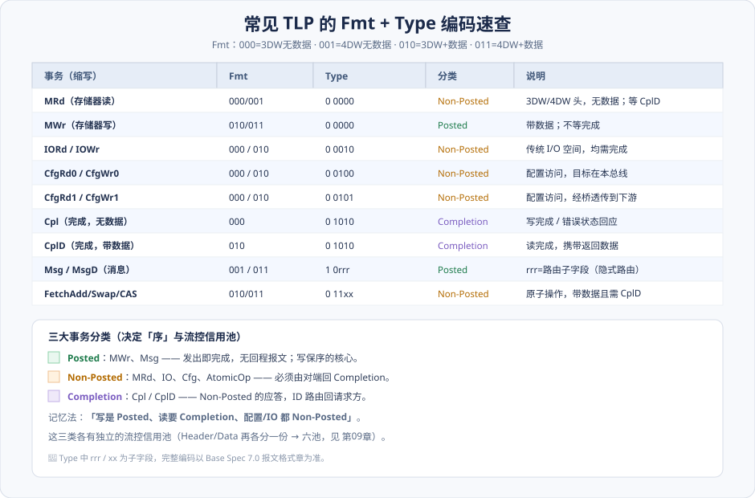
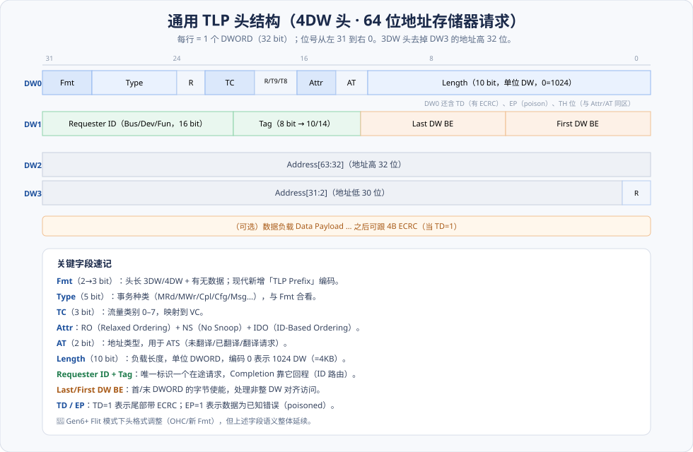
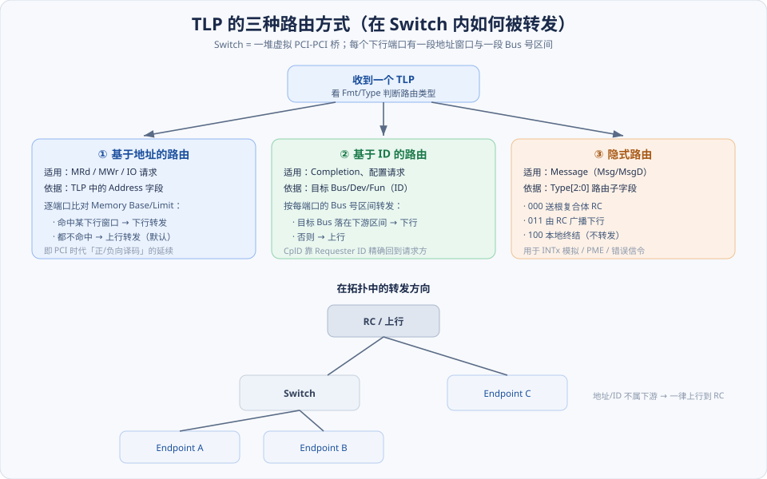
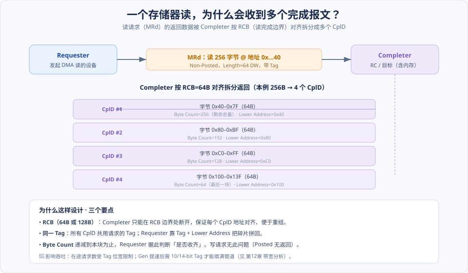
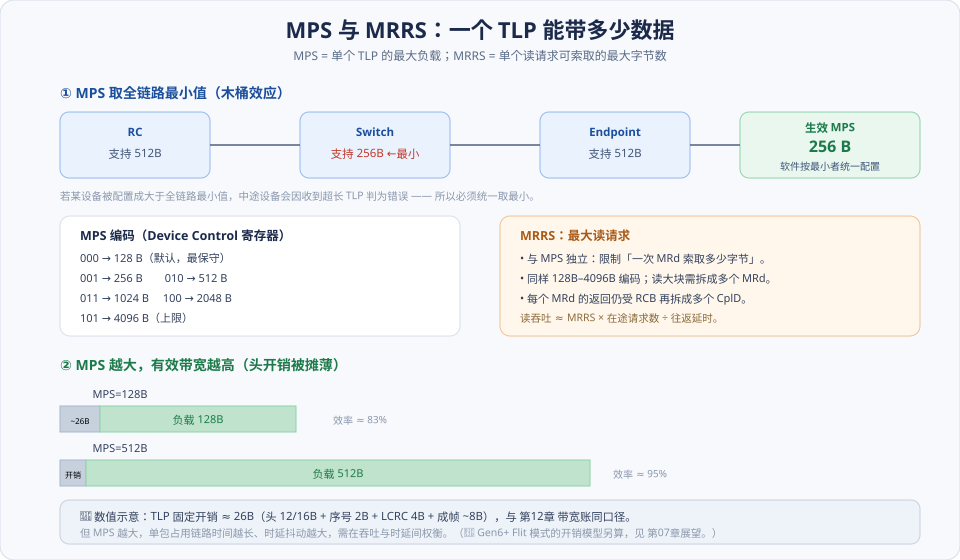
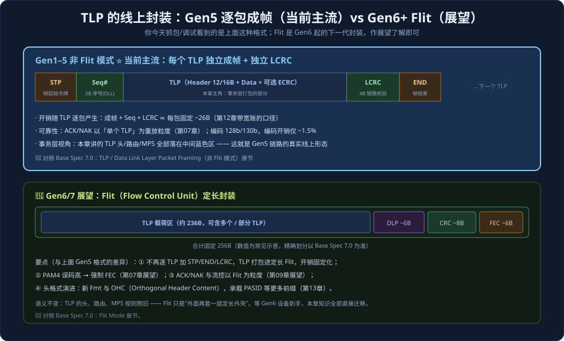

# 第06章　PCIe 总线的事务层

> **导读**：事务层（Transaction Layer）是 PCIe 协议栈的最上层，也是整本书里信息密度最高、最需要"逐字段抠"的一章。它的职责用一句话概括就是——**把软件的一次读 / 写 / 配置 / 消息请求，翻译成能在链路上端到端传递的报文；再把对端的回应翻译回软件能理解的结果**。这个"报文"，就是从本章开始、贯穿全书的主角：**TLP（Transaction Layer Packet，事务层包）**。
>
> 为什么要把事务层放在协议栈讲解的最前面？因为它正好卡在两个世界的接缝上：
>
> - **往上看**，它对应你在驱动里写下的每一行 `readl() / writel() / dma_map_single()`。软件根本不知道什么是差分信号、什么是 8b/10b，它只知道"我要读设备的第 4 号寄存器""我要把这块内存 DMA 给网卡"。把这些**意图**变成结构化报文，是事务层的活。
> - **往下看**，TLP 决定了数据链路层要保护多长的数据、物理层要搬运多少比特。可以说，下面两层所有的辛苦，都是为了让事务层的这封"信"完好无损地送到。
>
> 所以，读懂 TLP 头的每一个字段，你就同时获得了三种能力：**看懂协议分析仪（如 Teledyne LeCroy）抓下来的每一个包**、**手算一条链路的真实有效带宽**、以及**定位"配置读设备回来全是 0xFFFFFFFF""DMA 数据对不上"这类现场问题**。这三件事，恰恰是 PCIe 工程师日常最高频的工作。
>
> 本章严格按 [CLAUDE.md §5.1](../../CLAUDE.md) 的八节骨架展开，配 6 张图，力求"每个字段都讲清它为什么存在"。

---

## 术语表

| 英文 / 缩写 | 中文 | 一句话释义 |
|-------------|------|-----------|
| TLP, Transaction Layer Packet | 事务层包 | 事务层的基本传输单元，"一封信" |
| Fmt / Type | 格式 / 类型字段 | 决定头长度、有无数据、事务种类 |
| DW, DoubleWord | 双字 | 4 字节 = 32 bit，TLP 头与长度的计量单位 |
| Requester / Completer ID | 请求方 / 完成方 ID | 用 Bus/Dev/Fun 标识事务两端 |
| Posted | 无需回应事务 | 发出即完成，无回程报文（如 MWr、Msg） |
| Non-Posted | 需回应事务 | 必须由对端回 Completion（如 MRd、Cfg、IO） |
| Completion (Cpl / CplD) | 完成报文 | Non-Posted 请求的应答（无数据 / 带数据） |
| MPS, Max Payload Size | 最大负载 | 单个 TLP 数据负载上限，全链路取最小 |
| MRRS, Max Read Request Size | 最大读请求 | 单次读请求可索取的最大字节数 |
| RCB, Read Completion Boundary | 读完成边界 | 读完成拆分对齐边界（64 / 128B） |
| BE, Byte Enable | 字节使能 | 首 / 末 DWORD 中哪些字节有效 |
| ECRC | 端到端 CRC | 事务层级的可选校验（TD=1 时附带） |
| Tag | 标签 | 标识在途 Non-Posted 请求，扩展至 10 / 14-bit |
| Flit, Flow Control Unit | 流控单元 | Gen6+ 固定 256B 的传输单元 |
| TLP Prefix | TLP 前缀 | 承载 PASID、扩展 TPH 等的头前缀 |

---

## 核心概念：先钉下三根桩

在钻进一个个 bit 之前，先把三个心智模型钉牢。后面所有细节都能挂到这三根桩上——如果哪里读晕了，就回到这三句话。

### 桩一：TLP 是一封"请求—完成"的信

PCIe 抛弃了 PCI 那种"大家共享一根总线、抢仲裁"的模式，改成了严格的**端到端**通信：一个设备作为 **Requester（请求方）** 发出请求，目标作为 **Completer（完成方）** 处理，并——**在需要时**——回一个 Completion（[第04章](第04章-PCIe总线概述.md) 的拓扑）。

打个比方：

- **写**像寄一封平信：投进邮筒，你就走了，不等回执（这叫 **Posted**）。
- **读**像寄一封挂号索取回执的信：你必须**等对方把东西寄回来**，才算这件事办完（这叫 **Non-Posted**，回来的东西就是 **Completion**）。

这个"写便宜、读昂贵"的不对称，是本章、也是后面 [第12章](第12章-PCIe应用.md) 所有性能分析的根。请务必记牢。

### 桩二：天下事务，只分三类

无论 TLP 千变万化，最终只归为三类。这三类是理解**排序**（[第11章](第11章-总线的序.md)）和**流量控制**（[第09章](第09章-流量控制.md)）的总开关：

| 分类 | 典型成员 | 有无回程 | 记忆 |
|------|----------|----------|------|
| **Posted** | MWr（存储器写）、Msg（消息） | 无 | "发了就走" |
| **Non-Posted** | MRd（存储器读）、IO 读写、Cfg 读写、AtomicOp | 有（Completion） | "非发即忘，得等回信" |
| **Completion** | Cpl（无数据）、CplD（带数据） | —（它本身就是回程） | "回执" |

为什么偏偏是这三类，而不是简单地分"读/写"？因为**排序规则和缓冲管理必须按这三类分开处理**：Posted 写要保持强顺序（否则生产者/消费者模型会崩），而 Completion 必须能"绕过"阻塞的 Non-Posted 请求向前流动（否则会死锁）。这个道理 [第11章](第11章-总线的序.md) 会展开，这里先埋下。

### 桩三：TLP 头是一张固定格式的"快递面单"

每个 TLP 都由**头（Header）+ 可选数据（Data）+ 可选 ECRC** 组成。头是 **3 个或 4 个 DWORD**（12 或 16 字节）——注意 PCIe 世界一切以 **DWORD（DW，4 字节）** 为计量单位。这张"面单"写清楚了六件事：

> **这是什么事务（Fmt/Type）· 发给谁 / 谁发的（地址或 ID）· 多长（Length）· 怎么路由 · 有什么属性（TC/Attr）· 谁来认领回执（Requester ID + Tag）**。

读懂面单，就读懂了这次传输的全部意图。下面 §6.1 就带你把这张面单**逐字段**拆开。

---

## 6.1 TLP 的格式：逐字段拆解"面单"

### 6.1.1 第一 DWORD 的灵魂：Fmt 与 Type

TLP 头第一个 DWORD 的最高几位，是 **Fmt** 和 **Type**——它俩合起来唯一确定"这是哪种事务"。

- **Fmt（Format）**：原书（Gen1/2 时代）是 2 bit，现代规范扩展为 **3 bit**。它同时回答两个问题：
  - 头是 **3DW 还是 4DW**？——地址是 32 位就用 3DW（省一个 DWORD），64 位就用 4DW。
  - **带不带数据负载**？——写类带数据，读请求不带数据（数据在 Completion 里回来）。
  - 现代还多了一个编码，表示这是一个 **TLP Prefix**（前缀，见 §6.5 现代化）。
- **Type**：5 bit，指明事务种类——存储器 / IO / 配置 / 完成 / 消息 / 原子。

**Fmt 与 Type 必须合起来看**。同样是 `Type = 0 0000`（存储器访问），配 `Fmt = 000`（3DW 无数据）就是 32 位地址的 **MRd**，配 `Fmt = 011`（4DW 带数据）就是 64 位地址的 **MWr**。下面这张速查表把工程中最常见的组合整理成一图，抓包时一眼就能对号入座——而且能顺带看出它属于 Posted / Non-Posted / Completion 哪一类：

### 6.1.2 一张完整的 TLP 头长什么样

下图是一个**最完整的例子**：4DW（64 位地址）存储器请求头。所有其他 TLP 头都是它的"简化版"（比如 3DW 头就是去掉地址高 32 位那一行）。建议对照图，跟着下面的文字把每个 DWORD 走一遍：

**DW0（控制信息，所有 TLP 都有）**：装着 Fmt、Type、TC、Attr、AT、Length，以及 TD / EP / TH 等控制位。这是"面单"的抬头，说明这封信的种类、优先级、属性和长度。

**DW1（事务标识 + 字节使能）**：装着 `Requester ID`（16 bit）+ `Tag`（8 bit），以及 `Last DW BE` 和 `First DW BE`。前者标识"谁发的、这是第几号在途请求"，后者处理"非整 DWORD 对齐"的字节级访问。

**DW2 / DW3（地址）**：4DW 头里 DW2 放地址高 32 位、DW3 放地址低 30 位（最低 2 位恒为 0，因为按 DWORD 对齐）；3DW 头则只有一个 DWORD 放 32 位地址。

**头之后**：如果是带数据的 TLP，紧跟数据负载；若 `TD=1`，负载后再附 4 字节 **ECRC**。

下面把 DW0 和 DW1 里几个"最常出问题"的字段单独拎出来讲透。

#### Length：单位是 DWORD，不是字节！

`Length` 有 10 bit，表示负载长度，**单位是 DWORD（4 字节）**。它能表示 1～1023，而**编码值 0 特殊地表示 1024 DW（= 4096 字节 = 4KB）**，这是单个 TLP 的最大负载。

> ⚠️ **这是新手读抓包最常算错的地方**。看到 `Length = 0x010`，是 16 个 DWORD = 64 字节，不是 16 字节。看到 `Length = 0`，是 4KB 满载，不是空包。

#### First / Last DW BE：处理"不满一个 DWORD"的访问

既然 Length 以 DWORD 为粒度，那"只想写 1 个字节"怎么办？答案是 `First DW BE` 和 `Last DW BE` 两个 4-bit 掩码：

- `First DW BE`：负载**第一个** DWORD 里，哪几个字节有效（bit0 对应最低字节）。
- `Last DW BE`：负载**最后一个** DWORD 里，哪几个字节有效。
- 中间的 DWORD 默认全部有效。

举例：要写地址 `0x1002` 处的 1 个字节，硬件会发一个 `Length=1`、`First DW BE = 0b0100`（只有第 3 字节有效）的 MWr。**读寄存器读到一半的值、或写寄存器只生效了部分字节**，往往就是 BE 没算对。

#### TD / EP：校验与"中毒"

- `TD = 1`：TLP 尾部带 4 字节 **ECRC（End-to-End CRC）**。注意它和数据链路层的 **LCRC** 不是一回事——LCRC 只保相邻两跳（[第07章](第07章-数据链路层与物理层.md)），而 ECRC 是**端到端**的，能发现中间 Switch 内部损坏的数据。
- `EP = 1`：**Poisoned（中毒）**，表示这个 TLP 携带的数据是**已知错误**的。发送方明知数据坏了但仍要把它传下去（比如源头内存已 ECC 报错），用 EP 位标记，让最终消费者知道"别信这块数据"，而不是让链路直接报错断连。这是一种优雅的错误传播机制。

### 6.1.3 TC 字段：给流量分优先级

`TC（Traffic Class）` 是 3 bit 标签（0～7）。它本身不产生调度，而是作为"钥匙"通过 **TC → VC 映射**，把不同优先级的流量分配到不同的 **VC（Virtual Channel，虚拟通道）**（[第04章](第04章-PCIe总线概述.md)）。

为什么要这么绕一层？因为不同 VC 有**各自独立的缓冲和流控信用**（[第09章](第09章-流量控制.md)）。这样一来，一个对时延敏感的高优先级流（比如音视频等时传输、或存储的元数据），就能走 TC 高、VC 独立的通道，**不被同链路上的大块 DMA 堵在同一个队列里**。绝大多数普通设备只用 `TC0 → VC0`，但当你需要 QoS 分级时，TC/VC 就是入口。

### 6.1.4 Attr 字段：把"一致性 / 排序意图"写进报文

还记得 [第03章](../第一篇-PCI体系结构/第03章-PCI数据交换.md) 讲的 Cache 一致性与预读吗？PCIe 把那些"意图"显式地编码进了 TLP 头的 `Attr（Attribute）` 位：

- **RO（Relaxed Ordering）**：允许放宽写—写之间的强制顺序，换取更高吞吐。
- **NS（No Snoop）**：告诉系统"这块内存我保证一致，不必替我侦听（snoop）CPU 的 Cache"，省掉侦听开销。
- **IDO（ID-Based Ordering）**：后期加入的第三个属性位，允许不同 Requester ID 的事务之间放宽排序。

> ⚠️ 这三个是**性能优化开关，用错会导致数据竞争**。例如生产者/消费者模型里，如果对"数据写"滥用 RO，可能让"标志写"先于"数据写"到达，消费者就读到了尚未写完的数据。它们与"序"深度耦合，[第11章](第11章-总线的序.md) 会专门用一整章讲清楚什么时候能放宽、什么时候绝对不能。

### 6.1.5 Requester ID 与 Tag：回程的"运单号"

`Requester ID`（16 bit = 发起方的 Bus:Dev:Fun）+ `Tag`（8 bit）合起来，**唯一标识一个在途的 Non-Posted 请求**。当 Completer 回 Completion 时，它把请求里的 Requester ID 抄进 Completion，Switch 就靠这个做 ID 路由（§6.2），把回执准确送回发起方；发起方再靠 Tag 分清"这是我发出的第几号请求的回执"。

> 💡 **Tag 的位宽 = 你能同时"挂"多少个未完成的读**。8-bit Tag 最多 256 个在途请求。当链路又快又长（高带宽 × 高时延）时，256 个可能不够填满管道——这正是现代引入 **10-bit / 14-bit Tag** 的原因（§6.5、[第12章](第12章-PCIe应用.md)）。

---

## 6.2 TLP 的路由：一个包如何找到目标

PCIe 是树状交换拓扑，中间的 **Switch 本质上是一组"背靠背"的虚拟 PCI-PCI 桥**（[第04章](第04章-PCIe总线概述.md)）。每个 Switch 端口手里握着两样"地图"：

1. 一段**地址窗口**（Memory / Prefetchable Base 和 Limit 寄存器）；
2. 一段 **Bus 号区间**（Secondary Bus Number ～ Subordinate Bus Number）。

当一个 TLP 到达 Switch，它根据报文类型，从三种路由方式里选一种来决定"往哪个端口转发"：

### ① 基于地址的路由（Address Routing）

**用于**：MRd / MWr / IO 请求（它们头里带 Address）。
**规则**：Switch 逐个下行端口，检查 TLP 的目标地址**是否落在该端口的 Memory Base/Limit 窗口内**——命中就往那个端口下行转发；如果所有下行端口都不命中，就**默认往上行端口转发**（送回 RC 方向）。

这套"命中窗口就认领、都不命中就上抛"的逻辑，正是 PCI 时代**正向译码 / 负向译码**（[第03章](../第一篇-PCI体系结构/第03章-PCI数据交换.md)）的直接延续。

### ② 基于 ID 的路由（ID Routing）

**用于**：Completion、配置请求（它们的目标用 Bus:Dev:Fun 标识，而非地址）。
**规则**：Switch 看目标 ID 里的 **Bus 号**落在哪个下行端口的 `[Secondary, Subordinate]` 区间内，就往那个端口转发；否则上行。

一个 CplD 就是这样靠请求里记下的 `Requester ID` 精确地"顺着来路"回到发起方的。

### ③ 隐式路由（Implicit Routing）

**用于**：Message（Msg / MsgD）。
**规则**：路由方式直接编码在 `Type` 字段的低 3 位子字段里，常见几种：

| 子字段 | 含义 |
|--------|------|
| 000 | 送往 Root Complex（如 PME、错误消息上报） |
| 011 | 由 RC 广播到所有下行设备 |
| 100 | 本地终结（接收端处理，不再转发） |

INTx 中断模拟、PME 电源事件、错误信令都走这条路。

> 💡 **一句话记忆整个 §6.2**：**"读写看地址、回执看 ID、消息看类型"**。

---

## 6.3 各类请求与完成报文详解

### 6.3.1 存储器读写请求（MRd / MWr）

这是最主流的两种事务，DMA 和 MMIO 的主力：

| | MWr（存储器写） | MRd（存储器读） |
|---|---|---|
| 分类 | **Posted** | **Non-Posted** |
| 带数据 | 是（写的数据在包里） | 否（数据在 CplD 里回来） |
| 回程 | 无 | 有（一个或多个 CplD） |
| 典型场景 | DMA 写主存、写设备寄存器 | DMA 读主存、读设备寄存器 |
| 成本 | 低（发出即走） | 高（要等一个往返 RTT） |

这里再次强调那个**关键的不对称**：**写是"单程"，读是"往返"**。一次读的延迟至少是一个链路往返加上 Completer 的处理时间。因此高性能设计里，"尽量多发并行的读、用大块读摊薄往返开销"是永恒的主题（[第12章](第12章-PCIe应用.md)）。

### 6.3.2 完成报文（Completion）与 RCB —— 为什么一次读会收到多个回包

Non-Posted 请求的应答就是 Completion：

- `Cpl`（无数据）：用于**写完成确认**（如 IO 写、配置写完成）或**回报错误状态**。
- `CplD`（带数据）：用于**读完成**，把读到的数据带回来。

这里藏着一个**几乎所有初学者都会踩的坑**：一个 MRd 请求，可能收到**好几个** CplD！

原因是 Completer（通常是 RC / 内存侧）只能在 **RCB（Read Completion Boundary，读完成边界，取 64 字节或 128 字节）** 的对齐边界处切断返回数据。如上图：请求读 256 字节，可能被切成 4 个各 64 字节的 CplD 陆续返回。那 Requester 怎么把这些碎片正确拼回去？靠三个字段：

- **Tag**：所有碎片 CplD 都带**同一个 Tag**（就是原请求的 Tag），据此归属到同一次读。
- **Lower Address**：每个 CplD 带一个低位地址，指明"我这块数据是原请求里从哪个偏移开始的"，据此摆放位置。
- **Byte Count**：一个**递减**的"剩余总字节数"。Requester 靠它判断"是否已经收齐"——当某个 CplD 的 Byte Count 等于它自己携带的数据量时，说明这是最后一块。

写请求没有这个烦恼——Posted 写压根没有回程。

#### Completion Status：读排障的关键线索

Completion 头里有个 3-bit 的 **Completion Status**，编码这次请求的结果：

| 状态 | 缩写 | 含义 |
|------|------|------|
| Successful Completion | **SC** | 成功 |
| Unsupported Request | **UR** | 不支持的请求（目标不存在 / 功能未实现） |
| Completer Abort | **CA** | 完成方主动中止（内部错误） |
| Config Retry Status | **CRS** | 配置请求：设备还没准备好，请稍后重试 |

> 🔧 **现场排障必备**：当你配置读一个设备，CPU 侧读回 `0xFFFFFFFF` 时，十有八九是底层收到了一个 **UR** Completion——RC 把"读不到"翻译成了全 1。这时应该去查：设备是否真的存在？链路训练（[第08章](第08章-链路训练与电源管理.md)）是否成功到 L0？枚举有没有把它扫进来？

### 6.3.3 配置读写请求（Cfg）

`CfgRd0 / CfgWr0`（目标就在本总线上）与 `CfgRd1 / CfgWr1`（需经桥透传到下游总线），对应 [第02章](../第一篇-PCI体系结构/第02章-PCI桥与配置.md) 讲的 Type 0 / Type 1 配置请求。系统枚举、读 BAR 探测大小、使能 `Memory Space Enable`——全靠这几个事务。它们都是 **Non-Posted**（配置写也要等 Cpl 确认）。

### 6.3.4 消息请求（Message）

Message 是 PCIe 的一个巧妙设计：**把 PCI 时代的边带信号（专用引脚）搬进了带内报文**。这样一来，物理引脚大幅减少（[第04章](第04章-PCIe总线概述.md)），而各种"事件通知"改用消息传递：

- **INTx 模拟**：用 `Assert_INTx` / `Deassert_INTx` 消息，模拟 PCI 的电平中断线（[第01章](../第一篇-PCI体系结构/第01章-PCI总线基础.md)）。
- **PME**：电源管理事件唤醒。
- **错误信令**：把 correctable / uncorrectable / fatal 错误上报 RC。
- **Vendor-Defined**：厂商自定义消息，用于私有带内通信。

Message 是 **Posted**，走隐式路由（§6.2 ③）。

### 6.3.5 原子操作（AtomicOp）

PCIe 补上了 PCI 时代缺失的**原子原语**，让设备能和 CPU 无锁地协作更新共享变量：

- `FetchAdd`：读回旧值并原子地加上一个数。
- `Swap`：原子交换。
- `CAS（Compare-and-Swap）`：比较并交换。

它们都是 **Non-Posted**（带数据发出、要 CplD 回旧值）。在 GPU、加速器、DPU 这类需要设备与主机频繁同步计数器 / 队列指针的场景里非常关键。

### 6.3.6 TLP Processing Hint（TPH）

TPH 通过 DW0 里的 `TH` 位配合 **Steering Tag**，给 Completer / 缓存系统一个"提示"：这块数据接下来最可能被哪个 CPU / 哪一级 Cache 消费。系统据此做**数据引导**（比如把 DMA 写的数据直接注入目标 CPU 的 LLC，即 Direct Cache Injection / DDIO 类优化），减少后续访问延迟。这是高性能网络（低时延收包）里的常用手段。

---

## 6.4 决定真实带宽的三个旋钮：MPS / MRRS / RCB

前面讲的是"报文长什么样"，这一节讲"报文能装多大"——这三个参数直接决定了 PCIe 的**真实有效带宽**，是性能调优时最先要看的旋钮。

### MPS（Max_Payload_Size）：单个 TLP 能带多少数据

取值 128 B ～ 4096 B（3-bit 编码，见图）。它有一条**铁律**：

> **整条链路上所有设备，必须统一配置为它们之中支持的最小 MPS**（木桶效应）。

为什么？因为一个 TLP 从源头出发，会穿过 RC、Switch、Endpoint 等多个节点，**每个节点的接收缓冲都是按它自己的 MPS 设计的**。如果你把某个设备配得比链路里最小的还大，它发出的超长 TLP 到了那个"小缓冲"节点，就会被判为 **Malformed TLP（畸形包）** 而丢弃报错。所以系统软件在枚举后，会扫描全链路、取最小值统一下发。

**MPS 越大越好吗？** 从带宽看是的——TLP 有固定开销（头 12/16 B + 序号 + LCRC + 成帧 + 编码），负载越大，固定开销占比越小、有效带宽越高。图中示意：128 B 负载效率约 86%，512 B 约 96%。但**从时延看不是**：MPS 越大，单个包独占链路的时间越长，会推高其他流量（尤其是高优先级小包）的排队时延与抖动。服务器上常取一个折中（如 256 / 512 B），并保证全链路一致。

### MRRS（Max_Read_Request_Size）：单次读能索取多少

与 MPS **相互独立**。它限制"**一个 MRd 请求最多能要多少字节**"。要读一大块（比如 16 KB）时，若 MRRS = 512 B，就得拆成 32 个 MRd 发出去。

一个极其重要的性能公式：

> **读吞吐 ≈ MRRS × 在途请求数 ÷ 往返时延（RTT）**

这里"在途请求数"受 **Tag 位宽**限制（8-bit → 最多 256）。也就是说，光把 MRRS 调大还不够——如果 Tag 不够、同时在飞的读请求不足以填满"带宽 × 时延"这根管道，链路就会空闲等待。这就是现代必须上 **10-bit / 14-bit Tag** 的根本原因（[第12章](第12章-PCIe应用.md) 有完整的带宽账）。

### RCB（Read Completion Boundary）：读回来怎么切

见 §6.3.2。它决定一个 MRd 的返回被切成几个 CplD（64 B 或 128 B 对齐）。RCB 越小、拆得越碎、Completion 的头开销占比越高。

> 🧮 **把三者串起来看一次 4 KB DMA 读**：先被 MRRS 切成若干 MRd；每个 MRd 的返回又被 RCB 切成若干 CplD。所以抓包看到"一次 4 KB 读产生了十几个 TLP"是完全正常的——这也解释了为什么增大 MRRS / MPS、增多在途请求能显著提升 DMA 吞吐。

---

## 📘 SPEC 7.0 现代化对照（本章重头）

原书基于 Gen1/2。而从 **Gen6 起，事务层的封装方式发生了结构性变化**——进入 **Flit 模式**。这是本章最需要补的现代化内容，也是理解今天 64/128 GT/s PCIe 的钥匙。

> 📘 **SPEC 7.0 · Flit 模式（Base Spec 7.0：Flit Mode 章）**
> 从 Gen6 开始，链路强制以固定 **256 字节的 Flit（Flow Control Unit）** 为传输单位。传统模式下每个 TLP 要独立地用 `STP … Seq# … TLP … LCRC … END` 成帧；而 Flit 模式下，**TLP 直接被打包进定长 Flit**，一个 Flit 内含：TLP 载荷区（约 236 B，可容纳一个或多个、乃至部分 TLP）+ DLP（约 6 B，流控 / Ack）+ CRC（约 8 B）+ FEC（约 6 B）。这带来四个根本变化：
>
> 1. **封装单位固定化**：不再逐 TLP 加 STP/END/LCRC，成帧开销被"摊平"成 Flit 的固定占比。
> 2. **强制 FEC（前向纠错）**：因为 Gen6 用 PAM4 调制（[第07章](第07章-数据链路层与物理层.md)），误码率显著升高，必须先用 FEC 就地纠正大部分错误，再靠 CRC + 重放兜底，否则重传会淹没链路。
> 3. **重放粒度变为 Flit**：ACK/NAK 和流控（DLP）都以 Flit 为单位，延迟预算与信用换算随之改变（[第09章](第09章-流量控制.md)）。
> 4. **头格式演进**：引入新的 Fmt 编码与 OHC（Orthogonal Header Content），以支持更多前缀和更大寻址。

其余关键现代化点：

> 📘 **10-bit / 14-bit Tag**：8-bit Tag 上限 256 个在途请求，在"高带宽 × 高时延"链路下会直接卡住读吞吐（§6.4 公式）。10-bit（1024）/ 14-bit Tag 把在途请求上限抬高一个数量级，是填满现代管道的前提。能力位在扩展配置空间声明（[第04章](第04章-PCIe总线概述.md)）。

> 📘 **TLP Prefix**：在 TLP 头前面再加一段"前缀"，承载 **PASID（进程地址空间 ID）**、扩展 TPH 等信息。它是**共享虚拟内存（SVM）** 与 **ATS 地址翻译**的基础（[第13章](第13章-虚拟化技术.md)）。

> 📘 **Scaled Flow Control**：与 §6.4 的"大 MPS + 多在途请求"配套——原始 8-bit 信用字段在高带宽链路下不够用，需要缩放因子放大可通告信用量，否则带宽会被信用耗尽卡住（[第09章](第09章-流量控制.md)）。

> 📘 **一个心态提醒**：忠于原书理解"TLP 三类事务 / 头字段 / 路由"的语义是**长期有效**的——Flit 模式改变的是"打包和纠错的外壳"，没有推翻"事务层在做什么"。先把经典模型学扎实，再叠加 Flit 这层现代外壳，是最省力的路径。

---

## 常见误区 / FAQ

**Q1：配置读设备回来全是 `0xFFFFFFFF`，是设备坏了吗？**
不一定，而且大概率不是"坏"。多半是底层收到了 **UR（Unsupported Request）Completion**——目标设备不存在、功能未实现、或还没被枚举进来，RC 便把"读不到"翻译成全 1。排查顺序：①链路是否训练到 L0（[第08章](第08章-链路训练与电源管理.md)）；②枚举是否扫到该设备；③Bus/Dev/Fun 地址是否算对。

**Q2：`Length = 0` 是"读 0 字节"吗？**
不是。Length 单位是 **DWORD**，编码 `0` 特殊表示 **1024 DW = 4 KB**（最大负载），不是空传输。

**Q3：为什么我一次 4 KB 的 DMA 读，抓包看到十几个 TLP？**
正常现象。读请求先被 **MRRS** 拆成多个 MRd；每个 MRd 的返回又被 **RCB** 拆成多个 CplD。二者叠加，包数就上去了。想减少包数 / 提吞吐，就增大 MPS、MRRS 并增加在途请求数。

**Q4：MWr 是 Posted、发出不等回应，那软件怎么确认"写成功了"？**
链路层的 ACK/NAK（[第07章](第07章-数据链路层与物理层.md)）保证它**可靠地到达了对端链路**，但事务层确实不给应用层回执。若要确认"设备真的处理了写"，软件常用的手法是紧接着发一个**读**——利用"Posted 写不能被后续读超越"的排序规则（[第11章](第11章-总线的序.md)），这个读的完成，间接证明前面的写已经在设备侧生效。这类"读作栅栏（read-back as fence）"是驱动里的常见套路。

**Q5：ECRC 和 LCRC 有什么区别，我该用哪个？**
LCRC 是数据链路层的，**逐跳（相邻两设备）**校验，永远存在、自动工作。ECRC 是事务层的，**端到端**校验，可选（`TD=1`），能发现 Switch 内部转发时损坏的数据。对可靠性要求极高的系统（如需要满足 AER 的服务器）会开 ECRC；普通消费级场景通常不开，以省一点开销。

**Q6：RO（Relaxed Ordering）能随便开来提速吗？**
不能。RO 放宽的是"写—写保序"。在生产者/消费者模型里，如果"数据"和"完成标志"都开了 RO，标志可能先于数据到达，消费者就读到了半成品。安全的用法是：只对"确定彼此无依赖"的大块数据流开 RO（比如纯 DMA 搬运的载荷），而对"标志 / 门铃"这类有因果关系的写保持默认强序。细节见 [第11章](第11章-总线的序.md)。

**Q7：TC 和 VC 到底谁决定优先级？**
TC 是 TLP 上的"标签"，VC 是链路上"真实的独立队列 + 独立信用"。TC 通过 TC→VC 映射被分到某个 VC，**真正产生隔离和调度效果的是 VC**。只贴 TC 标签而不配置多 VC，是没有 QoS 效果的。

---

## 小结

事务层做的事，可以浓缩成一张"软件动作 ↔ TLP"的翻译对照表——记住它，你就掌握了看懂 PCIe 数据流的地图：

| 软件动作 | TLP 事务 | 分类 | 有无回程 |
|----------|----------|------|----------|
| 写设备寄存器 / DMA 写 | MWr | Posted | 无 |
| 读设备寄存器 / DMA 读 | MRd → 一个或多个 CplD | Non-Posted + Completion | 有 |
| 枚举 / 读 BAR / 使能设备 | CfgRd / CfgWr | Non-Posted | 有（Cpl） |
| 发中断（现代主流） | MWr（MSI，见 [第10章](第10章-MSI和MSI-X中断.md)） | Posted | 无 |
| 边带事件（INTx / PME / 错误） | Msg / MsgD | Posted | 无 |
| 设备与主机原子协作 | FetchAdd / Swap / CAS | Non-Posted | 有 |

**三句话记忆整章**：

1. **"读写看地址、回执看 ID、消息看类型"**（路由）。
2. **"写是 Posted 单程、读要 Completion 往返；一次读可能回多个 CplD，靠 Tag + Lower Address + Byte Count 拼回"**（事务与完成）。
3. **"MPS 全链路取最小、读吞吐 = MRRS × 在途请求 ÷ RTT、Gen6+ 外面套一层 Flit"**（带宽与现代化）。

掌握了这张表和 TLP 头的字段语义，你就拿到了 PCIe 数据流的钥匙。下一章 [第07章](第07章-数据链路层与物理层.md)，我们把这些 TLP 交给**数据链路层**和**物理层**，看它们如何用序号、LCRC、ACK/NAK 和编码，把这封"信"可靠地变成铜线上流动的差分比特。

---

## 与 SPEC 7.0 章节对照

| 本章主题 | Base Spec 7.0 章节（对照回查关键词） |
|----------|--------------------------------------|
| TLP 格式 / Fmt / Type / 头字段 | Transaction Layer — Transaction Layer Protocol / Packet Formats |
| TLP 路由（地址 / ID / 隐式） | TLP Routing |
| 完成报文 / Completion Status / RCB | Completion Rules / Read Completion Boundary |
| 配置 / IO / 消息 / 原子操作 | Configuration Requests / Message Requests / Atomic Operations |
| MPS / MRRS | Device Capabilities / Control（Max_Payload_Size、Max_Read_Request_Size） |
| Byte Enable / Length 规则 | Request Rules / Byte Enables |
| TLP Processing Hint | TLP Processing Hints (TPH) |
| ECRC / Poisoned TLP | Error Handling / Data Poisoning |
| Flit 模式 / 新头格式 / OHC | Flit Mode |
| 10-bit / 14-bit Tag | Tag 相关能力小节 |
| TLP Prefix / PASID | TLP Prefix / PASID |

> 说明：具体章节号以工程内 `NCB-PCI_Express_Base_7.0.pdf` 目录为准；上表给出定位关键词，便于回查原文。
