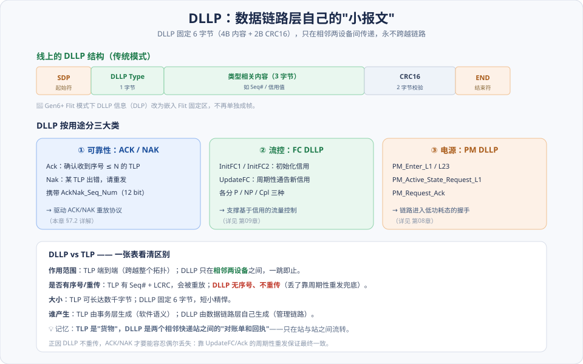
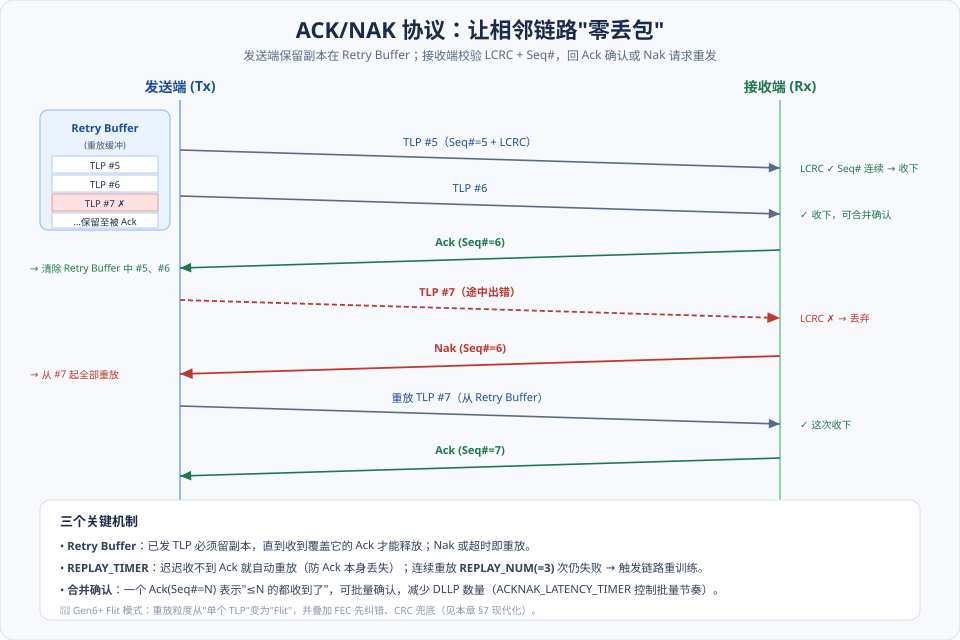
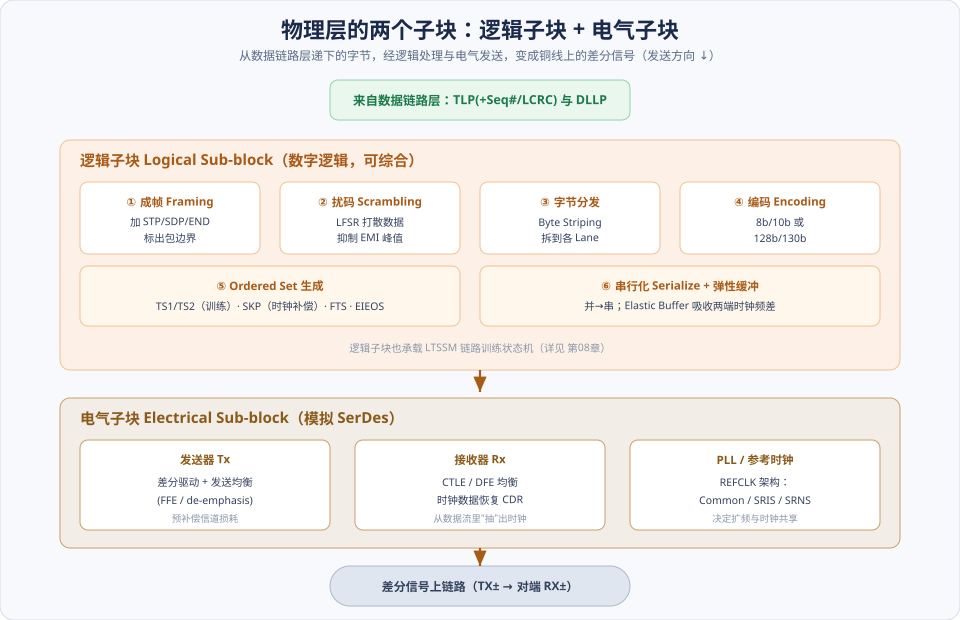
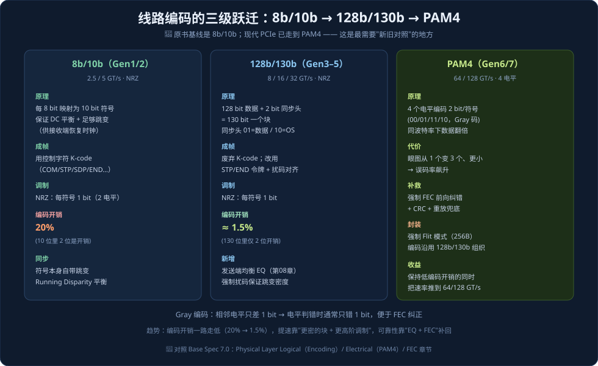
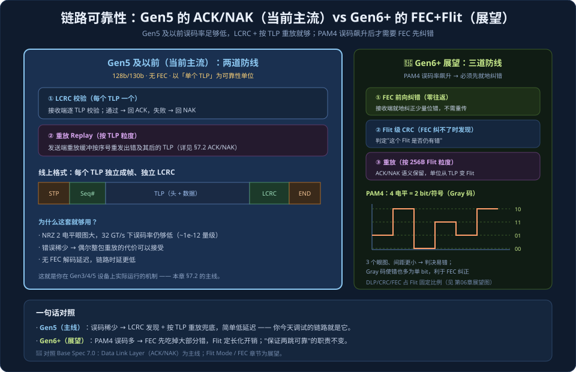

# 第07章　PCIe 总线的数据链路层与物理层

> **导读**：上一章（[第06章](第06章-事务层.md)）我们把软件的意图封装成了一个个 **TLP**。但 TLP 只是"想传的内容"——它还是一串比特，既不知道怎么保证不丢，也不知道怎么变成铜线上的电压。这一章，就负责把 TLP **可靠地、逐比特地**送到对端设备。
>
> 这件事由协议栈的下面两层接力完成，各管一段：
>
> - **数据链路层（Data Link Layer, DLL）** 管"**可靠**"。它给每个 TLP 编号、加校验，用 **ACK/NAK 协议**保证"相邻两个设备之间一个 TLP 都不丢"；同时用自己的小报文 **DLLP** 管理链路的流控与电源。它的视野只有"我和我的邻居"这一跳。
> - **物理层（Physical Layer, PHY）** 管"**变成信号**"。它把字节编码、扰码、拆到各条 Lane 上、串行化，最后用差分驱动器送上线；接收端再反过来解出比特。它还负责链路训练（这部分交给 [第08章](第08章-链路训练与电源管理.md) 专讲）。
>
> 这一章也是全书**"新旧差异"最大**的一章。原书写于 Gen1/2 时代，物理层用的是 **8b/10b** 编码；而今天的 PCIe 已经走到 **128b/130b（Gen3–5）→ PAM4 + FEC + Flit（Gen6/7）**。所以本章的现代化篇幅会很重——但你会看到，**数据链路层"保证可靠"的思想始终没变**，变的只是物理层"怎么编码、怎么纠错"的外壳。
>
> 本章按 [CLAUDE.md §5.1](../../CLAUDE.md) 的八节骨架展开，配 5 张图。

---

## 术语表

| 英文 / 缩写 | 中文 | 一句话释义 |
|-------------|------|-----------|
| DLL, Data Link Layer | 数据链路层 | 保证相邻两设备间 TLP 可靠传输的层 |
| DLLP, Data Link Layer Packet | 数据链路层包 | DLL 自己的小报文（Ack/Nak、流控、PM） |
| Seq#, Sequence Number | 序号 | 给每个 TLP 编号，用于检测丢失 / 乱序 |
| LCRC | 链路 CRC | DLL 附加在 TLP 上的 32 位完整性校验 |
| ACK / NAK | 确认 / 否认 | 接收端回执：收到了 / 出错请重发 |
| Retry Buffer | 重放缓冲 | 暂存已发 TLP，供 NAK / 超时后重发 |
| PHY, Physical Layer | 物理层 | 把比特变成差分信号的层 |
| Logical / Electrical Sub-block | 逻辑 / 电气子块 | PHY 的数字部分 / 模拟 SerDes 部分 |
| 8b/10b · 128b/130b | 线路编码 | 保证 DC 平衡与时钟恢复的编码方式 |
| PAM4 | 四电平脉冲幅度调制 | Gen6+ 每符号 2 bit（4 电平） |
| FEC, Forward Error Correction | 前向纠错 | Gen6+ 就地纠错，减少重传 |
| Ordered Set | 有序集 | TS1/TS2/SKP/FTS 等物理层控制序列 |
| PIPE | PHY 接口标准 | MAC 与 PHY 之间的事实标准接口 |

---

## 核心概念：两层、两种"可靠"、一条流水线

在展开之前，先建立三个总览印象。

**① 数据链路层是"逐跳"的，事务层是"端到端"的。** 这是最容易混淆的一点。一个 TLP 从设备 A 经 Switch 到设备 C，事务层看到的是"A 到 C"这条完整路径；而数据链路层只负责"A 到 Switch"、"Switch 到 C"**每一跳单独可靠**。每过一个 Switch，TLP 的 Seq# 和 LCRC 都会被**剥掉重加**。所以 DLL 的 ACK/NAK 永远只发生在**直连的一对设备**之间。

**② "可靠"其实有两层含义，别混为一谈。**
- **数据链路层的 LCRC + ACK/NAK**：保证"**相邻一跳**不丢包、不误码"，永远在线、自动工作。
- **事务层的 ECRC**（[第06章](第06章-事务层.md)）：可选的"**端到端**"校验，能抓到 Switch 内部转发时损坏的数据。
两者互补：LCRC 是"每一段路的护栏"，ECRC 是"发货到收货的封条"。

**③ 物理层是一条对称的流水线。** 发送方向：字节 → 成帧 → 扰码 → 分发到各 Lane → 编码 → 串行化 → 差分驱动。接收方向就是把这条流水线**倒着走一遍**。理解了发送流水线，接收侧无非是逆操作。

---

## 7.1 数据链路层的组成结构

### 7.1.1 数据链路层的三个状态

数据链路层自己有一个很简单的状态机，描述"这条链路能不能可靠传 TLP"：

| 状态 | 含义 |
|------|------|
| **DL_Inactive** | 物理层还没把链路带起来（没到 L0），DLL 什么也做不了 |
| **DL_Init** | 物理层通了，正在做**流控初始化**（交换初始信用，见 [第09章](第09章-流量控制.md)），还不能传 TLP |
| **DL_Active** | 流控就绪，链路**完全可用**，TLP 可以自由收发 |

只有进入 **DL_Active**，事务层才被允许发 TLP。这就引出了下一个话题。

### 7.1.2 事务层如何看待 DL_Up 与 DL_Down

数据链路层用两个状态通知事务层：

- **DL_Up**：链路进入 DL_Active，"可以发货了"。
- **DL_Down**：链路断了（比如设备热拔、训练失败、连续重放超限）。

**DL_Down 是个"大事件"**：事务层必须把所有在途请求当作失败处理、丢弃相关状态、并向软件报告。对上层软件而言，DL_Down 往往表现为"设备突然消失"。理解这一点，有助于排查"设备偶发掉线"类问题——根因常在物理层的信号完整性或电源状态切换（[第08章](第08章-链路训练与电源管理.md)）。

### 7.1.3 DLLP 的格式：链路自己的"对账单"

数据链路层有自己的小报文——**DLLP（Data Link Layer Packet）**。它和 TLP 是完全不同的两种东西：

如上图，DLLP **固定 6 字节**（1 字节类型 + 3 字节内容 + 2 字节 CRC16），在传统模式下用 `SDP`（Start DLLP）和 `END` 成帧。它按用途分三大类：

- **① 可靠性类（Ack / Nak）**：驱动 §7.2 的 ACK/NAK 协议，携带 12 位的 `AckNak_Seq_Num`。
- **② 流控类（InitFC / UpdateFC）**：交换和更新流量控制信用，各分 Posted / Non-Posted / Completion 三种（[第09章](第09章-流量控制.md) 详解）。
- **③ 电源管理类（PM_Enter_L1 等）**：链路进入低功耗态的握手（[第08章](第08章-链路训练与电源管理.md)）。

**DLLP 与 TLP 的关键区别**（记住这张对比，能避开很多理解误区）：

| 维度 | TLP | DLLP |
|------|-----|------|
| 作用范围 | 端到端（跨整个拓扑） | **只在相邻两设备一跳** |
| 有无序号/重传 | 有 Seq# + LCRC，会被重放 | **无序号、不重传** |
| 大小 | 十几到数千字节 | 固定 6 字节 |
| 谁产生 | 事务层（软件语义） | 数据链路层（管理链路） |

> 💡 一个漂亮的比喻：**TLP 是要送的"货物"，DLLP 是相邻两个快递站之间的"对账单和回执"**——只在站与站之间流转，从不随货物走远。也正因为 DLLP 不重传，ACK/NAK 和流控才设计成"能容忍偶尔丢一张"：靠**周期性重发**保证最终对得上账。

---

## 7.2 ACK/NAK 协议：如何做到"逐跳零丢包"

这是数据链路层的核心机制。它的目标是：即使物理层偶尔出现误码，也能保证 TLP **可靠、按序**地交到邻居手里。整个协议围绕一个"发送端留副本、接收端回执"的循环展开：

### 7.2.1 发送端：留好副本，等回执

发送端每发一个 TLP，会做两件事：

1. 给它贴上一个递增的 **Seq#（12 位序号）**，并在尾部算一个 **32 位 LCRC**。
2. 把这个 TLP 的**副本存进 Retry Buffer（重放缓冲）**，**先不删**。

副本什么时候能删？直到收到一个覆盖它的 **Ack**。如果收到 **Nak**，或者等太久（`REPLAY_TIMER` 超时），发送端就从 Retry Buffer 里把相应 TLP **重放（replay）**一遍。

这里有两个保护机制值得记住：

- **REPLAY_TIMER**：防的是"Ack 本身丢了"。即使没收到 Nak，只要迟迟等不到 Ack，就主动重放，不会死等。
- **REPLAY_NUM**：连续重放 **3 次**仍不成功，说明这条链路可能真坏了——触发**链路重训练**（回到 [第08章](第08章-链路训练与电源管理.md) 的 Recovery）。

### 7.2.2 接收端：校验、按序、回执

接收端每收到一个 TLP，检查两件事：

1. **LCRC 对不对**？——错了说明传输中被干扰了，丢弃。
2. **Seq# 是不是紧接着上一个**？——不连续说明中间丢了包，也要处理。

根据检查结果：

- 两项都通过 → 收下，并安排回一个 **Ack**（`Seq#=N` 表示"≤N 的我都收到了"）。
- LCRC 错或 Seq# 断裂 → 回一个 **Nak**，请发送端从出错处重发。

### 7.2.3 发送顺序与"合并确认"的优化

如果每收一个 TLP 就立刻回一个 Ack，DLLP 会太多、浪费带宽。所以 PCIe 用**合并确认**：一个 `Ack(Seq#=N)` 一次性确认所有 ≤N 的 TLP。`ACKNAK_LATENCY_TIMER` 控制"攒多久回一次"的节奏——既不能攒太久（否则发送端 Retry Buffer 撑满、被迫停发），也不必每个都回。

> 🔧 **工程直觉**：Retry Buffer 的大小 + Ack 返回的及时性，共同决定了链路能容忍多大的"往返延迟"。链路越长（如经过多个 Retimer），越需要更大的 Retry Buffer，否则发送端会因为"副本存不下"而周期性停顿。

---

## 7.3 物理层简介

物理层分成两个子块：**逻辑子块**（纯数字逻辑，可综合进 ASIC/FPGA）和**电气子块**（模拟 SerDes）。数据链路层递下来的 TLP/DLLP，经过这条流水线变成差分信号：

### 7.3.1 差分信号：为什么 PCIe 用一对线传一个比特

PCIe 的每条 Lane，发送方向是**一对差分线**（TX+ / TX−），接收方向又是一对（RX+ / RX−）。用两根线传一个比特，是为了**抗噪**：干扰会同时叠加到两根线上（共模噪声），而接收端只看两根线的**电压差**（差模信号），一减就把共模噪声抵消了。这也是为什么高速链路能在嘈杂的板级环境里稳定工作。

链路空闲时会进入 **Electrical Idle（电气空闲）**——两线电压差归零、驱动器停摆，这既是省电手段，也是 [第08章](第08章-链路训练与电源管理.md) 状态切换的信号。

### 7.3.2 逻辑子块：成帧、扰码、分发、编码

对照上图的流水线，逻辑子块干六件事：

1. **成帧（Framing）**：给 TLP/DLLP 加上边界标记（传统 8b/10b 用 `STP/SDP/END` 控制字符；128b/130b 用 `STP/END` 令牌），让接收端能分清"一个包从哪开始、到哪结束"。
2. **扰码（Scrambling）**：用一个 LFSR（线性反馈移位寄存器）伪随机序列去异或数据。**为什么要打散？** 如果数据里有长串重复模式，会在某个频点形成很强的电磁辐射峰值（EMI）；扰码把能量摊平到整个频段，既降 EMI，也保证信号有足够跳变供接收端恢复时钟。
3. **字节分发（Byte Striping）**：把字节流轮流分到各条 Lane 上（x16 就是 16 条并行传）。
4. **编码（Encoding）**：8b/10b 或 128b/130b（§7.3.3 与现代化）。
5. **Ordered Set 生成**：TS1/TS2（训练）、SKP（时钟补偿）、FTS、EIEOS 等控制序列（[第08章](第08章-链路训练与电源管理.md) 详解）。
6. **串行化 + 弹性缓冲**：把并行数据转成串行比特流；`Elastic Buffer` 吸收发送端和接收端参考时钟之间的微小频率差（靠周期性插入/删除 SKP 有序集来补偿）。

逻辑子块里还"住着" **LTSSM 链路训练状态机**——它是把链路从静止带到可用的大脑，[第08章](第08章-链路训练与电源管理.md) 专门讲。

### 7.3.3 电气子块与 8b/10b 编码（原书基线）

**电气子块**就是 SerDes：发送端的差分驱动器 + 发送均衡（FFE / de-emphasis，预先补偿信道的高频损耗），接收端的均衡（CTLE / DFE）+ **时钟数据恢复（CDR）**（从数据流本身"抽"出时钟，PCIe 不单独传时钟线），以及 PLL 与参考时钟架构。

**8b/10b 编码**是原书的基线，理解它就理解了"编码为什么存在"：

- **规则**：每 8 bit 数据映射成 10 bit 符号。
- **目的一：DC 平衡**。通过 `Running Disparity`（游程差）机制，保证长期看 0 和 1 数量均衡，信号不会有直流偏置。
- **目的二：足够的跳变**。保证信号里 0→1、1→0 的翻转足够密，接收端才能靠 CDR 稳定恢复时钟。
- **控制字符（K-code）**：像 `COM`、`STP`、`SDP`、`END`、`SKP` 这些特殊 10 位码，不对应数据，专门用来成帧和标记边界。
- **代价**：10 位里有 2 位是"开销"，**编码效率只有 80%**（20% 开销）。这个 20% 的浪费，正是 Gen3 要改用 128b/130b 的直接动机。

---

## 7.4 小结（承上启下）

把这一章浓缩成一条链路上的旅程：

> 事务层的 **TLP** → 数据链路层加 **Seq# + LCRC** 并存入 **Retry Buffer**（可靠性）→ 物理层**成帧、扰码、分发、编码、串行化** → **差分信号**上线 → 对端物理层逆向解出比特 → 对端数据链路层**校验 LCRC/Seq#** 并回 **Ack/Nak** → 交付对端事务层。

这条链路上，数据链路层负责"一个都不能丢"，物理层负责"把比特安全地变成信号"。而这一切的"新旧差异"，集中在物理层的编码与纠错——下面的现代化对照就来补齐 Gen3 之后的演进。

---

## 📘 SPEC 7.0 现代化对照（本章重头）

原书停在 8b/10b。要理解今天 8~128 GT/s 的 PCIe，必须补上编码的三级跃迁，以及 Gen6 引入的 FEC 与 Flit。

### 编码的三级跃迁：8b/10b → 128b/130b → PAM4

> 📘 **128b/130b（Gen3–5）**：把 128 bit 数据配上 2 bit **同步头**打成一个 130 bit 的"块"。同步头 `01` 表示数据块、`10` 表示有序集块。这样编码开销从 8b/10b 的 20% **骤降到约 1.5%**。代价是不再有自带跳变的 K-code，因此**强制扰码**来保证跳变密度，成帧改用 `STP/END` 令牌。Gen3 同时引入了发送端**均衡（Equalization）**（[第08章](第08章-链路训练与电源管理.md)），为更高速率"打开眼图"。

> 📘 **PAM4（Gen6/7）**：不再是 NRZ 的"高/低两电平各表示 1 bit"，而是用 **4 个电平**、每个符号表示 **2 bit**（采用 Gray 编码：相邻电平只差 1 bit）。这样在同样的波特率下数据翻倍，直接把速率推到 64/128 GT/s。**代价是眼图从 1 个变成 3 个、每个都更小**，判决更容易出错——误码率显著上升，于是必须引入 FEC。

### PAM4 为什么必须配 FEC + Flit

> 📘 **FEC（前向纠错，Gen6+）**：在 PAM4 的高误码环境下，如果每个错误都靠"重放整包"来救，重传会淹没链路。所以 Gen6 加了一道**前向纠错**防线——接收端**就地纠正**少量错误，**不需要往返重传**。三道防线由快到慢是：**① FEC 就地纠错（零往返）→ ② CRC 发现 FEC 没纠净的错 → ③ 重放兜底（一个往返，成本最高）**。Gray 编码在这里帮了大忙：电平判错时通常只错 1 bit，正好落在 FEC 的纠错能力内。

> 📘 **Flit 模式与数据链路层的关系（Gen6+）**：进入 Flit 模式后（[第06章](第06章-事务层.md) 已介绍其封装），**ACK/NAK 的重放粒度从"单个 TLP"变成"固定 256B 的 Flit"**。§7.2 讲的协议**语义完全保留**（还是留副本、回执、超时重放），只是"重放单位"和"校验粒度"变了，并叠加了 FEC 这一层。DLP（流控/Ack 信息）也从独立成帧改为嵌入 Flit 的固定区。

### 其他现代物理层要点

> 📘 **PIPE 接口**：`PHY Interface for PCIe` 是 MAC（逻辑子块）与 PHY（电气子块）之间的**事实标准接口**。它让 SoC 厂商可以把 PHY 当作独立 IP 复用，MAC 和 PHY 解耦、各自迭代——这是现代 PCIe/CXL IP 生态的重要基石。

> 📘 **Lane 反转 / 极性反转 / deskew**：为方便 PCB 布线，允许 Lane 顺序颠倒（Lane Reversal）、差分对正负接反（Polarity Inversion），由链路训练自动纠正；多条 Lane 之间的到达时间差（skew）靠 SKP 有序集做 **lane-to-lane deskew** 对齐。

> 📘 **Retimer 与参考时钟架构**：长链路（如经背板、线缆）会插入 **Retimer**（协议感知的中继器）延展距离。参考时钟有 **Common Clock（共享）**、**SRIS**、**SRNS** 等架构，决定两端时钟是否共源、能否扩频——影响 Elastic Buffer 的设计和 SKP 插入频率。

> 📘 **一个学习心态**：数据链路层"保证逐跳可靠"的**思想是永恒的**（编号 + 校验 + 回执 + 重放）；物理层变的是"编码/调制/纠错"的具体手段。先把 8b/10b + ACK/NAK 这套经典模型学透，再把 128b/130b、PAM4、FEC、Flit 当作"叠加的外壳"理解，最省力。

---

## 常见误区 / FAQ

**Q1：LCRC 和 ECRC 到底谁保护谁，我该开哪个？**
LCRC 是数据链路层的、**逐跳**校验，永远在、自动工作，你无法关闭。ECRC 是事务层的、**端到端**校验，可选（TLP 头 `TD=1`），能发现 Switch 内部转发时损坏的数据。对可靠性要求高的服务器（配合 AER 错误上报）会开 ECRC；普通场景通常不开以省一点开销。**结论**：LCRC 不用你管，ECRC 按可靠性需求决定。

**Q2：DLLP 会不会像 TLP 一样被重传？**
不会。DLLP **没有序号、不进 Retry Buffer、不重传**。它的可靠性靠"周期性重发"来兜底——比如 UpdateFC 流控信用会不断重发，偶尔丢一个不影响最终一致；Ack 也可以靠后续的 Ack 覆盖（合并确认）来"补救"。

**Q3：为什么 PCIe 不单独拉一根时钟线，接收端怎么知道何时采样？**
高速下单独传时钟会有严重的时钟-数据偏移问题。PCIe 让**时钟隐含在数据里**：靠编码（8b/10b 的跳变、或 128b/130b 的扰码）保证数据流有足够多的翻转，接收端用 **CDR** 从数据边沿"抽"出时钟。这也是为什么"编码必须保证跳变密度"如此重要。

**Q4：Gen3 换成 128b/130b，效率提升这么大，为什么 Gen1/2 不早用？**
128b/130b 去掉了 K-code 的自带跳变，改**完全依赖扰码 + CDR**来恢复时钟，对接收端的均衡（EQ）和 CDR 能力要求高得多。Gen1/2 的 2.5/5 GT/s 信道还相对"干净"，8b/10b 足够；到 8 GT/s，信道损耗大、20% 的编码浪费也扛不住了，才有条件也有必要切换。技术演进总是"需求 + 可行性"同时成熟的结果。

**Q5：Flit 模式下，我在 Gen5 学的 ACK/NAK 知识还有用吗？**
非常有用。Flit 模式**没有推翻** ACK/NAK 的思想——留副本、回执、超时重放这套逻辑都在，只是"重放单位"从单个 TLP 变成 256B 的 Flit，并在前面加了一层 FEC。把经典 ACK/NAK 学扎实，Flit 模式只是换了粒度和多了道纠错防线。

**Q6：设备偶发"掉线"（DL_Down），一般从哪查起？**
DL_Down 意味着链路可靠性彻底失守。常见根因：①信号完整性差（PCB 走线、连接器、Retimer），导致误码率高、连续重放超 REPLAY_NUM 触发重训练甚至断链；②电源状态切换异常（[第08章](第08章-链路训练与电源管理.md) 的 ASPM/L1 子状态）；③时钟架构不匹配（SRIS/共享时钟配置错）。排查时先看链路是否频繁进 Recovery、错误计数器（AER correctable error）是否飙升。

---

## 小结

数据链路层与物理层的分工，可以用一句话锁定：

> **数据链路层保证"相邻一跳，一个 TLP 都不丢"（Seq# + LCRC + ACK/NAK + Retry Buffer）；物理层保证"比特安全地变成差分信号"（成帧 + 扰码 + 编码 + SerDes）。**

三条记忆线：

1. **DLL 逐跳、事务层端到端**；每过一个 Switch，Seq#/LCRC 剥掉重加。
2. **DLLP 是链路的"对账单"**，只在相邻两跳流转、不重传、固定 6 字节，分 Ack/Nak、流控、PM 三类。
3. **编码一路演进**：8b/10b（20% 开销）→ 128b/130b（1.5%）→ PAM4（4 电平 + 强制 FEC + Flit）；**思想不变、外壳升级**。

下一章 [第08章](第08章-链路训练与电源管理.md)，我们进入物理层的"大脑"——**LTSSM 状态机**，看这条链路是如何从上电时一片沉寂，一步步训练成可以跑 TLP 的高速通道，以及空闲时如何省电。

---

## 与 SPEC 7.0 章节对照

| 本章主题 | Base Spec 7.0 章节（对照回查关键词） |
|----------|--------------------------------------|
| 数据链路层状态 / DL_Up/Down | Data Link Layer — Data Link Control and Management |
| DLLP 格式与类型 | Data Link Layer Packets |
| ACK/NAK 协议 / Retry Buffer / Seq# | Data Link Layer — Retry Buffer / ACK-NAK Protocol |
| 物理层逻辑子块 / 成帧 / 扰码 | Physical Layer Logical |
| 8b/10b 编码 | Physical Layer Logical — 8b/10b Encoding |
| 128b/130b 编码 / 同步头 | Physical Layer Logical — 128b/130b Encoding |
| PAM4 / 电气规范 | Physical Layer Electrical |
| FEC | Flit Mode / Forward Error Correction |
| Ordered Sets / SKP / deskew | Physical Layer Logical — Ordered Sets |
| 参考时钟 / SRIS / SRNS | Physical Layer Electrical — Reference Clock |

> 说明：具体章节号以工程内 `NCB-PCI_Express_Base_7.0.pdf` 目录为准；上表给出定位关键词，便于回查原文。
