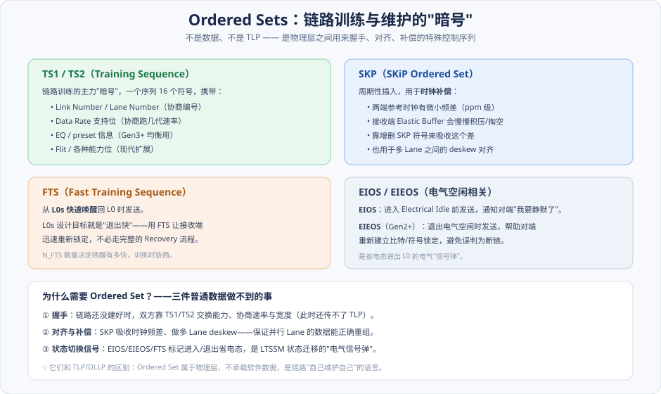
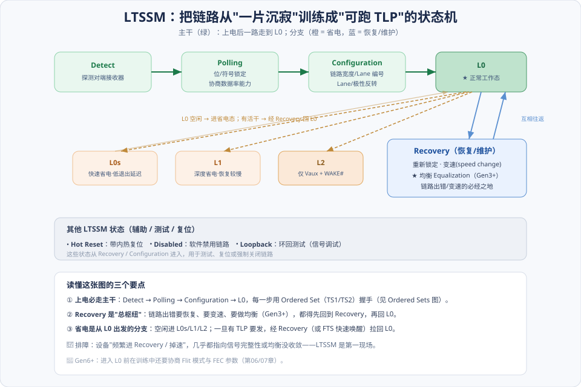
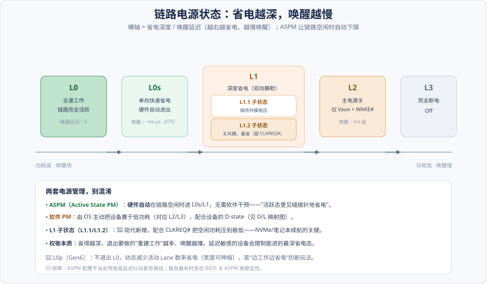
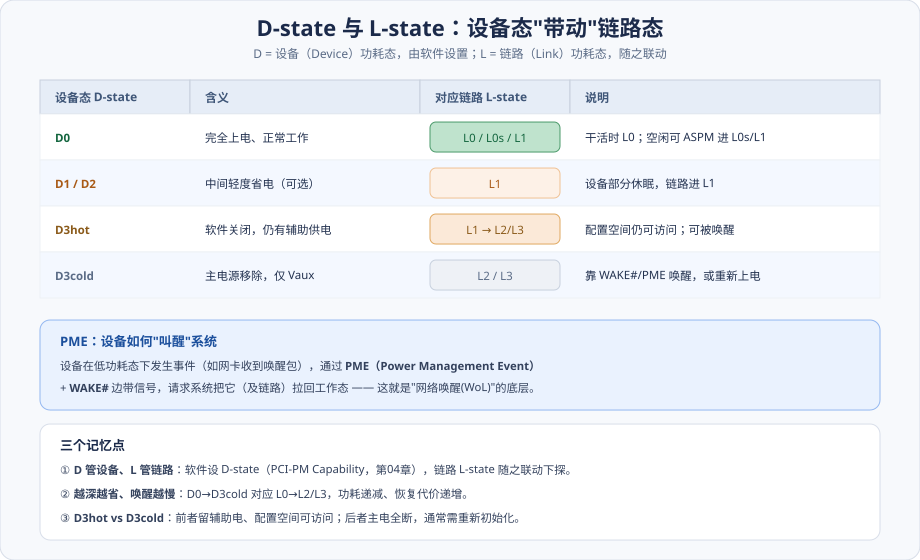
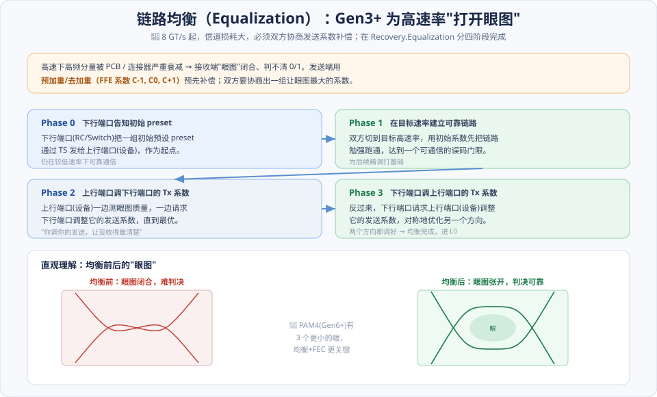

# 第08章　PCIe 总线的链路训练与电源管理

> **导读**：[第07章](第07章-数据链路层与物理层.md) 讲了物理层"怎么把比特变成信号"，但漏了一个根本问题：**上电那一刻，链路两端互不相识、速率宽度都没定，怎么从"一片沉寂"变成"能跑 TLP 的高速通道"？** 答案就是本章的主角——物理层里的那台状态机 **LTSSM（Link Training and Status State Machine，链路训练与状态状态机）**。
>
> 本章讲两件互相关联的事：
>
> - **链路训练**：LTSSM 如何一步步把链路带到工作态 L0——探测对端、锁定时钟、协商速率与宽度、（Gen3+ 还要）做均衡。这是 [第04章 §4.1.5](第04章-PCIe总线概述.md) 初始化流水线里"硬件自动完成"的那一段。
> - **电源管理**：链路空闲时怎么省电（**ASPM**，链路级）、设备整体怎么进低功耗（**PCI-PM 的 D-state**，设备级），以及二者如何联动。
>
> 这一章也和排障强相关：现实中"设备偶发掉线""跑不到额定速率""进省电态后延迟抖动"这类问题，第一现场几乎都在 LTSSM。**现代化重点**：Gen3+ 的 **Equalization（均衡）**、**L1 子状态（L1.1/L1.2）**、Gen6 的 **L0p**。本章按 [CLAUDE.md §5.1](../../CLAUDE.md) 八节骨架展开，配 5 张图。

---

## 术语表

| 英文 / 缩写 | 中文 | 一句话释义 |
|-------------|------|-----------|
| LTSSM | 链路训练状态机 | 物理层管理链路建立 / 恢复 / 省电的状态机 |
| Ordered Set (TS1/TS2/SKP/FTS/EIEOS) | 有序集 | 训练与对齐用的物理层控制序列 |
| Electrical Idle | 电气空闲 | 链路静默、驱动器停摆的电气状态 |
| Receiver Detect | 接收器探测 | 发送端探测对端是否接了接收器 |
| Recovery | 恢复态 | 重锁定 / 变速 / 均衡的必经状态 |
| Equalization (EQ) | 均衡 | Gen3+ 协商发送系数以"打开眼图" |
| Preset / Coefficient | 预设 / 系数 | 发送均衡的初值 / 精调参数（C-1,C0,C+1） |
| ASPM | 主动态电源管理 | 链路空闲时硬件自动进 L0s/L1 |
| L0/L0s/L1/L2/L3 | 链路状态 | 从全速到断电的链路功耗态 |
| L1.1 / L1.2 | L1 子状态 | 更深度的 L1 省电（配合 CLKREQ#） |
| D0/D1/D2/D3 | 设备功耗态 | PCI-PM 定义的设备电源态 |
| PME | 电源管理事件 | 设备从低功耗态唤醒系统的机制 |

---

## 核心概念：三句话搭好框架

**① 链路不是"通电就能用"，要先训练。** 上电后两端速率、宽度、Lane 编号、极性都还没确定，接收端连时钟都没锁上。LTSSM 就是那套"从零把链路谈妥"的流程——它跑完，链路才进 L0，数据链路层才能开始初始化流控（[第07章](第07章-数据链路层与物理层.md)、[第09章](第09章-流量控制.md)）。

**② 训练用的"语言"不是 TLP，是 Ordered Set。** 链路还没建好时，TLP 根本传不了。这个阶段双方靠 **TS1/TS2 等 Ordered Set**（物理层专用控制序列）来握手、交换能力、协商参数。

**③ 省电是"从 L0 出发的分支"，越深越难回。** L0 是干活态；空闲时链路可以下探到 L0s/L1/L2 省电，但省得越深，唤醒时要重建的东西越多、延迟越大。**这是一个贯穿始终的权衡：省电 vs 唤醒延迟。**

---

## 8.1 PCIe 链路训练简介

### 8.1.1 训练使用的字符序列：Ordered Sets

在看状态机之前，先认识它用来"说话"的暗号——**Ordered Set**：

它们不是数据、也不是 TLP/DLLP，而是物理层之间用来握手、对齐、切换状态的控制序列。四类最关键：

- **TS1 / TS2（Training Sequence）**：训练的主力。一个序列 16 个符号，携带 **Link/Lane Number**（协商编号）、**Data Rate 支持位**（协商跑几代速率）、**EQ/preset 信息**（Gen3+ 均衡用），以及现代扩展的 Flit 等能力位。训练时双方反复对发 TS1/TS2 来"谈条件"。
- **SKP（SKiP Ordered Set）**：周期性插入，做**时钟补偿**。两端参考时钟总有 ppm 级频差，接收端的 Elastic Buffer 会慢慢积压或掏空，靠增删 SKP 里的符号来吸收这个差；SKP 也用于多 Lane 之间的 **deskew 对齐**。
- **FTS（Fast Training Sequence）**：从 **L0s 快速唤醒**回 L0 时用，让接收端迅速重锁定，不必走完整 Recovery。
- **EIOS / EIEOS**：进出 **Electrical Idle** 的"信号弹"——EIOS 宣告"我要静默了"，EIEOS（Gen2+）在退出空闲时帮对端重建锁定。

> 💡 为什么非要有 Ordered Set？因为链路还没建好时传不了 TLP，双方必须有一种"物理层自己的语言"来完成握手、对齐和状态切换——这是普通数据做不到的三件事。

### 8.1.2 Electrical Idle 状态

**Electrical Idle（电气空闲）** 是链路的"静默态"：差分对电压差归零、发送驱动器停摆。它既是省电手段（省电态下链路就处于电气空闲），也是 LTSSM 判断状态切换的依据。进出电气空闲分别用 EIOS/EIEOS 标记，避免对端把"静默"误判成"断链"。

### 8.1.3 Receiver Detect 识别逻辑

链路训练的第一步是**确认对面到底接没接设备**。发送端通过 **Receiver Detect**——在 TX 上施加一个电压变化，观测充电响应——判断对端是否存在接收器终端电阻。检测到了，才有必要往下训练；没检测到，就待在 Detect 态继续等（比如空插槽）。

---

## 8.2 LTSSM 状态机

现在看主角。LTSSM 有十几个状态，但抓住"一条主干 + 一个枢纽 + 一组省电分支"就掌握了骨架：

### 8.2.1 Detect：探测对端接收器

上电或复位后的起点。用 §8.1.3 的 Receiver Detect 探测对端是否存在。探到了就进 Polling，探不到就原地等——空插槽会一直停在 Detect。

### 8.2.2 Polling：锁定与速率协商

进入 Polling，双方开始对发 TS1/TS2，完成**位锁定（bit lock）** 和**符号锁定（symbol lock）**——接收端从数据流里恢复出时钟、并找到符号边界。同时通过 TS 里的 Data Rate 位**协商双方都支持的速率能力**。这一步做完，接收端才算"听得清"对面在说什么。

### 8.2.3 Configuration：宽度与编号协商

Polling 之后进 Configuration，敲定链路的"形状"：

- **链路宽度协商**：两端各有多少可用 Lane，取能共同支持的宽度（如两边都是 x16 就跑 x16；有 Lane 坏了可降到 x8）。
- **Lane 编号**：给每条 Lane 分配号码。
- **Lane 反转 / 极性反转**：为方便 PCB 布线，允许 Lane 顺序颠倒、差分对正负接反，这里自动识别纠正（[第07章](第07章-数据链路层与物理层.md)）。

做完这些，链路第一次进入 **L0**——此时是**最低速率**（如 Gen1）下的可用链路。要跑到更高速率，还得经过 Recovery。

### 8.2.4 Recovery：恢复、变速与均衡的"总枢纽"

**Recovery 是 LTSSM 里最重要的枢纽状态**。任何时候链路需要"重新校准"，都要回到这里：

- **重新锁定**：L0 下出现误码累积、失步，回 Recovery 重新同步。
- **变速（Speed Change）**：从 Gen1 升到目标速率（Gen3/4/5/6…），必须经 Recovery。
- **均衡（Equalization）**：Gen3+ 的关键步骤，在 `Recovery.Equalization` 子状态完成（§8.2 后的现代化详解）。

> 🔧 **排障第一现场**：如果一块设备"频繁进 Recovery""跑不到额定速率""偶发掉速"，几乎都指向信号完整性或均衡没收敛。用协议分析仪看链路是不是反复在 L0↔Recovery 之间跳、或看 AER 的 correctable error 计数，是定位这类问题的起手式。

### 8.2.5 其他状态

- **L0s / L1 / L2**：省电态，§8.3 详解。
- **Hot Reset**：带内热复位（不断电，逻辑复位链路）。
- **Disabled**：软件主动禁用链路。
- **Loopback**：环回测试态，把接收的数据原样发回，用于信号完整性调试。

---

## 8.3 PCIe 总线的 ASPM

链路训练好进了 L0，但设备大部分时间其实是空闲的。**ASPM（Active State Power Management，主动态电源管理）** 让链路在**空闲时硬件自动省电**，无需软件干预：

### 8.3.1 与电源管理相关的链路状态

如上图，链路电源态沿"省电深度 / 唤醒延迟"这根轴排开——**越省电，唤醒越慢**，这是贯穿始终的权衡。

### 8.3.2 L0：全速工作态

链路完全活跃，TLP 自由收发，唤醒延迟为零。这是"干活"的状态。

### 8.3.3 L0s：低退出延迟的快速省电

L0s 是**单向、可由硬件自动进出**的浅省电态。它的设计目标就是"退出要快"——用 **FTS**（§8.1.1）快速重锁定，唤醒延迟在纳秒到微秒级。适合"频繁短暂空闲"的场景：见缝插针地省一点电，又能立刻恢复。

### 8.3.4 L1：更深的省电

L1 是**双向静默**的深度省电态，需要两端协商进入（用 PM DLLP，[第07章](第07章-数据链路层与物理层.md)）。它比 L0s 省更多，但唤醒也更慢（要经 Recovery 重建）。

### 8.3.5 L2：主电源关闭

L2 下主电源已关，只剩辅助电源 **Vaux** 和 **WAKE#** 信号维持"能被叫醒"的能力。唤醒延迟到毫秒级。再往下就是 L3（完全断电）。

> 📌 **两套电源管理别混淆**：ASPM（L0s/L1）是**硬件在活跃态里自动省电**；而 L2/L3 属于**软件主动**把设备/系统置于深度睡眠（配合下面的 D-state）。

---

## 8.4 PCI-PM 机制：设备的 D-state

ASPM 管的是"链路"，PCI-PM 管的是"设备整体"。设备的功耗态叫 **D-state**，由软件通过 PCI Power Management Capability（[第04章](第04章-PCIe总线概述.md)）设置：

### 8.4.1 PCIe 设备的 D-state

- **D0**：完全上电、正常工作（唯一能真正干活的态）。
- **D1 / D2**：可选的中间轻度省电态。
- **D3hot**：软件关闭，但**仍有辅助供电**——配置空间还能访问，可被唤醒。
- **D3cold**：主电源移除，只剩 Vaux；通常需要重新上电初始化。

### 8.4.2 D-state ↔ L-state 的联动与 PME 唤醒

关键在于**设备态"带动"链路态**（见上图映射）：软件把设备设成某个 D-state，链路的 L-state 就随之下探——D0 对应 L0/L0s/L1，D1/D2 对应 L1，D3hot 对应 L1→L2，D3cold 对应 L2/L3。

反过来，处于低功耗态的设备如何"叫醒"系统？靠 **PME（Power Management Event）+ WAKE# 信号**。比如网卡在 D3 下收到一个唤醒包，就发 PME 请求把自己和链路拉回工作态——这正是"网络唤醒（Wake-on-LAN）"的底层机制。

---

## 8.5 小结

把训练与电源两条线合到一张状态图里记忆：

> **训练**：上电 → **Detect**（探测对端）→ **Polling**（锁定 + 协商速率）→ **Configuration**（宽度 + 编号）→ **L0**（先低速）→ 经 **Recovery** 变速/均衡到目标速率。
> **省电**：从 L0 出发，空闲下探 **L0s / L1（含 L1.1/L1.2）/ L2 / L3**；设备侧对应 **D0→D3cold**；靠 **PME/WAKE#** 唤醒。**越省越慢，是永恒的权衡。**

三句话记忆：

1. **训练靠 Ordered Set**：TS1/TS2 协商速率宽度、SKP 补时钟、FTS 快唤醒、EIOS/EIEOS 进出空闲。
2. **Recovery 是总枢纽**：变速、均衡、重同步都得回它——排障先看是不是反复进 Recovery。
3. **两套 PM 联动**：ASPM 管链路（L0s/L1 硬件自动）、PCI-PM 管设备（D-state 软件设置），D 带动 L。

下一章 [第09章](第09章-流量控制.md)，我们回到数据链路层，看链路进了 L0、开始初始化后，双方如何用 **Credit（信用）机制**做流量控制，保证"永远不发对方放不下的包"。

---

## 📘 SPEC 7.0 现代化对照

### Equalization（均衡，Gen3 起）

这是 Gen3 之后**必不可少**的一步。8 GT/s 起，信道对高频分量的衰减严重到接收端"眼图闭合"，必须让发送端预先补偿。均衡在 `Recovery.Equalization` 分**四个阶段**完成：

> 📘 **四阶段握手（Base Spec 7.0：Link Equalization）**：**Phase 0** 下行端口把初始 preset 告知上行端口；**Phase 1** 双方切到目标速率、用初值先把链路勉强跑通；**Phase 2** 上行端口一边测眼图、一边请求下行端口调整其发送系数（C-1,C0,C+1，即 pre-shoot/de-emphasis）到最优；**Phase 3** 反过来下行端口调上行端口的发送系数——两个方向都调好，均衡完成，进 L0。图右的"眼图从闭合到张开"直观展示了均衡的作用。**PAM4（Gen6+）有 3 个更小的眼，均衡叠加 FEC（[第07章](第07章-数据链路层与物理层.md)）更为关键。**

### L1 子状态（L1 PM Substates）

> 📘 **L1.1 / L1.2**：现代新增的更深省电子状态，配合 **CLKREQ#** 信号。L1.1 保持共模电压、L1.2 连共模都关掉（最省），能把空闲功耗压到极低。它是现代 **NVMe SSD 与笔记本续航**的关键——没有它，一块常年 idle 的 SSD 会白白耗电。代价同样是唤醒更慢。

### L0p（Gen6）

> 📘 **L0p**：Gen6 引入的新玩法——**不退出 L0，就动态调整活动 Lane 数来省电**（宽度可伸缩）。比如 x16 链路负载低时只保留 x4 活跃、其余 Lane 休眠，负载上来再恢复。这是"边工作边省电"，避免了 L0s/L1 进出的唤醒开销。

### 训练阶段的现代协商

> 📘 **Flit / FEC 协商**：进入 Gen6+ 时，训练过程中还要确定是否进入 **Flit 模式**、以及 FEC 参数（[第06](第06章-事务层.md)/[07 章](第07章-数据链路层与物理层.md)）。现代 **TS1/TS2 携带更多能力位**（EQ、Flit、data rate 扩展）来完成这些协商。

---

## 常见误区 / FAQ

**Q1：链路第一次进 L0 就是最高速率了吗？**
不是。链路第一次进 L0 是在**最低速率（如 Gen1 2.5 GT/s）**。要跑到额定的 Gen4/5，必须再经 **Recovery** 做变速（Speed Change）和均衡。所以你可能会看到链路"先以 Gen1 建立、再逐级升到目标速率"的过程。

**Q2：我的设备训练完只跑到 Gen1，卡在低速上不去，怎么查？**
先读 `Link Status`（[第04章](第04章-PCIe总线概述.md)）确认当前速率与目标速率。常见原因：①信号完整性差，均衡（Equalization）不收敛，只能退守低速稳定运行；②BIOS/固件把速率上限设低了；③Retimer 或线缆问题。看链路是否反复进 Recovery、AER correctable error 是否在涨，能帮助定位。

**Q3：ASPM 到底该开还是该关？**
看目标。**省电优先**（笔记本、移动）应开，尤其配合 L1.2 能显著延长续航；**延迟/稳定优先**（服务器、某些实时设备）有时会在 BIOS 关掉 ASPM——因为退出省电态的唤醒延迟会带来抖动，个别设备的 ASPM 实现还有兼容性 bug 导致掉线。这是典型的"省电 vs 延迟/稳定"权衡。

**Q4：L0s 和 L1 有什么本质区别？**
L0s 是**单向、硬件自动、退出极快**（FTS 唤醒）的浅省电，适合频繁短空闲；L1 是**双向、需协商、退出较慢**（走 Recovery）的深省电，省得更多。可以理解为"打个盹（L0s）"和"睡一觉（L1）"的区别。

**Q5：D3hot 和 D3cold 都关了，区别在哪？**
D3hot **保留辅助供电**，设备的配置空间仍可访问、能被 PME 唤醒回 D0，无需完整重初始化；D3cold **主电源全断**（只剩 Vaux 或彻底断电），唤醒后通常要重新初始化设备。软件挂起/恢复流程需要区分对待。

**Q6：Loopback 状态平时会用到吗？**
正常运行不会进 Loopback。它是**测试态**——把收到的比特原样发回，供硬件工程师用仪器做信号完整性 / 误码率（BER）测试。你在量产测试或硬件调试文档里会看到它。

---

## 与 SPEC 7.0 章节对照

| 本章主题 | Base Spec 7.0 章节（对照回查关键词） |
|----------|--------------------------------------|
| LTSSM 总体 / 各状态 | Physical Layer — Link Training and Status State Machine |
| Ordered Sets（TS1/TS2/SKP/FTS/EIEOS） | Physical Layer Logical — Ordered Sets |
| Receiver Detect / Electrical Idle | Physical Layer Electrical |
| Configuration（宽度/编号/反转） | LTSSM — Configuration |
| Recovery / Speed Change | LTSSM — Recovery |
| Link Equalization（四阶段/系数） | Link Equalization Procedure |
| ASPM / L0s / L1 | Power Management — Active State Power Management |
| L1 PM Substates（L1.1/L1.2） | L1 PM Substates |
| L0p | Power Management — L0p |
| PCI-PM / D-states / PME | Power Management — Device Power States |

> 说明：具体章节号以工程内 `NCB-PCI_Express_Base_7.0.pdf` 目录为准；上表给出定位关键词，便于回查原文。
