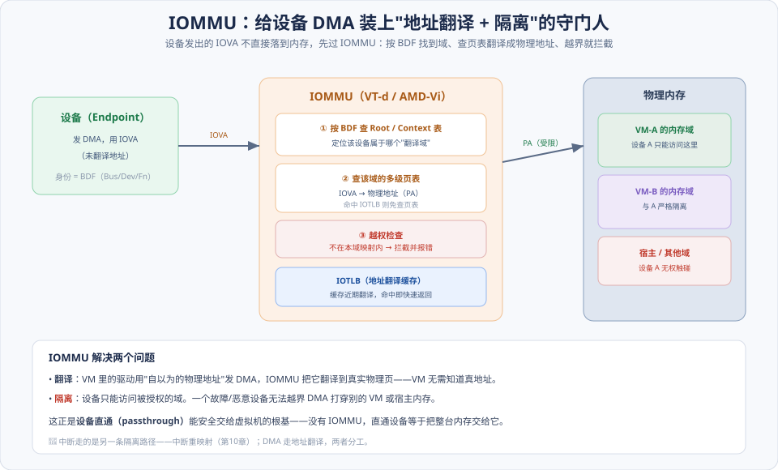
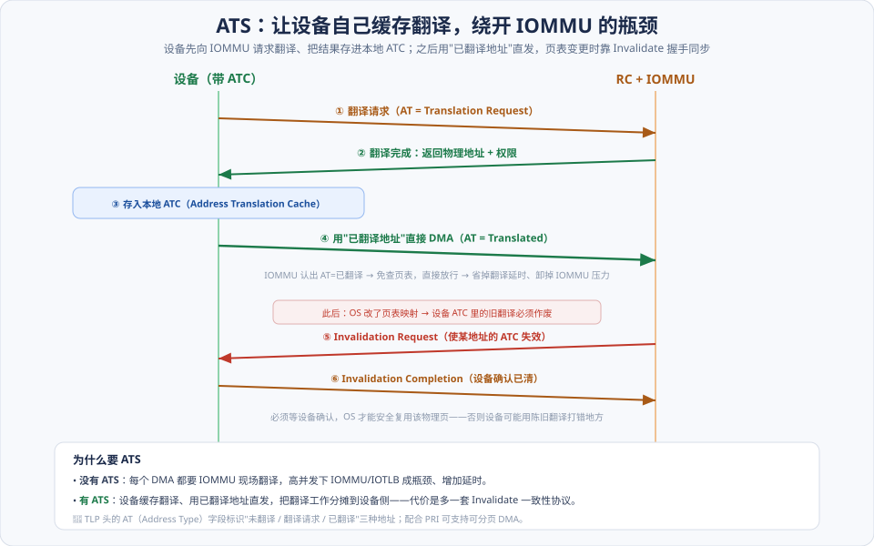
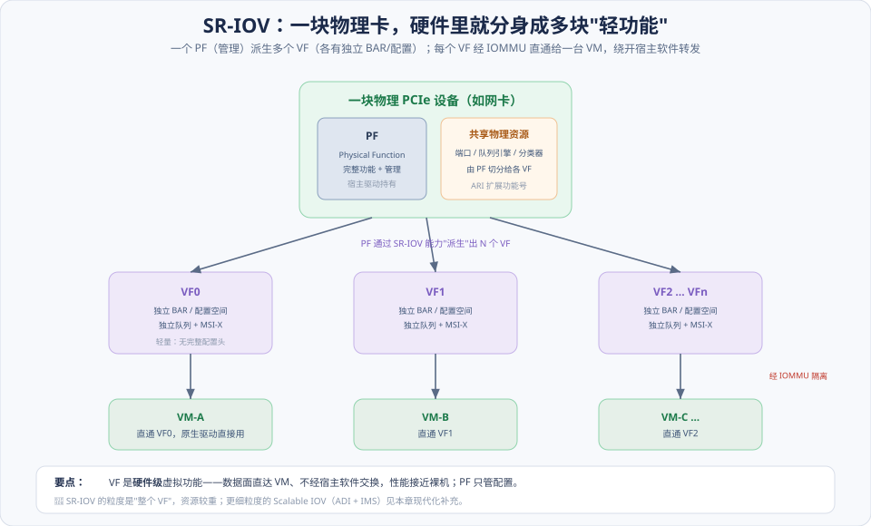
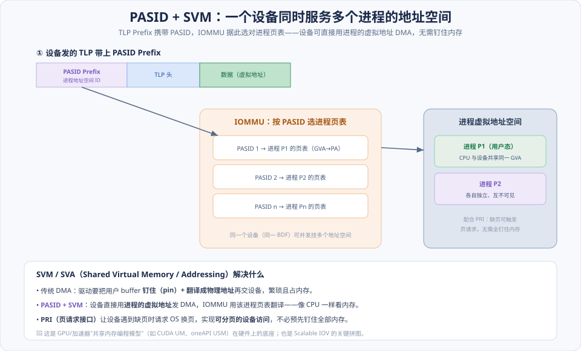

# 第13章　PCIe 总线与虚拟化技术

> **导读**：上一章 [第12章](第12章-PCIe应用.md) 我们让一块 Capric 卡在**单台机器**上跑通了 DMA + 中断。这一章把场景换成**云与数据中心**：一台物理服务器上跑着几十台虚拟机（VM），它们都想用同一块高性能网卡/GPU。问题立刻变尖锐——**怎么让一台 VM 安全地直接使用物理设备，而不会 DMA 越界打穿别的 VM 或宿主？**
>
> 答案是两组机制的配合，可以概括成八个字：**「翻译」+「复制」**。
> - **翻译**——**IOMMU** 拦在设备与内存之间，把设备发出的地址翻译到正确的物理页，并把每个设备锁在自己的"域"里（隔离）；**ATS** 让设备缓存翻译结果、绕开 IOMMU 瓶颈；**PASID/PRI** 更进一步，让一个设备直接用**进程虚拟地址**做 DMA。
> - **复制**——**SR-IOV** 让一块物理卡在硬件层面"分身"成多个轻量虚拟功能（VF），每个 VF 直通给一台 VM，数据面不经宿主软件、性能接近裸机。
>
> **⭐本章是现代化重头**：**PASID、ATS/PRI、Scalable IOV、以及与 CXL 的关系**都是原书成书后才成熟的机制，是理解今天云基础设施、DPU、异构计算的关键。本章按 [CLAUDE.md §5.1](../../CLAUDE.md) 八节骨架展开，配 4 张图。

---

## 术语表

| 英文 / 缩写 | 中文 | 一句话释义 |
|-------------|------|-----------|
| IOMMU | I/O 内存管理单元 | 翻译并隔离设备 DMA 地址（Intel VT-d / AMD-Vi） |
| IOVA, I/O Virtual Address | I/O 虚拟地址 | 设备发出的、需经 IOMMU 翻译的地址 |
| BDF, Bus/Device/Function | 总线/设备/功能号 | 设备在 PCIe 拓扑里的身份，IOMMU 据此定位翻译域 |
| IOTLB | I/O 页表缓存 | IOMMU 内缓存近期翻译的 TLB |
| ATS, Address Translation Services | 地址翻译服务 | 设备缓存翻译结果，绕开 IOMMU 现场翻译 |
| ATC, Address Translation Cache | 地址翻译缓存 | 设备侧缓存的翻译表项 |
| AT, Address Type | 地址类型 | TLP 头中标识"未翻译/翻译请求/已翻译"的字段 |
| PRI, Page Request Interface | 页请求接口 | 设备触发缺页请求，支持可分页 DMA |
| PASID, Process Address Space ID | 进程地址空间 ID | 让一个设备同时服务多个进程/VM 的地址空间 |
| SVM / SVA | 共享虚拟内存/寻址 | 设备与进程共享同一虚拟地址空间 |
| SR-IOV | 单根 I/O 虚拟化 | 一个 PF 派生多个 VF |
| PF / VF | 物理/虚拟功能 | 管理用主功能 / 可直通给 VM 的轻量功能 |
| ARI, Alternative Routing-ID | 备用路由 ID 解释 | 扩展功能号位宽，容纳大量 VF |
| Scalable IOV / ADI | 可扩展 IOV / 可分配设备接口 | 比 VF 更细粒度的虚拟化单元 |

---

## 核心概念：设备直通的两道难关

想把一块物理设备"直通"给虚拟机（让 VM 里的原生驱动直接操控硬件、获得裸机性能），必须先跨过两道关：

**① 地址关：VM 的驱动不知道真实物理地址。** 虚拟机里的驱动以为自己在裸机上，用"客户机物理地址（GPA）"编程 DMA。但这个地址不是真物理地址——若设备照它直接 DMA，会打到错误的内存。**必须有人在设备与内存之间做一次翻译**。这就是 IOMMU 的第一职责。

**② 隔离关：不能让一个设备乱访问内存。** 直通意味着 VM 直接给设备发命令。如果设备（因故障或恶意）发一个越界地址的 DMA，就能读写任意内存——直通等于把整台机器的内存交给它。**必须把每个设备锁进只能访问自己那份内存的"域"**。这是 IOMMU 的第二职责。

这两关都由 **IOMMU** 一并解决：**翻译**（关①）+ **隔离**（关②）。IOMMU 是整个 PCIe 虚拟化的地基——先吃透它，后面 ATS、PASID、SR-IOV 都是在它之上做优化和扩展。

> 记住一个分工：设备有**两条控制路径**，各自独立隔离——**DMA 走地址翻译（IOMMU/ATS）**，**中断走中断重映射（[第10章](第10章-MSI和MSI-X中断.md)）**。二者合起来才是完整的直通安全模型。

---

## 13.1 IOMMU

### 13.1.1 IOMMU 的工作原理

IOMMU 之于设备，正如 MMU 之于 CPU：**MMU 翻译 CPU 发出的虚拟地址，IOMMU 翻译设备发出的 DMA 地址。** 如图，设备发一个 DMA（用 **IOVA**），不直接落到内存，而是先过 IOMMU 三步：

1. **按 BDF 定位翻译域**：设备的身份是它的 **BDF（Bus/Device/Function）**。IOMMU 用 BDF 查 **Root Table → Context Table**，找到"这个设备属于哪个域、用哪张页表"。不同 VM 的设备指向不同的域——这是隔离的入口。
2. **查多级页表翻译**：在该域的页表里把 IOVA 翻成物理地址（PA）。近期翻译缓存在 **IOTLB** 里，命中就免查页表。
3. **越权检查**：目标地址若不在本域的映射内，**拦截并报错**，DMA 不放行。

**翻译 + 隔离，一次完成**。于是 VM 里的驱动可以放心用它"自以为的物理地址"，IOMMU 负责映射到真实的、且仅限本域的物理页。没有 IOMMU，设备直通就是安全灾难。

### 13.1.2 IA 处理器的 VT-d

Intel 的实现叫 **VT-d（Virtualization Technology for Directed I/O）**。关键部件：

- **DMAR（DMA Remapping）单元**：即 IOMMU 硬件，其存在与覆盖范围由 ACPI 的 **DMAR 表**描述给 OS。
- **Root Table / Context Table**：如上，按 BDF 两级索引到域。
- **二级页表**：把 IOVA 翻译到物理地址。在嵌套虚拟化下还可做两级翻译（GVA→GPA→HPA）。
- **中断重映射**：VT-d 同时负责把 MSI 经 **IRTE** 重映射（[第10章](第10章-MSI和MSI-X中断.md)），这是中断侧的隔离，与 DMA 翻译并列。

### 13.1.3 AMD 处理器的 IOMMU

AMD 的等价实现是 **AMD-Vi**，机制上与 VT-d 对应：用 Device Table（按 BDF 索引）定位每个设备的 DMA 页表与中断重映射表，同样提供翻译 + 隔离 + 中断重映射。ARM 体系也有对应的 **SMMU（System MMU）**。**思想一致，寄存器/表结构各家不同**——理解 VT-d 的模型即可迁移。

---

## 13.2 ATS（Address Translation Services）

IOMMU 虽好，但每个 DMA 都要它现场翻译，高并发下 IOMMU 和 IOTLB 会成为瓶颈，还给每次访问加上翻译延时。**ATS 的思路是：把翻译工作分摊到设备侧**——让设备自己缓存翻译结果。

### 13.2.1 TLP 的 AT 字段

这套机制的载体是 TLP 头里的 **AT（Address Type）字段**，它标识一个地址处于哪种状态：

- **Untranslated（未翻译）**：普通的、需要 IOMMU 翻译的地址（默认）。
- **Translation Request（翻译请求）**：设备在**请求** IOMMU 翻译某地址，但先别访问内存。
- **Translated（已翻译）**：这个地址**已经翻译过**，IOMMU 看到就直接放行、免再查页表。

### 13.2.2 地址转换请求

如图，带 ATC 的设备工作流是：

1. **① 翻译请求**：设备发 AT=Translation Request，问 IOMMU "IOVA 对应哪个物理地址、什么权限"。
2. **② 翻译完成**：IOMMU 返回物理地址与访问权限。
3. **③ 存入 ATC**：设备把结果缓存在本地 **ATC（Address Translation Cache）**。
4. **④ 用已翻译地址直发**：之后设备用 AT=Translated 的地址直接 DMA，IOMMU 认出"已翻译"就**免查页表放行**——省掉翻译延时、卸掉 IOMMU 压力。

### 13.2.3 Invalidate ATC

缓存必然带来一致性问题：**OS 改了页表映射，设备 ATC 里的旧翻译就是陈旧的**，若还用它 DMA 会打到错误的物理页。所以有一套**失效握手**（图中 ⑤⑥）：

- **⑤ Invalidation Request**：IOMMU/OS 通知设备"使某地址的 ATC 表项失效"。
- **⑥ Invalidation Completion**：设备清掉后回确认。

关键纪律：**OS 必须等到 ⑥ 确认，才能安全地复用那个物理页**——否则设备可能拿陈旧翻译写到已被别人使用的内存。这也是 ATS 的代价：换来性能，但多背一套一致性协议。

---

## 13.3 SR-IOV 与 MR-IOV

IOMMU/ATS 解决了"翻译与隔离"，但还有个效率问题：如果一块物理网卡只有一个功能，多台 VM 想用它，就得靠宿主软件（如虚拟交换机）**逐包转发**——软件转发是性能杀手。**SR-IOV 用硬件级"复制"绕开它。**

### 13.3.1 SR-IOV 技术

**SR-IOV（Single Root I/O Virtualization，单根 I/O 虚拟化）** 让一块物理设备在硬件里分身：

- **PF（Physical Function，物理功能）**：功能完整的"本体"，带完整配置空间和管理能力，由**宿主驱动**持有。它负责通过 SR-IOV Capability **派生出 N 个 VF**，并切分物理资源（端口、队列引擎、分类器）给各 VF。
- **VF（Virtual Function，虚拟功能）**：轻量的虚拟功能。每个 VF 有**独立的 BAR、独立的队列、独立的 MSI-X**，但配置空间是精简的（不重复完整配置头）。每个 VF 可**直通给一台 VM**，VM 里用原生驱动直接操控。

关键收益：**数据面直达 VM，不经宿主软件交换**——网络包由硬件直接 DMA 进/出 VM 内存，性能接近裸机；宿主只在控制面（PF）参与。每个 VF 的 DMA 仍然过 IOMMU 隔离，所以既快又安全。

因为 VF 数量可能很多（几十上百个），传统的 8 位功能号（一个设备最多 8 个 Function）不够用——SR-IOV 依赖 **ARI（Alternative Routing-ID Interpretation）** 扩展功能号位宽，把 Device/Function 号重新解释以容纳大量 VF（[第04章](第04章-PCIe总线概述.md) 的路由 ID）。

### 13.3.2 MR-IOV 技术

**MR-IOV（Multi-Root IOV，多根 I/O 虚拟化）** 更进一步，让**多台物理主机**共享同一个设备/交换机。它在实际数据中心里**部署极少**（复杂度高、生态弱），了解其存在即可，不必深究。真正主流的是 SR-IOV，以及下面的 Scalable IOV。

---

## 13.4 小结

一张图记住 PCIe 虚拟化的骨架：

> **「翻译」+「复制」。IOMMU 把设备 DMA 地址翻译到正确物理页并隔离进域（安全的地基）；ATS 让设备缓存翻译绕开瓶颈；SR-IOV 把一块物理卡在硬件里复制成多个 VF 直通给各 VM（快的手段）。DMA 走地址翻译、中断走中断重映射，两条路径分头隔离。**

三句话记忆：

1. **IOMMU 是地基**：翻译（让 VM 用虚拟地址 DMA）+ 隔离（把设备锁进域），设备直通的安全前提。
2. **SR-IOV 是复制**：PF 派生多 VF，每 VF 直通一台 VM，数据面绕过宿主软件、接近裸机性能。
3. **两条路径分头隔离**：DMA 走 IOMMU/ATS，中断走中断重映射（[第10章](第10章-MSI和MSI-X中断.md)）。

现代化方向（下节展开）：**PASID/SVM 让设备直接用进程虚拟地址、Scalable IOV 提供更细粒度的虚拟化、CXL 在 PCIe 物理层之上加内存一致性**。这一章合上，PCIe 从"单机总线"延伸到了"云与异构计算的互联底座"。至此第Ⅱ篇（PCIe 体系结构）全部走完，接下来第Ⅲ篇转入 Linux 的软件视角（[第14章](../第三篇-Linux与PCI/第14章-Linux-PCI初始化.md)、[第15章](../第三篇-Linux与PCI/第15章-Linux-PCI中断处理.md)）。

---

## 📘 SPEC 7.0 现代化对照

> 📘 **PASID + SVM：设备直接用进程虚拟地址 DMA**。**PASID（Process Address Space ID，进程地址空间 ID）** 通过 **TLP Prefix**（[第06章](第06章-事务层.md)）携带在 TLP 里，标识"这个 DMA 属于哪个进程的地址空间"。IOMMU 据此选对进程的页表翻译。于是一个设备（同一 BDF）可**并发服务多个进程/VM 的独立地址空间**。这是 **SVM/SVA（Shared Virtual Memory/Addressing，共享虚拟内存）** 的基础——设备像 CPU 一样看内存，驱动不必再"钉住 + 翻译"用户缓冲。它正是 GPU/加速器"统一内存"编程模型（CUDA UM、oneAPI USM）在硬件上的底座。（Base Spec：PASID TLP Prefix）

> 📘 **PRI：可分页的设备访问**。传统 DMA 要求目标内存**全程钉住（pin）**在物理内存里，占用大、不灵活。**PRI（Page Request Interface，页请求接口）** 让设备在遇到缺页时向 OS 发**页请求**，由 OS 换页后再继续——实现**可分页的设备内存访问**，无需预先钉住全部内存。PRI 与 ATS、PASID 三者配合，构成完整的 SVM 支撑。（Base Spec：Page Request Interface）

> 📘 **Scalable IOV（S-IOV）：比 SR-IOV 更细的粒度**。SR-IOV 的虚拟化单元是"整个 VF"，资源较重、数量受硬件限制。**Scalable IOV** 把虚拟化单元细化为 **ADI（Assignable Device Interface，可分配设备接口）**——本质是设备内的队列/上下文级资源，用 **PASID** 区分、用 **IMS（Interrupt Message Store，[第10章](第10章-MSI和MSI-X中断.md)）** 提供海量中断。它更省资源、更可扩展，面向**大规模云、DPU、GPU**——一块卡要服务成千上万个虚拟队列的场景。（Intel Scalable IOV 规范）

> 📘 **与 CXL 的关系：PCIe 之上的内存一致性扩展**。**CXL（Compute Express Link）** 复用 **PCIe 的物理层**（同样的电气、LTSSM、Flit），在其上定义三个协议：`CXL.io`（等价 PCIe 事务）、`CXL.cache`（设备缓存主机内存）、`CXL.mem`（主机访问设备内存）。后两者提供 **设备-主机的内存一致性**——这是 PCIe（本质是 I/O 语义、非一致）所没有的。CXL 是现代异构计算（内存扩展、内存池化、加速器一致访问）的方向，可视为"PCIe 物理层 + 一致性语义"。（CXL 规范，复用 PCIe PHY）

> 📘 **AER 与虚拟化下的错误隔离**。虚拟化把设备直通给 VM，一旦设备出错，错误不能扩散污染整机或别的 VM。**AER（Advanced Error Reporting，高级错误报告）** 提供细粒度的错误检测、报告与隔离，是虚拟化环境可靠性的配套机制——与 IOMMU 的访问隔离相辅相成。（Base Spec：Advanced Error Reporting）

---

## 常见误区 / FAQ

**Q1：IOMMU 和 CPU 的 MMU 是一回事吗？**
思想同源、对象不同。**MMU 翻译 CPU 发出的虚拟地址**（进程的 VA→PA），**IOMMU 翻译设备发出的 DMA 地址**（IOVA→PA）。二者都是"地址翻译 + 访问保护"，但服务对象一个是 CPU、一个是 I/O 设备。可以把 IOMMU 理解成"设备专用的 MMU"。

**Q2：有了 IOMMU，还要 ATS 干什么？不是多此一举？**
不是。IOMMU 每次现场翻译，在**高并发**下会成瓶颈，且给每个 DMA 加翻译延时。ATS 让设备**缓存翻译结果、用已翻译地址直发**，把翻译负载分摊到设备侧，缓解 IOMMU 压力、降低延时。代价是多一套 ATC 失效协议。所以 ATS 是 IOMMU 的**性能优化**，不是替代。

**Q3：SR-IOV 的 VF 和用软件虚拟出来的虚拟网卡有什么区别？**
关键在**数据面走哪条路**。软件虚拟网卡（如 virtio）的数据要经宿主软件（虚拟交换机）转发，CPU 开销大、延时高。SR-IOV 的 VF 是**硬件级**功能，数据由硬件直接 DMA 进/出 VM 内存，**不经宿主软件**，性能接近裸机。代价是灵活性差些（VF 数量、迁移能力受硬件约束）。

**Q4：PASID 和 IOMMU 的域（domain）是什么关系？**
两个维度。**域（按 BDF 划分）**回答"这个设备属于哪个隔离环境"；**PASID** 在一个设备内**再细分出多个地址空间**，回答"这个 DMA 属于该设备服务的哪个进程"。没有 PASID 时一个设备对应一个地址空间；有了 PASID，一个设备能同时挂多个进程的页表——这是 SVM 和 Scalable IOV 的基础。

**Q5：CXL 会取代 PCIe 吗？**
不会取代，是**在其上扩展**。CXL 复用 PCIe 的物理层（同样的 PHY、LTSSM、Flit），只是在链路协商时切换到 CXL 协议。它增加的是 PCIe 本身缺少的**内存一致性**（`CXL.cache/CXL.mem`）。所以更准确的说法是：**CXL = PCIe 物理层 + 一致性语义**，二者共存，面向不同需求（PCIe 管 I/O，CXL 管一致内存访问）。

**Q6：为什么直通设备一定要开 IOMMU？不开会怎样？**
不开 IOMMU 的直通是**严重安全漏洞**。VM 里的驱动能直接给设备编程 DMA，若无 IOMMU 翻译与隔离，设备可以 DMA 到**任意物理地址**——一台被攻破的 VM 就能通过设备读写宿主和其他 VM 的内存，彻底击穿虚拟化边界。所以主流虚拟化平台把"直通必须配 IOMMU"作为硬性前提。

---

## 与 SPEC 7.0 章节对照

| 本章主题 | Base Spec 7.0 章节 / 相关规范 |
|----------|-------------------------------|
| IOMMU 翻译与隔离 | Intel VT-d / AMD-Vi / ARM SMMU 规范 |
| ATS / AT 字段 | Address Translation Services（TLP AT 字段） |
| ATC 失效握手 | Invalidation Request / Completion |
| PASID / SVM | PASID TLP Prefix |
| PRI（可分页 DMA） | Page Request Interface |
| SR-IOV / PF / VF | PCI-SIG Single Root I/O Virtualization 规范 |
| ARI（扩展功能号） | Alternative Routing-ID Interpretation |
| Scalable IOV / ADI / IMS | Intel Scalable IOV 规范（[第10章](第10章-MSI和MSI-X中断.md)） |
| CXL 一致性扩展 | CXL 规范（复用 PCIe PHY） |
| 错误隔离 | Advanced Error Reporting（AER） |

> 说明：ATS、PASID、PRI、AT 字段等定义在 Base Spec 及其 ECN；IOMMU 的具体表结构（VT-d/AMD-Vi）、SR-IOV、Scalable IOV、CXL 属于**配套规范/架构相关**，随平台而定。章节号以工程内 `NCB-PCI_Express_Base_7.0.pdf` 及相应规范为准。
